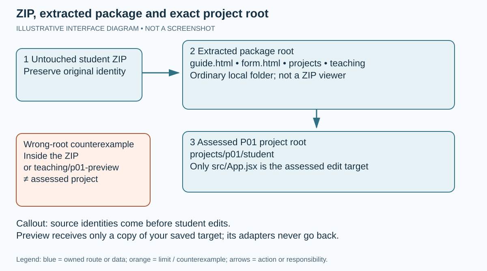
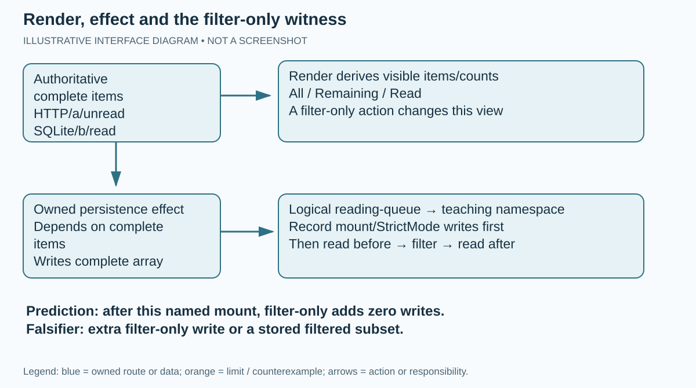
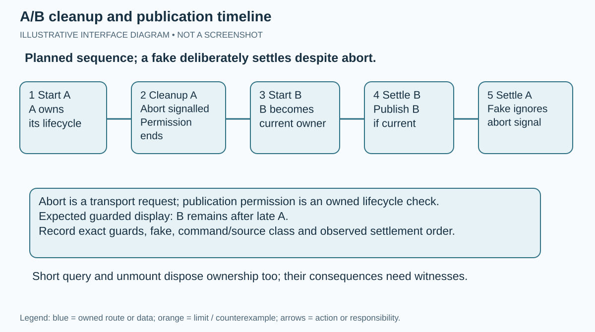
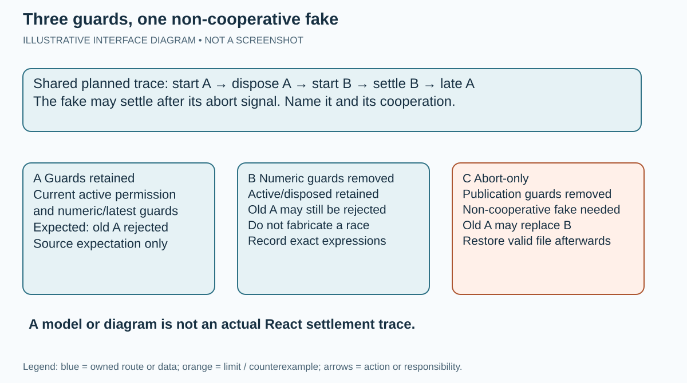
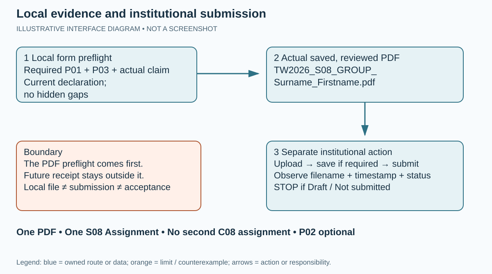

# S08 — State, identity and effect ownership

**Ultra-beginner individual guide · EN-GB · v1.2.0 · LOCAL PRODUCTION CANDIDATE**

Individual student route · EN-GB · v1.2.0 · LOCAL PRODUCTION CANDIDATE. The public package supplies incomplete assessed starters, not completed solutions.
Full P01 App.jsx and the full P03 SearchPanel.jsx portfolio are mandatory. P02 is optional without a compulsory-mark cap. One S08 Assignment receives one readable TW2026_S08_GROUP_Surname_Firstname.pdf; no extra C08 Assignment or required code ZIP.
The meeting is 90 minutes: 60 minutes of content plus 30 minutes of logistics. STOP content at minute 60. The 18-minute P01 segment is progress, not a promise of completion. Source estimates P01 55–65 and P03 45–60 minutes are unmeasured; full P03 and unfinished P01 continue individually after the meeting. Deadline: teacher configures later.
This guide is self-contained offline, including CSS, JavaScript and seven SVG diagrams. Its assets are also supplied separately for inspection. All interface routes/diagrams are illustrative and unobserved; no native OS/browser/Gemini/Moodle screenshot or qualification is claimed.
Declared project environment: Node v24.21.0/npm 11.19.0 and already provisioned project-local dependencies for each project/preview. This route contains no hidden install, download or upgrade. Source identity, reasoning, models, actual React tests, actual browser observations, saved PDF and institutional submission remain different classes.

## Meeting plan — content stops at minute 60

| Minutes | Purpose |
| --- | --- |
| 00–05 | Identity, environment and prior prediction |
| 05–12 | Ownership and common fixture |
| 12–30 | P01 progress in App.jsx — 18 minutes |
| 30–39 | Transition/filter/persistence witness |
| 39–45 | One actual bounded sanitised Gemini claim |
| 45–50 | Independent check, verdict, correction and limit |
| 50–55 | P03 prediction and initial diagnostic |
| 55–60 | Exit draft, pending-work inventory and STOP |

The other 30 minutes are logistics. Full P03 continues after the meeting. Deadline: teacher configures later.

## Open the offline route

At the extracted student package root open guide.html or OPEN_BEGINNER_GUIDE.cmd/.sh. Open form.html or OPEN_EVIDENCE_FORM.cmd/.sh for the aligned 55-field evidence route. Browser menu labels are illustrative variants. The HTML guide includes optional progress, controlled reset, copy fallback, browser selector, larger/projector text, keyboard-visible focus, A4 print and a 60-minute timer. Every step is readable without scripting.

## 1. Identity and privacy

### WHERE YOU ARE

You have received the public S08 student package. You are still outside the React applications. The public route is individual work in EN-GB. This v1.2.0 guide is a local production candidate; browser, React, Word, Gemini and Moodle operation are not qualified by the production audit.

### WHAT TO FIND

Find the student ZIP supplied for S08, its neighbouring SHA-256 file when supplied, PACKAGE_ID.txt after extraction and CANONICAL_SOURCES.json / PROJECT_BASELINES.json. The latter record preserved source identities, not completed implementations or teacher approval.

### EXACT ACTION

1. In your downloads list, read the complete filename and version; do not select a teacher/private archive.
2. Keep an untouched copy of the supplied ZIP. Record its exact name and any supplied checksum. A matching checksum establishes byte identity under the recorded method, not who authorised the package.
3. Write your own GROUP | Surname | Firstname in the form when opened. Record the experiment date, operating system and actual tool/browser versions separately.
4. Before collecting evidence, close unrelated private tabs and remove credentials, cookies, tokens, private student data and unrelated conversations from any excerpt. Use the small supplied HTTP/SQLite fixture and fabricated error text.
5. Read the obligations: full P01 App.jsx and full P03 SearchPanel.jsx portfolio are required. P02 is optional and its absence does not cap the compulsory mark.

### WHAT YOU SHOULD SEE

A clearly identified public package and your own blank record. No practical result or AI exchange has yet been recorded. The final standard payload is one PDF for one S08 Assignment, with no extra C08 Assignment and no compulsory code ZIP.

### WHAT TO RECORD

student_identity, seminar_date, operating_system, browser_tool_versions, package_identity and privacy_check. Use NOT_EXECUTED or PENDING for actions not performed. Date of an AI exchange does not substitute for experiment date.

### DO NOT CONTINUE UNLESS

You can identify the public S08 version and know which information must remain private. You understand that a source identity is a different class from actual execution.

### IF YOU DO NOT SEE THIS

If a name is shortened, use the file's Properties/Get Info or enlarge the Name column. If the package is missing or ambiguous, retain an identity-blocked draft; do not infer a version from a previous seminar.

### STOP CONDITION

Do not open or distribute a teacher/private package. Do not label a placeholder, source prediction or model as ACTUAL_RECORDED. No personal acceptance action is being requested as part of this production phase.

### CONTINUE WITH

Step 2 — Extract and locate.



**ZIP, extracted package and exact project root.** Illustrative interface diagram — original vector teaching asset, not a screenshot. The package root, assessed project root and preview root are separate.

## 2. Extract and locate

### WHERE YOU ARE

You are in the operating system's file manager with the student ZIP. A ZIP is a container; opening a project file inside it is not the same as working in an extracted project folder.

### WHAT TO FIND

On Windows, the download starting location is D:\#___MY_SPACE\Downloads when you use that location. The location you actually saved to takes priority. A practical short working destination is D:\WT08S. On macOS/Linux, use your chosen local Downloads and a short writable working folder.

### EXACT ACTION

1. Windows: open File Explorer with Windows+E, select This PC and open D:\#___MY_SPACE\Downloads, or open your actual download location. Right-click the S08 student ZIP and choose Extract All. Enter a new empty local destination such as D:\WT08S, then choose Extract. If Windows shows a different context menu, choose Show more options first only if needed.
2. macOS: open Finder, locate the ZIP and double-click it to extract. Move the extracted folder to a short local working location. Linux: open the file manager, right-click the ZIP and choose the available Extract/Extract Here action, selecting an empty local destination. These are illustrative interface variants, not observed native sessions.
3. Open the extracted folder. Continue through a possible single wrapper folder until guide.html, form.html and projects appear together. This is the student package root. Do not guess the root from a folder name alone.
4. Confirm projects/p01/student/src/App.jsx and projects/p03/student/src/SearchPanel.jsx exist. The two student directories are separate project roots; the package root is not their Vite root.
5. Keep the original archive untouched. Never edit files through a ZIP viewer or move private references into this folder.

### WHAT YOU SHOULD SEE

An ordinary writable folder with guide.html, form.html, projects and teaching. Windows should no longer show Compressed Folder Tools for the working tree. The assessed file is in projects/p01/student/src, not teaching/p01-preview/src.

### WHAT TO RECORD

Your actual extraction destination and the relative assessed paths in package_identity. Record an extraction block honestly if no writable folder is available.

### DO NOT CONTINUE UNLESS

You can reopen an assessed file from the extracted tree and distinguish the package root, the P01 root and the P03 root. The file is not being opened inside the ZIP.

### IF YOU DO NOT SEE THIS

If the file manager created two folders with the same name, open the inner folder and locate the named files. If projects is absent, search within the extracted folder for App.jsx and read its full path; do not replace missing material with another project.

### STOP CONDITION

Stop on a corrupt ZIP, absent assessed tree, permission error or teacher/private content. Do not overwrite another seminar's folder or treat partial extraction as a valid environment.

### CONTINUE WITH

Step 3 — Open the local guide.


**ZIP, extracted package and exact project root.** Illustrative interface diagram — original vector teaching asset, not a screenshot. The package root, assessed project root and preview root are separate.

## 3. Open the local guide

### WHERE YOU ARE

You are at the extracted student package root. This guide is the offline navigation document. It is separate from every Vite application and from the evidence form.

### WHAT TO FIND

Find guide.html or the OPEN_BEGINNER_GUIDE launcher for your OS. The guide's title is S08 — State, identity and effect ownership. Its browser selector labels Chrome, Edge and Firefox routes as illustrative/unobserved.

### EXACT ACTION

1. Double-click guide.html. If your OS asks which application to use, select an already available browser. Alternatively open the supplied OPEN_BEGINNER_GUIDE.cmd on Windows or OPEN_BEGINNER_GUIDE.sh on macOS/Linux according to the adjacent launcher instructions. A launcher opens a file; it does not provision Node or dependencies.
2. Select your browser family in the guide controls. This changes the visible route notes, not the evidence status. Record the browser actually used.
3. Use the table of contents to open Step 4. Press Tab to see focus on controls; use Enter/Space to operate them. All steps remain readable with JavaScript disabled.
4. Progress saving is off by default. Turn it on only if you want this browser to remember checked guide steps. Use Reset progress to clear only this guide's progress after confirming. A tick is your navigation note, not evidence of a successful experiment.
5. Use Larger/projector text if needed. Use Copy next to a displayed command; if clipboard access fails, the guide selects the text for Ctrl+C or Command+C. Start the 60-minute timer only at the teacher's content start. It is a local navigation aid, using elapsed time within this page; it does not authenticate timing or extend the teacher's content boundary. Pausing, resetting or reopening it does not postpone STOP. At the teacher's minute 60 save an honest draft and stop content.

### WHAT YOU SHOULD SEE

The complete guide, seven illustrative diagrams, 15 numbered steps and visible controls without an internet connection. Offline guide operation does not make the React projects offline runnable. A file:// Vite index.html is not a development server.

### WHAT TO RECORD

Actual guide/browser version or any guide opening block. Do not record a route diagram as an actual screenshot.

### DO NOT CONTINUE UNLESS

You can read all steps and use the relevant local paths. No diagram or browser selector has been treated as native UI verification.

### IF YOU DO NOT SEE THIS

If the launcher cannot start the browser, open guide.html directly. If a diagram is hidden, the caption and equivalent text remain in the step. If scripting is disabled, use the full document and manually record progress; do not infer that any React check failed.

### STOP CONDITION

Stop if the page belongs to another seminar/version. Do not enable a download, install an extension or approve an account request to read this offline guide.

### CONTINUE WITH

Step 4 — Check the environment.

## 4. Check the environment

### WHERE YOU ARE

You are inspecting an already provisioned local machine. The current production phase has not run Node, npm, React, Vite, Vitest or a browser. The commands below are explicit future learner checks, not recorded outcomes or installation permission.

### WHAT TO FIND

The project reference requirement is Node v24.21.0 with npm 11.19.0. Each assessed project and each teaching preview needs its own project-local dependencies. A folder named node_modules alone is not proof that its dependencies work. Archived README instructions mentioning npm install do not govern this derived no-install route.

### EXACT ACTION

1. Windows: in File Explorer open the extracted package root. Right-click its empty background and choose Open in Terminal, or open an already available terminal and change to your recorded folder. macOS: open an available Terminal and change to your recorded folder. Linux: use Open in Terminal if available or an existing terminal. The exact menu wording is an illustrative variant.
2. Type node --version, press Enter and preserve the actual output. Then type npm --version, press Enter and preserve its actual output. Compare the printed pair with the declared reference pair; do not paste the reference as your observation.
3. Open projects/p01/student/package.json and package-lock.json as text. Confirm they are present. Inspect whether node_modules is provisioned in that same project. Repeat for projects/p03/student and any separate preview you intend to use.
4. If a command is unavailable, a version differs or a project-local dependency is absent, record the precise block and keep source-reading/model evidence distinct. There is no hidden npm install, npm ci, npx download or global Vite installation in this route.
5. When already provisioned execution is available, later commands must run inside the named project root. Read tools/README_EN_GB.md for the current prepared environment/boundary routes. source_reference/v1.1.0/RUN_AND_EVIDENCE.md is preserved historical source, not permission to execute its archived helper or install instruction. Do not bind a development server to a public interface.

### WHAT YOU SHOULD SEE

Actual version lines or an explicit environment block. No successful build, test or browser result follows merely from these version checks. The runtime pins are declared project requirements, not versions observed by the production audit.

### WHAT TO RECORD

actual_runtime, browser_tool_versions, execution_class and environment_limit with the actual command/output, project path and date. Use BLOCKED_ENVIRONMENT for missing tools/dependencies or mismatches, including the exact error.

### DO NOT CONTINUE UNLESS

The required environment and project-local dependencies are already present for the specific route. Otherwise continue only with an honestly labelled source/model draft, not practical success claims.

### IF YOU DO NOT SEE THIS

If terminal output scrolls away, select/copy it or capture your own sanitised output. If npm's shell policy blocks its wrapper, record that block; do not change system policy or run an unreviewed installer. A teacher-configured later remedy is separate from this guide.

### STOP CONDITION

Stop execution on missing commands, parser errors, crashes, unavailable dependencies or a mismatch. These are not intended starter assertion failures. Do not install or upgrade anything to force progress.

### CONTINUE WITH

Step 5 — Open the assessed project. Steps 5–7 can be source reading when execution is blocked.

## 5. Open the assessed project

### WHERE YOU ARE

You are opening the full P01 assessed tree. The student App.jsx is intentionally incomplete and the baseline files are preserved. The separate preview does not replace the assessed file.

### WHAT TO FIND

Find projects/p01/CONTRACT.md, projects/p01/student/src/App.jsx, the adjacent main.jsx/storage.js and the canonical tests. Only src/App.jsx is the P01 assessed edit target. P03's only target is projects/p03/student/src/SearchPanel.jsx.

### EXACT ACTION

1. Open the package root in an already available text editor. In the editor's file tree expand projects, p01, student and src, one level at a time. Select App.jsx and confirm its full path in the editor.
2. Read projects/p01/CONTRACT.md. Read App.jsx's prop names storage, initialItems and createItemId. Read relevant tests as specification; do not change a test to make it pass.
3. Before your first edit preserve the supplied identities from PROJECT_BASELINES.json and CANONICAL_SOURCES.json. Keep the original ZIP as the baseline and record the target's pre-edit identity with the supplied boundary route or your available checksum tool. Do not claim that reading a hash proves the code ran.
4. Keep main.jsx, storage.js, CSS, tests, weak evidence, package files and lockfiles unchanged. Write your implementation only inside App.jsx.
5. For a preview later, save your assessed App.jsx first. In the file manager copy that single file from projects/p01/student/src into teaching/p01-preview/src, confirming replacement only for its App.jsx. Record the source and preview paths and current identities. Never copy preview main.jsx, adapters, tests or helpers back to the assessed tree. P03 uses the analogous SearchPanel.jsx-only copy. Exact-package mode preserves both supplied starters. In --student-work mode only a changed named preview target whose bytes exactly equal its current paired assessed target may be accepted as a separate teaching copy; it is reported separately and does not enlarge the two-file assessed edit boundary. Do not edit the preview target independently: save each assessed change first, then copy that target in one direction.

### WHAT YOU SHOULD SEE

The incomplete ReadingQueue target and an explicit one-file boundary. A teaching preview copy is initially another starter, not a completed public solution. Your assessed work remains in the project that will be checked.

### WHAT TO RECORD

edit_boundary and package_identity with original and edited identity/version. For preview use record the separate path, copied target identity and teaching adapter identity. These are data bindings, not a runtime qualification.

### DO NOT CONTINUE UNLESS

You can name exactly which file you may edit and which files must remain unchanged. You know that copying your edit to a preview is one-way and does not widen the boundary.

### IF YOU DO NOT SEE THIS

If the editor displays teaching/p01-preview/src/App.jsx, return to projects/p01/student/src/App.jsx. If it opens a teacher reference, close it and return to the public student tree. Do not paste a private completed target.

### STOP CONDITION

Stop if you cannot identify the root or preserved baseline. Do not alter source helpers to conceal an entry-point defect or to manufacture a check outcome.

### CONTINUE WITH

Step 6 — Fix the common fixture.

## 6. Fix the common fixture

### WHERE YOU ARE

You are preparing a bounded comparison before claiming parity. The common teaching comparator is teaching/p01-preview at /vanilla.html. Its React route is the actual Vite local root. The inherited /vanilla/ route is a separate original comparator with an empty default fixture and reading-queue storage; do not silently equate it with the common route.

### WHAT TO FIND

Common fixture: [{"id":"a","title":"HTTP","read":false},{"id":"b","title":"SQLite","read":true}]. The teaching vanilla namespace is tw2026-s08-p01-vanilla; React uses tw2026-s08-p01-react. The component's logical key remains reading-queue through the labelled adapter. Use valid plain-text titles only.

### EXACT ACTION

1. Record the two initial items, both read flags and the chosen starting storage state before opening either application. Name whether stored data is absent, a valid array or an invalid JSON/shape case.
2. On a qualified, already provisioned machine, open a terminal and change specifically to teaching/p01-preview using the quoted root examples in Commands below. Confirm the current directory, then start npm run dev. Read the local address actually printed by Vite and open that address; do not guess 5173. In a second tab at the same printed origin open /vanilla.html. Record both complete local URLs and which tab is React/vanilla.
3. Inspect only the teaching namespace of the correct local tab using Step 10. If previous preview data is present, export/copy the relevant evidence first. The labelled window.S08Preview.resetFixture() asks confirmation and removes only that route's teaching key before reload. Use it only after recording what will be removed; do not clear all site data.
4. After any reset/reload, record the actual starting complete array and mount conditions. Mount/StrictMode writes are separate from later action writes. If your target is still incomplete, record that visible starter and do not claim the two-item React UI is working.
5. For your assessed React P01 target's storage policy, use a named fresh test/fake or carefully labelled React preview case: absent/invalid JSON or any invalid item shape must fall back as a whole. Shape validation alone cannot establish unique IDs. The vanilla comparator accepts any array and interpolates title markup; do not expect it to apply that React item-shape policy. Common parity is bounded to the recorded valid plain-text fixture. Do not inject unsafe markup into the comparator or present malformed-storage cases as parity evidence.

### WHAT YOU SHOULD SEE

The intended baseline is HTTP unread and SQLite read on both bounded common routes when your implementation supports it. This is an expectation until you observe it. Different storage namespaces protect the comparison from the two pages overwriting each other.

### WHAT TO RECORD

fixture, transition_trace and package_identity: complete starting array, namespace, URL, source/preview path, mount/StrictMode condition and evidence class. Valid fixture titles do not test unsafe HTML handling.

### DO NOT CONTINUE UNLESS

The two named observations use the same recorded valid fixture and separately named starting storage. You have not compared one stale store with one clean store.

### IF YOU DO NOT SEE THIS

If an old item appears, check the exact tab/origin and teaching key before resetting anything. If PREVIEW BLOCKED reports duplicate IDs or storage errors, retain the message and use a new labelled fixture rather than silently repairing data.

### STOP CONDITION

Stop practical comparison on wrong origin, duplicate stored IDs, storage denial, unexpected markup or a preview block. The original vanilla comparator's innerHTML behaviour is not an objective to reproduce.

### CONTINUE WITH

Step 7 — Predict ownership and persistence.


**State ownership, props and callbacks.** Illustrative interface diagram — arrows describe responsibility, not a completed implementation. Event-owned ID allocation precedes a pure transition.



**Render, effect and the filter-only witness.** Illustrative interface diagram — zero additional filter-only writes is a falsifiable expectation under a recorded mount, not an observed result.

## 7. Predict ownership and persistence

### WHERE YOU ARE

Before the selected P01 action, you are writing a falsifiable prediction. ReadingQueue owns complete items and the active filter; QueueForm owns its controlled title input; visible items and counts are derived at render time. Child props carry data down; callbacks carry user intent up.

### WHAT TO FIND

Find QueueForm, QueueFilter, QueueList and QueueItem responsibilities in the full contract. Find the persistence effect and its complete-item dependency. The question is which owned state changed, not whether the page looks similar.

### EXACT ACTION

1. In p01_prediction write: after the named mount has completed, changing only the active filter should change visible items without changing the complete stored array or adding a persistence write.
2. Name the mount/StrictMode condition, starting array and chosen filter. Write the expected complete state and expected visible count before clicking anything. A post-mount filter-only write or stored filtered subset would falsify the prediction.
3. Draw or describe ReadingQueue → QueueFilter data props and QueueFilter → ReadingQueue filter intent. For QueueItem identify the ID passed to toggle/remove callbacks. Keep child event handling separate from authoritative state transitions.
4. For addition, write the intended event sequence: trim title; reject blank; allocate the injected ID in the event handler; enter a pure functional item transition; clear input on success. ID allocation inside a replayable updater is a side effect, so keep it outside.
5. Identify what is derived: all/remaining/read counts and visible items. Do not create an effect-managed second copy of derived data.

### WHAT YOU SHOULD SEE

A prediction recorded before the action and a causal ownership map. These are SOURCE_REASONING until you perform a named witness. The ownership model alone is not an observed storage write count.

### WHAT TO RECORD

p01_prediction, ownership_map, p01_action, p01_expected and later p01_observed, p01_difference, p01_mechanism. Keep expected and observed in separate fields.

### DO NOT CONTINUE UNLESS

Your prediction names an action, expected state/output and a possible contradictory result. You have not written the expected result into the observed field.

### IF YOU DO NOT SEE THIS

If you cannot identify a value's owner, trace from App.jsx to the prop and callback instead of introducing another state variable. Use the contract and tests to resolve required labels; leave a precise source-reading gap if unresolved.

### STOP CONDITION

Do not replace an experiment with a generic statement such as “React is faster”. Stop a claim of observed success when no action or output has been recorded.

### CONTINUE WITH

Step 8 — Record the starter check classes.


**State ownership, props and callbacks.** Illustrative interface diagram — arrows describe responsibility, not a completed implementation. Event-owned ID allocation precedes a pure transition.


**Render, effect and the filter-only witness.** Illustrative interface diagram — zero additional filter-only writes is a falsifiable expectation under a recorded mount, not an observed result.

## 8. Record the starter check classes

### WHERE YOU ARE

You are distinguishing pedagogical starter assertions from infrastructure failure. The canonical student tests are source specifications until actually executed on a qualified machine. Current-phase production did not execute them.

### WHAT TO FIND

Within projects/p01/student, the named scripts are test:baseline, test:objective, test:regression and build. P03 has the same category names in its own separate root. Additional s08_checks are a separate suite; a title does not prove every responsibility is asserted.

### EXACT ACTION

1. If environment checks passed, open a terminal in projects/p01/student. Confirm the prompt/current directory before every command. Run npm run test:baseline and preserve its actual exit/output, then npm run test:objective, then npm run test:regression, then npm run build, one at a time. Do not run a command from the package root by guessing.
2. Record exact named assertions and your file version. Baseline/regression success and objective RED on an unchanged incomplete starter are source expectations, not this guide's measured result. Report an intended failed assertion only when the actual output and exact preserved starter/test identify it.
3. Classify missing command/package, syntax/parser error, crash, timeout or unrelated TypeError as accidental/infrastructure failure. Do not turn a process failure into the expected objective failure.
4. Read additional test bodies before using the separate additional command: node node_modules/vitest/vitest.mjs run --config s08_checks/config.js. Keep its result separate from canonical categories. If this path is absent, record BLOCKED; do not use npx.
5. For a source-boundary check, return to the package root. With an already installed Python 3.9 or later run python tools/verify_s08_package.py against the untouched extracted distribution before any generated directories are present. That exact-package mode rejects active node_modules, dist and .vite directories. For an already provisioned working tree use python tools/verify_s08_package.py --student-work before your first edit, recording that both assessed targets are still unchanged, then again after assessed edits. Its generated-directory exclusions remain unqualified. Windows may use py -3; macOS/Linux may use python3. Read tools/README_EN_GB.md for the exact supplied mode and preserve its complete JSON output. A byte-boundary PASS proves preserved files under its contract, not correct React behaviour. Record its exact command/name.

### WHAT YOU SHOULD SEE

Actual logs with category/name/source identity or explicit NOT_EXECUTED/BLOCKED. A green build is not behavioural parity and canonical regression is not a browser reload witness. The source-boundary check covers its named protected source trees, not the whole package or dependency supply chain. Exact-package mode rejects active generated directories. Only --student-work excludes active node_modules, dist and .vite directories without validating them; historical source_reference has no such exclusions.

### WHAT TO RECORD

baseline_result, objective_result, regression_result, build_result and edit_boundary. Use ACTUAL_RECORDED: PASS only for actual successful checks with command and embedded locator. Record failures and source-only expectations honestly.

### DO NOT CONTINUE UNLESS

You can identify the category and cause of each result. Every ACTUAL_RECORDED label is supported by an observation you performed.

### IF YOU DO NOT SEE THIS

If an intended test is not named in output, preserve the complete relevant log and inspect its body. If a package is missing, return to the environment block rather than downloading it. If execution is unavailable, retain SOURCE_REASONING/NOT_EXECUTED and continue the source draft.

### STOP CONDITION

Stop execution on infrastructure failure. Never change tests/helpers/lockfiles to convert a red result into green or report a source expectation as an actual run.

### CONTINUE WITH

Step 9 — Implement and observe P01.

## 9. Implement and observe P01

### WHERE YOU ARE

You are implementing the full required App.jsx. The class segment from minute 12 to 30 is 18 minutes of progress. Source estimates of 55–65 minutes for P01 and 45–60 for P03 are not measured guarantees. Required unfinished work continues after the meeting.

### WHAT TO FIND

Find the full P01 contract: valid-storage initialisation/fallback, controlled trimmed input, blank rejection, injected IDs, immutable add/toggle/remove, stable ID keys, derived filters/counts/empty states and complete-array persistence. Use the required semantic controls and exact supplied labels.

### EXACT ACTION

1. Save only your App.jsx changes. Keep QueueForm, QueueFilter, QueueList and QueueItem responsibilities explicit. Do not use document/querySelector/innerHTML/manual listeners, mutable array edits or new dependencies.
2. Before using a preview witness, save your assessed App.jsx and re-copy only that saved file to teaching/p01-preview/src/App.jsx as in Step 5; record the matching pair. If your qualified run/preview is available, record the starting fixture and perform one action at a time: add the valid plain-text title “  React  ”; verify trimmed “React”, unread status and cleared input. Next submit blank spaces and record rejection without allocating another item ID.
3. Toggle HTTP, remove SQLite and change all/remaining/read filters as named separate actions. For each, record complete state, visible labels/counts, expected result, actual result, difference and mechanism. Include an empty filtered view.
4. Check valid storage and whole-array fallback for absent/invalid JSON/invalid shape using named cases. Do not weaken shape validation or claim uniqueness from it.
5. Rerun the named canonical checks on your current assessed file where execution is qualified; keep source/preview versions separate. Embed the sanitised diff or complete changed file and relevant actual logs in your single PDF. At minute 60 save a draft even if implementation/checks remain pending.

### WHAT YOU SHOULD SEE

The required behaviour when your implementation is correct, or a precisely recorded failure/block. A matching visible count alone does not prove complete state/persistence. The public package supplies a starter, so these are your observations to obtain.

### WHAT TO RECORD

transition_trace, p01_action, p01_expected, p01_observed, p01_difference, p01_mechanism, p01_diff, p01_completion and named check fields. Evidence must be embedded/readable, not merely a path to a file outside the PDF.

### DO NOT CONTINUE UNLESS

Each practical claim has a named action, actual result and locator. The full P01 obligation remains present even when only part was completed in class.

### IF YOU DO NOT SEE THIS

If a control is absent, record your implementation state and inspect the required label/contract. If the preview differs from the assessed edit, save the assessed file and repeat the single-file copy with identities recorded. Do not repair a wrong entry by editing the boundary.

### STOP CONDITION

Stop content at minute 60. Stop any runaway preview process with Ctrl+C in its terminal; record the failure. Do not present incomplete work, copied generated implementation or unexecuted claims as full completion.

### CONTINUE WITH

Step 10 — Inspect storage and identity.

## 10. Inspect storage and identity

### WHERE YOU ARE

You are inspecting only the correct local application tab. Opening DevTools on this offline guide, another local port or a private site would inspect a different origin. All interface routes below are illustrative, not screenshots of a verified browser session.

### WHAT TO FIND

React common preview: tw2026-s08-p01-react. Vanilla common comparator: tw2026-s08-p01-vanilla. window.S08Preview.writes and window.S08Preview.stored() belong only to the labelled preview. The original assessed main counter resets on module initialisation and can collide after reload; it remains preserved.

### EXACT ACTION

1. Click the intended local application tab. Read its complete URL and confirm the route/source in your record before opening tools. Chrome/Edge: use menu → More tools → Developer tools, or Ctrl+Shift+I / Command+Option+I. Firefox: use menu → More tools → Web Developer Tools, or the corresponding keyboard shortcut shown by your installed browser.
2. Chrome/Edge: select Application; if hidden select the overflow tabs then Application. Expand Local Storage and select the exact printed local origin. Firefox: select Storage, expand Local Storage and select that origin. Click the exact teaching namespace. Do not inspect/copy cookies or another domain's data.
3. To obtain the labelled preview counter, select Console in that same tab. Read the displayed command before typing: window.S08Preview.writes.length. Press Enter and record the actual post-mount count, without clearing it. Read window.S08Preview.stored() for the complete saved JSON. Do not paste arbitrary scripts into DevTools or disable its protections.
4. Change only the filter. Return to the same Console and repeat the count/storage reads. Compare after-minus-before for this post-mount action. Keep mount/StrictMode writes separate. An optional temporary filter dependency experiment must name the edit, actual result and restoration. Restore your valid assessed App.jsx, save it and re-copy that restored target into the paired preview before the final boundary check or further evidence; never restore by copying a preview helper back.
5. For identity, record the current namespace/array, add a named item and record its ID, reload the actual local page with the browser Reload control, then add another item and record the resulting complete array and IDs. Label the separate teaching allocator; it reserves against persisted/current-session IDs and rejects duplicates, but does not establish concurrent-tab atomicity or global historical uniqueness.
6. Stop the development process with Ctrl+C when finished. Preserve actual output before resetting only the named teaching fixture. Never use Clear all site data as the experiment's cleanup.

### WHAT YOU SHOULD SEE

Under the named post-mount condition, a valid filter-only witness is expected to add zero writes and keep the complete array. This is not claimed as already observed. A real reload/add trace is a separate actual browser witness; source/helper reasoning does not replace it.

### WHAT TO RECORD

persistence_trace and identity_trace plus p01_action, p01_expected, p01_observed, p01_difference, p01_mechanism and browser_result. Name browser, URL/origin, namespace, mount condition, counts, complete arrays, IDs and evidence locator. State a genuine gap when a reload was not performed.

### DO NOT CONTINUE UNLESS

The tab/origin/namespace is exact and the before/after readings belong to the same named mount. You can separate array shape, current ID uniqueness and bounded allocation policy.

### IF YOU DO NOT SEE THIS

If S08Preview is undefined, confirm the route is the labelled teaching preview rather than the assessed entry or guide. If storage is denied, record the actual failure. If DevTools labels differ, use the browser's visible menus and retain the alternative label in your record; do not assume a hidden tab is proof of absent storage.

### STOP CONDITION

Stop on an unrelated domain, secrets in the selected pane, duplicate stored IDs, storage denial or a missing preview object. Do not fabricate a storage count or browser reload from a source trace.

### CONTINUE WITH

Step 11 — Record a bounded Gemini claim.


**Correct local tab, origin and storage namespace.** Illustrative interface diagram — browser labels are unobserved variants. A selected guide tab or different port does not inspect the application store.

## 11. Record a bounded Gemini claim

### WHERE YOU ARE

You have your own prediction and source-linked work/observation. During minutes 39–45 the task is one bounded actual claim from Gemini, followed by your own independent review. The seed GeneratedSearchPanel is supplied weak evidence; it is not an actual Gemini conversation.

### WHAT TO FIND

Use only a service/account route already authorised for you by the institution/teacher. Availability, account access and UI labels have not been observed here. Find the bounded review prompt supplied in the package; never request the complete assessed implementation.

### EXACT ACTION

1. Choose one narrow P01 ownership/persistence claim or P03 lifecycle/publication claim. Copy only the small relevant excerpt and trace to a local draft. Remove names, credentials, cookies, keys, tokens, private data and unrelated conversation text; record privacy_check.
2. In an already authorised Gemini route, create/open a new conversation using the visible interface. Click its prompt box. Paste the bounded prompt below, replacing each bracketed placeholder with your own sanitised material. Re-read the text in the box before sending.
3. Prompt: “Review only this ownership or effect claim against my small excerpt and trace. Claim: [one claim]. Excerpt: [sanitised relevant lines]. Trace: [my source/actual class and named sequence]. Identify one condition under which the claim could fail. Distinguish supplied evidence from inference. Propose one independent check. Do not implement the complete exercise, invent executed tests or certify my work.”
4. Use the visible Send control only after that review. Retain the actual relevant prompt and one relevant response claim, with tool/date reference. Do not paste the whole private conversation into the form. A screenshot must be your actual sanitised capture and must be embedded if referenced.
5. If unavailable, record gemini_mode PENDING and the access block in pending_work. A SYNTHETIC_ILLUSTRATION can aid practice but does not complete the actual-exchange requirement. A separately authorised alternative needs prior teacher reference and actual replacement evidence; the form selector does not grant or authenticate permission.

### WHAT YOU SHOULD SEE

One actual bounded claim to test, or an honest PENDING draft. An answer from Gemini is a claim source, not a marking authority or proof that a test ran. This guide supplies no actual exchange or account approval.

### WHAT TO RECORD

gemini_mode, gemini_prompt, gemini_claim and privacy_check. Retain only sanitised actual material and date/tool reference. Do not label the supplied weak seed or sample text ACTUAL_RECORDED.

### DO NOT CONTINUE UNLESS

The retained claim was genuinely received in your authorised route and you can distinguish it from a sample. Otherwise keep PENDING and continue the independent source/model exercise with the correct class.

### IF YOU DO NOT SEE THIS

If Send is absent or access is blocked, retain the exact block without sharing credentials. If the answer gives a complete implementation, do not adopt it; retain only a relevant narrow claim and record the limitation. Do not switch providers or fabricate an exchange as an automatic substitute.

### STOP CONDITION

Stop before sending secrets/private data, an entire project or a request for the full solution. No sign-in, account action or real exchange is being performed by this package's production phase.

### CONTINUE WITH

Step 12 — Check the claim independently.

## 12. Check the claim independently

### WHERE YOU ARE

You are reviewing one claim using your own independent witness. Minutes 45–50 are for a verdict, justified correction and limit, not a second model's agreement.

### WHAT TO FIND

Find your recorded claim, source contract and a falsifiable witness. For P01 use a named post-mount filter/storage case. For P03 use start A → cleanup/abort A → start B → settle B → settle A with a non-cooperative fake. Name which execution class is actually available.

### EXACT ACTION

1. Restate the claim with its relevant conditions. Before the check write what result would contradict it. Do not choose only a confirming happy path.
2. Design/perform one independent check using the source contract, your own source reasoning or a qualified actual test/browser trace. Name the method, input, exact source version and witness. SOURCE_REASONING and MODEL remain distinct from REACT_TEST and REACT_BROWSER.
3. Record the actual result if performed; otherwise record the source/model result and practical gap. Do not claim ACTUAL_RECORDED: PASS from an unrun test title, hash, syntax check or synthetic model.
4. Select ACCEPTED, REJECTED, PARTIALLY_ACCEPTED or UNKNOWN for the claim. Explain why the witness supports that verdict. Give a justified correction or explain why no correction follows.
5. State the remaining limit: a bounded fixture is not universal parity, cooperative abort is not proof against non-cooperative settlement, and byte identity is not runtime or authorisation. Preserve pending required work; UNKNOWN is not a waiver or a practical PASS.

### WHAT YOU SHOULD SEE

A source-linked or actually observed witness, a reasoned verdict, correction and honest scope. These are different from agreement between two generated answers.

### WHAT TO RECORD

independent_check, verdict, correction and claim_limit. Include the witness locator in evidence_index. Reclassify any overclaim explicitly rather than leaving contradictory ACTUAL_RECORDED labels.

### DO NOT CONTINUE UNLESS

Your verdict is justified by a named independent method/result and the correction stays within what it establishes. Required execution/exchange gaps are still visible.

### IF YOU DO NOT SEE THIS

If the claim is too broad, narrow it to the fixture/guard conditions you can test and record that correction. If the check is unavailable, use UNKNOWN or bounded source reasoning while retaining the practical block.

### STOP CONDITION

Stop an unsupported success claim. Do not alter the canonical test or fake to force an answer and do not fabricate agreement, teacher authorisation or execution evidence.

### CONTINUE WITH

Step 13 — Introduce P03 at minutes 50–55, then complete its full required portfolio after the meeting.

## 13. Complete required P03 after the meeting

### WHERE YOU ARE

During minutes 50–55 you introduce the P03 prediction and initial diagnostic. During minutes 55–60 save the exit draft and STOP at 60. Full P03 implementation, three guard comparisons, error/cleanup witnesses and final checks continue individually after the meeting. The deadline will be set by the teacher; it is not invented here.

### WHAT TO FIND

Find projects/p03/CONTRACT.md and P03_PORTFOLIO_EN_GB_v1.2.0.md for the required full portfolio route. The assessed target is projects/p03/student/src/SearchPanel.jsx. Preserve evidence/GeneratedSearchPanel.jsx, demo-search.js, main.jsx, tests and package files. The eight required parts are prediction, diagnostic, bounded patch, timeline, guards, errors, checks and limits.

### EXACT ACTION

1. Before patching, record p03_prediction for a named non-cooperative deferred fake: start A; cleanup/abort A; start B; settle B; settle A despite abort. Expected current ownership belongs to B; old A must not replace B.
2. Read the weak evidence and diagnose mirrored derived state, recreated options dependency, missing timer cleanup, missing signal and missing publication permission. The original demo adapter dereferences its required absent signal; its incidental TypeError is a separate adapter discrepancy, not the ordering witness. The compatible teaching/p03-preview adapter permits the weak call but does not repair lifecycle.
3. Implement only SearchPanel.jsx. Keep controlled immediate query input and request-owned status/results/error; derive visible display. One effect owns eligible trimmed query debounce, replacement timer, per-request AbortController and cleanup. Short input resets idle/empty; stale settlement cannot publish after supersession/unmount even if abort is ignored. Use a stable omitted-onUnexpectedError default, pass the same unexpected object to the logger and display only sanitised error text.
4. Record canonical baseline/objective/regression/build separately in the P03 project. For the standard final route report actual named successes and browser observations. Additional checks for omitted callback, unmount consequences, abort rejection and instances remain a distinct suite. Inspect actual assertions; a test calling unmount is not necessarily an assertion about later consequences.
5. On labelled temporary variants of your own file compare A: all publication guards retained; B: numeric comparisons removed while active/disposed permission remains; C: abort-only with publication guards removed. Name exact expressions, fake cooperation and order. B can still reject old A; do not invent a race. C needs a deliberately non-cooperative fake for the late-settlement witness, not just a cooperative preview.
6. Record debounce, short-query, out-of-order, post-abort settlement, unmount, fabricated unexpected error identity/sanitised display, omitted callback and instance isolation evidence. Stop a runaway weak preview with Ctrl+C. Restore your valid assessed SearchPanel.jsx, record restoration/identity and re-copy that restored target into any preview used before the final paired-copy boundary check. Recheck before final evidence.
7. Include all eight P03 parts in the same S08 form/PDF. P02's optional dashboard is not a prerequisite and no second C08 Assignment is required.

### WHAT YOU SHOULD SEE

A completed required portfolio after individual continuation, or an honest pending draft. The cooperative preview's ordinary transport cancellation does not prove late-settlement resistance. The three guard conditions are hypotheses until recorded in an actual/source-model class.

### WHAT TO RECORD

p03_prediction, p03_diagnostic, p03_patch, p03_timeline, p03_guards, p03_errors, p03_checks and p03_limits, plus p03_action, p03_expected, p03_observed, p03_difference, p03_mechanism. Record pending_work for every incomplete obligation. Name temporary variants/restoration and locators.

### DO NOT CONTINUE UNLESS

The full P03 requirement is completed for a standard final candidate, with one-file boundary restored and genuine named evidence. Otherwise retain a draft with explicit unfinished work, not hidden UNKNOWN completion.

### IF YOU DO NOT SEE THIS

If the weak canonical demo fails on missing signal, record the discrepancy and use the named deterministic fake for ordering reasoning. If the teaching preview is used, copy only your saved SearchPanel.jsx and record both identities. Do not edit the assessed adapter, fake or tests.

### STOP CONDITION

Stop all seminar content at minute 60. Stop execution on infrastructure failure, runaway work or ambiguous guard variants. Do not turn a source trace, cooperative cancellation or seed component into actual race evidence.

### CONTINUE WITH

Step 14 — Complete and review the form/PDF, after all required individual work.



**A/B cleanup and publication timeline.** Illustrative interface diagram — planned non-cooperative fake sequence, not a pre-recorded React run. B owns publication after supersession.



**Three guards, one non-cooperative fake.** Illustrative interface diagram — name actual expressions and restore your valid file. Removing numeric comparisons does not necessarily create a race.

## 14. Complete and review the form/PDF

### WHERE YOU ARE

You are preparing one individual evidence record. form.html and the blank native-control DOCX use the same 55 field IDs across seven sections. Choose one working master; do not treat a second route as independently observed evidence.

### WHAT TO FIND

Find form.html and S08_EVIDENCE_FORM_EN_GB_v1.2.0.docx. The final filename convention is TW2026_S08_GROUP_Surname_Firstname.pdf, using your actual group/name. The HTML route is text-only; use the DOCX route for actual embedded screenshots. No supplied diagram is your screenshot.

### EXACT ACTION

1. Open form.html from the package root, or open the blank DOCX in an already available editor supporting its controls. Enter your own identity/date/privacy/environment data and all required P01/P03/Gemini evidence. Use PENDING/NOT_EXECUTED/BLOCKED honestly where needed.
2. At minute 60 save a CORE DRAFT and list pending work. In HTML use Export JSON draft for a portable draft; optional local draft saving starts off. Export, local saving and import share a 2,000,000-byte UTF-8 limit for the complete serialised JSON, including its metadata. If the draft exceeds that limit, STOP that transfer: your visible responses are retained, without truncation. Reduce unnecessary excerpts or use the already available DOCX route and keep the evidence readable. After import/local restoration, treat text as IMPORTED_UNVERIFIED_DRAFT: declaration, PDF status, privacy review and upload preflight are all reset and must be reviewed anew. If you edit responses while an imported file is still being read, the import is rejected and your current responses are retained; review them and reselect the file. If a manual JSON copy fallback is shown, any field edit invalidates it: export again before copying. The selector does not verify truth or authorisation.
3. For a final candidate, check full P01, all eight P03 parts, the actual bounded Gemini extract, independent verdict/correction/limit and named actual canonical results. Embed readable snippets/logs in the PDF. In DOCX, insert your actual sanitised images next to the relevant field and caption them; a file path alone does not embed an image.
4. Prepare the upload checklist items, but retain upload_checklist PENDING before the first PDF save: the actual saved file still needs review. After reopening the saved PDF, review the exact Assignment reference, readability, filename, privacy, current declaration and required completion before choosing PREFLIGHT_REVIEWED_NOT_MOODLE_RECEIPT. Do not demand a final Moodle timestamp/status inside this pre-submission PDF; those are observed after submission.
5. For the first PDF export, finish evidence then select FINAL_CANDIDATE_NOT_YET_SAVED and REVIEWED_NO_EXCLUDED_DATA, leave upload_checklist PENDING and renew the declaration last. This is a candidate BEFORE PDF SAVE, with upload preflight still pending. Use Check final-candidate preflight and Print/save final candidate. Print/save draft PDF remains available for an incomplete draft. These checks verify recorded structure, not truth, execution or authorisation. Browser variant: press Ctrl+P/Command+P, inspect preview and select the visible Save as PDF/Print to file route only if offered. DOCX variant: use the editor's visible Export/Save as PDF route; native label/layout is unobserved here. Select the actual filename/location and save.
6. In the file manager locate the saved PDF, open it and inspect every section/page. Check long text, code, images, captions, page breaks and the final filename. A print button or preview is not proof of saving. Evidence edits reset declaration, PDF status, privacy review and upload preflight. Review-selector changes reset declaration. After actual local review choose LOCAL_PDF_REVIEWED_NOT_MOODLE_RECEIPT and PREFLIGHT_REVIEWED_NOT_MOODLE_RECEIPT, renew declaration last and regenerate/reopen if you include those review states in the PDF. A pending first-export checklist does not qualify the file for upload. Earlier review does not transfer automatically.

### WHAT YOU SHOULD SEE

An actual readable saved PDF when you performed and reviewed the export. Before saving it remains FINAL_CANDIDATE_NOT_YET_SAVED; after local review it is LOCAL_PDF_REVIEWED_NOT_MOODLE_RECEIPT. Drafts and field-validation success do not establish practical completion or submission.

### WHAT TO RECORD

upload_checklist, evidence_index, learning_transfer, declaration, teacher_exception and pdf_status. Reference only evidence actually embedded in the single PDF. Keep portable draft backups locally and do not include a full AI conversation or unnecessary personal data.

### DO NOT CONTINUE UNLESS

The standard final PDF has all required work, current truthful declaration, readable embedded evidence and an actual local inspection. A separately authorised alternative, if any, has its prior reference and replacement evidence; the form cannot grant it.

### IF YOU DO NOT SEE THIS

If the browser has no PDF route, record the export block and use the already available DOCX/editor route later. If images are named but absent, embed them in DOCX or remove the unsupported statement. If pages are clipped, re-export with readable page layout rather than shrinking evidence beyond legibility.

### STOP CONDITION

Stop final submission preparation while required work/export remains incomplete, the saved file is absent/unreadable or private data is present. Retain a draft instead of fabricating a saved PDF or receipt.

### CONTINUE WITH

Step 15 — Complete the institutional submission.



**Local evidence and institutional submission.** Illustrative interface diagram — the preflight PDF does not require a future receipt. A local file is not Moodle submission or teacher acceptance.

## 15. Complete the institutional submission

### WHERE YOU ARE

This is a later institutional action by the student after final local review. The package has not accessed or configured online.ase.ro. The teacher sets the exact S08 Assignment URL, availability and deadline later. All UI routes are illustrative variants conditioned on the configured Assignment.

### WHAT TO FIND

Read moodle/SUBMISSION_GUIDE_EN_GB.html for the standalone variant route. Find the teacher-designated private S08 Assignment and its exact upload/submit controls. The standard payload is the one reviewed TW2026_S08_GROUP_Surname_Firstname.pdf. A PDF on your computer and a “draft saved” state are different from final institutional submission.

### EXACT ACTION

1. Use the institution's already authorised access route when it is available. Open the exact S08 Assignment supplied by the teacher. Read its title, instructions, availability and actual deadline; do not upload to C08 or another seminar.
2. Read the displayed current submission state. If the visible control is Add submission/Edit submission or a configured equivalent, open it. Select the file upload area or file-picker control shown by that Assignment.
3. Choose Upload a file/Browse/Choose file if shown, locate your locally reviewed PDF, select it and confirm the visible upload action. Check the complete displayed filename and that only the intended single PDF is attached. Do not attach the ZIP, draft JSON, DOCX or full AI conversation as a substitute.
4. Select Save changes if this site's page requires it. Return to the submission overview and read its status. If a separate Submit assignment/Confirm submission action is displayed, read any declaration, complete that explicit action and return to the overview. Saving a draft is not that final step.
5. Record the actual displayed final filename, submission timestamp and submission status outside the preflight PDF, in your private submission record. If Moodle does not display a timestamp, record timestamp NOT_DISPLAYED and separately your local observation time/timezone; never pass the local clock off as the institutional timestamp. Retain an actual institutional confirmation if available. Labels/timezone may differ by configuration; preserve what the page actually shows rather than this guide's example.
6. If the final state remains Draft/Not submitted, STOP: the action is not complete. Keep the actual message and follow the teacher's configured route later. No production-phase task requires you to perform this login/upload now.

### WHAT YOU SHOULD SEE

Only an actually observed final submitted state and matching filename establish your recorded institutional action. Preserve the displayed timestamp when available, or explicit timestamp NOT_DISPLAYED with a separately labelled local observation time/timezone. This guide's diagram, local validation or selected option does not create a Moodle receipt or teacher acceptance.

### WHAT TO RECORD

Your separate private submission record: exact Assignment reference, final displayed filename, timestamp/timezone if shown, status and actual confirmation locator. The preflight PDF does not require an already completed submission.

### DO NOT CONTINUE UNLESS

The intended Assignment displays a final submitted state for the reviewed one PDF with the correct name. Record its actual timestamp, or NOT_DISPLAYED with a separate local observation time/timezone if the site omits it. Keep local and institutional evidence classes distinct.

### IF YOU DO NOT SEE THIS

If no Assignment/submit control is available, availability/deadline is unset or the site displays an error, retain the precise block and the locally reviewed PDF. Do not invent a URL/deadline or silently upload elsewhere. A later institutional remedy is separate.

### STOP CONDITION

STOP on Draft/Not submitted, wrong Assignment, wrong filename, absent confirmation or missing availability. Do not claim submission or final acceptance until actually observed.

### CONTINUE WITH

Finish the student route. No second C08 submission or optional P02 completion is required.


**Local evidence and institutional submission.** Illustrative interface diagram — the preflight PDF does not require a future receipt. A local file is not Moodle submission or teacher acceptance.

## Commands and expressions — future learner instructions

These are explicit future learner commands, not executed audit outcomes. Replace example destinations with the actual extracted root, including any wrapper folder. Keep the complete destination quoted, particularly when it contains spaces or #. PowerShell examples belong in PowerShell, not Command Prompt. From an already correct package root you may use the corresponding relative subfolder. Confirm the current directory before every project command. Stop on a wrong or missing directory; do not create a lookalike folder, install, use npx or guess a local server address.

Environment check only

```text
node --version
```

Environment check only

```text
npm --version
```

Windows PowerShell: actual extracted package root — replace this example path if different

```text
Set-Location -LiteralPath 'D:\WT08S'
```

Windows PowerShell: assessed P01 root

```text
Set-Location -LiteralPath 'D:\WT08S\projects\p01\student'
```

Windows PowerShell: assessed P03 root

```text
Set-Location -LiteralPath 'D:\WT08S\projects\p03\student'
```

Windows PowerShell: paired P01 preview root

```text
Set-Location -LiteralPath 'D:\WT08S\teaching\p01-preview'
```

Windows PowerShell: paired P03 preview root

```text
Set-Location -LiteralPath 'D:\WT08S\teaching\p03-preview'
```

macOS/Linux: replace the whole quoted path with your actual package root; do not type a placeholder literally

```text
cd '/your/actual/extracted/S08 package'
```

macOS/Linux: assessed P01 root

```text
cd '/your/actual/extracted/S08 package/projects/p01/student'
```

macOS/Linux: assessed P03 root

```text
cd '/your/actual/extracted/S08 package/projects/p03/student'
```

macOS/Linux: paired P01 preview root

```text
cd '/your/actual/extracted/S08 package/teaching/p01-preview'
```

macOS/Linux: paired P03 preview root

```text
cd '/your/actual/extracted/S08 package/teaching/p03-preview'
```

Confirm the current directory — PowerShell

```text
Get-Location
```

Confirm the current directory — macOS/Linux

```text
pwd
```

Inside the named provisioned P01/P03 student project

```text
npm run test:baseline
```

Inside the same project; report exact assertions

```text
npm run test:objective
```

Inside the same project; canonical category

```text
npm run test:regression
```

Inside the same project; build does not prove behaviour

```text
npm run build
```

Separate additional suite in the same project

```text
node node_modules/vitest/vitest.mjs run --config s08_checks/config.js
```

Inside an already provisioned named project/preview; use printed local address

```text
npm run dev
```

Read only in correct labelled teaching app Console

```text
window.S08Preview.writes.length
```

Read complete saved array in that same teaching Console

```text
window.S08Preview.stored()
```

## Troubleshooting

| Symptom | Next bounded action |
| --- | --- |
| Guide does not open | Open guide.html directly in an available browser; no installation is needed to read the document. |
| Vite file opens as file:// | A project index.html is not the offline guide or a server. Use the actual address printed by a qualified npm run dev session. |
| Wrong project root | Return to projects/p01/student or projects/p03/student. Never run from the ZIP or package root by guessing. |
| Missing Node/npm/dependency | Record BLOCKED_ENVIRONMENT and exact output. Do not install, use npx or modify lockfiles. |
| Starter objective is red | Separate named intended assertions from syntax/import/crash/adapter errors. A source expectation is not an actual run. |
| Preview repeats requests | Stop its process with Ctrl+C and record the weak lifecycle. Compatible transport is not a lifecycle repair. |
| S08Preview is undefined | Confirm the exact local teaching tab, route and origin; the offline guide and assessed original entry do not expose that teaching object. |
| Old storage appears | Record the key/array first. After preserving evidence, reset only the named teaching fixture, never all site data. |
| Gemini unavailable | Keep PENDING and retain a draft. Synthetic practice is not an actual exchange or authorised substitute. |
| PDF absent/clipped | Locate/reopen the actual saved file and re-export readable evidence; a print preview is not saving. |
| Moodle shows Draft | STOP: final submission is not complete. Preserve actual status and use the configured institutional route later. |

## Glossary

**Authoritative state.** The value owned by the component from which a view is derived.

**Props.** Data supplied from an owner to a child.

**Intent callback.** A child calls a supplied function to request a change; the owner performs the transition.

**Derived value.** A value calculated from current owned values while rendering, such as a visible count.

**Pure transition.** A calculation of next state without external allocation, mutation or persistence side effects.

**Effect.** An owned synchronisation lifecycle, separate from rendering.

**Cleanup.** Disposal of a previous timer/request lifecycle on change or unmount.

**Abort signal.** A transport cancellation signal; a fake may still settle, so it is not universal publication permission.

**Publication permission.** The current lifecycle may update visible request state; disposed/superseded work may not.

**Non-cooperative fake.** A controlled test fake that can resolve/reject after abort, used to examine publication guards.

**Namespace.** The specific storage key used by the teaching adapter for one preview route.

**Mount/StrictMode condition.** The named mounting/development condition to record before interpreting write counts.

**SOURCE_REASONING.** Reasoning from source/contract; not an executed application.

**MODEL.** A labelled synthetic model or planned trace; not a real React/browser run.

**REACT_TEST / REACT_BROWSER.** An actual recorded execution/observation with source identity and locator.

**PENDING / BLOCKED.** Honest incomplete evidence; not a success label or automatic waiver.

**Preflight.** Local review before submitting; it cannot require an already completed future receipt.


## Source and qualification limits

Derived from sealed S08 phase-1 contract, production plan and preserved v1.1.0 sources. Gold comparator inspected: S01 v6.0.1; no parity claim with uninspected v6.0.2. New SVG/vector assets are educational diagrams, not generated screenshots.

Source/data authoring does not qualify Node/npm, React/Vite/Vitest, browser, native Word, Gemini or Moodle. Hashes, CRC, syntax and synthetic models do not establish runtime, truth, authorisation or acceptance. No production-phase owner action is requested now. Source/data verifiers and current bindings are at verify.html, SOURCE_BINDINGS_v1.2.0.json and tools/environment_check.py / tools/verify_s08_package.py.
