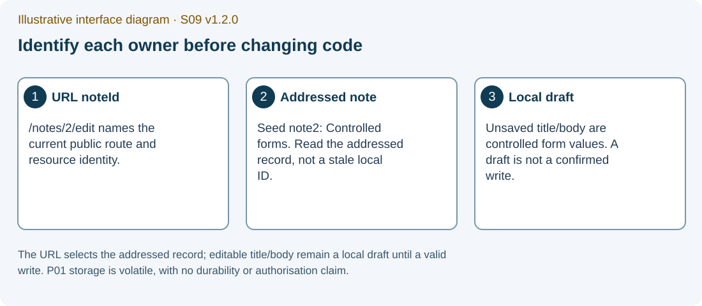

# S09 P02 — Full-Stack Notes CRUD transfer

Conceptual semester-milestone transfer, without a second S09 implementation gate

Version 1.2.1 · EN-GB · PHASE3_LOCAL_REMEDIATION_CANDIDATE_NOT_RUNTIME_QUALIFIED

Application commands below are for your later separately provisioned and authorised teaching environment. No application, test, server, browser or Gemini exchange was executed while producing this candidate.

The matching S09_P02_TRANSFER_GUIDE_EN_GB_v1.2.1.docx and S09_P02_TRANSFER_GUIDE_EN_GB_v1.2.1.pdf are supplied under student/documents. Use FORM_S09_EN_GB.docx under student/form for genuine captures in your one individual final PDF.

One final individual S09 PDF: TW2026_S09_GROUP_Surname_Firstname.pdf.

[Ultra-beginner guide](../guide/S09_INTERACTIVE_ULTRA_BEGINNER_GUIDE_EN_GB_v1.2.1.html) · [Evidence form](../form/FORM_S09_EN_GB.html) · [Moodle upload guide](../moodle/MOODLE_UPLOAD_GUIDE_S09_EN_GB.md)

## 1. A later capstone obligation with a truthful status

During S09, explain the transfer from URL/form ownership to confirmed server notes, local UI draft and submission state. Record actual capstone progress, including NOT_STARTED. Full P02 implementation is a later semester milestone with an unmeasured source estimate 70–90 minutes.

The later assessed file is capstone/p02/student/client/src/NotesWorkspace.jsx. Keep server, API adapter, proxy, fixtures, tests and dependencies exact. P02 is one workspace; no router is required.

The supplied adapter actually exposes list/create/update/remove. The original spec mentions an individual get contract that this supplied API/server does not implement. A POST Location header does not create that GET endpoint.

### Ownership map

| Owner | Concrete state | Economic review interpretation |
| --- | --- | --- |
| Confirmed server notes | Data from a successful API result | The revision acknowledged within the stated server domain |
| Local selection | Selected existing note ID or no selection | Which order/invoice is being reviewed |
| Controlled draft | Editable title/body and new/edit mode | A proposed revision that has not been confirmed |
| Submission state | Pending/error/success status | Whether the proposed revision was accepted or remains unresolved |

IMG-S09-02 — Illustrative interface diagram. The URL selects the addressed record; editable title/body remain a local draft until a valid write. P01 storage is volatile, with no durability or authorisation claim.

## 2. The S09 conceptual task

### TG-01 — Write the confirmed-data versus draft map

**WHERE YOU ARE:** The S09 form’s P02 transfer fields, not an additional implementation session.

**WHAT TO FIND:** p02_transfer_map, p02_integration_status, economic_informatics_transfer and optional p02_evidence_optional.

**EXACT ACTION:** Map one order/invoice review workflow onto confirmed data, selection, draft and submission state.

**WHAT YOU SHOULD SEE:** A cause→observable consequence→economic implication→limit explanation and the actual progress status.

**WHAT TO RECORD:** Your conceptual map and a precise consequence of publishing an unconfirmed or stale revision.

**DO NOT CONTINUE UNLESS:** The record distinguishes proposal from confirmation and describes only the evidence you have.

**IF YOU DO NOT SEE THIS:** Use the ownership table and state NOT_STARTED if no implementation has begun. Optional actual evidence can remain blank.

**STOP CONDITION:** Stop if NOT_STARTED is being hidden or a completed P02 build is being invented to finish S09.

**CONTINUE WITH:** TG-02: explain the supplied API scope.

### TG-02 — State the supplied API operations accurately

**WHERE YOU ARE:** The exact supplied notes-api.js and server/app.js read as source.

**WHAT TO FIND:** list/create/update/remove, collection GET, POST, PUT and DELETE. Source reading is a SOURCE witness.

**EXACT ACTION:** Record the four implemented operations and the limitation that no individual get method is supplied.

**WHAT YOU SHOULD SEE:** A source-grounded API map. The server’s initial note 1 is Server state, not the P01 seed 1/2; fresh P02 creates begin at ID 2.

**WHAT TO RECORD:** p02_transfer_map with source locator and the distinction between P01 volatile store and P02 server-returned data.

**DO NOT CONTINUE UNLESS:** A Location header is not mislabelled proof of a GET route or database persistence.

**IF YOU DO NOT SEE THIS:** Return to the exact adapter/server rather than borrowing a different lecture example’s contract.

**STOP CONDITION:** Stop a claim of an unimplemented endpoint, actual HTTP result or durable database.

**CONTINUE WITH:** TG-03: record lifecycle and confirmation risks for later capstone work.

## 3. Confirmation, read/write order and cleanup

Later implementation must retain server notes only from successful API results. A save click expresses intent; it is not confirmation. Use returned note identity/normalisation rather than the original draft as the confirmed record.

An older refresh can settle after a newer one. A list started before a confirmed write can also settle afterwards and erase that confirmation from the view. These are different orderings to investigate with declared deferred witnesses.

Abort is a cancellation request rather than proof that a non-cooperative promise cannot publish after cleanup. A later callback must still belong to the active session. Repeated submissions also need a declared ownership policy.

A failed load/write should preserve the last confirmed notes and relevant local draft while exposing a stable sanitised error and a retry route. A UI status flag does not, by itself, prove synchronous exclusion of repeated writes.

### Later capstone witness plan

| Situation | Discriminating future witness | Current status |
| --- | --- | --- |
| Two refreshes settle newest then oldest | Actual deferred-order result retains the newer publication | PENDING; no execution in production |
| List begins before a successful write | Older list cannot erase the confirmed returned record | PENDING; separate read/write ordering witness |
| Non-cooperative promise settles after cleanup | Active-session publication rights are revoked | PENDING; aborted signal alone is insufficient |
| Repeated submit or selected-ID change | Only intended write/target owns the result | PENDING; use exact event/session identity |
| HTTP/transport/schema failure | Confirmed notes/draft retained with sanitised retry | PENDING; source adapter support is bounded |

## 4. Later source boundaries and environment blocks

The in-memory server is not a database and local UI confirmation is not a general economic transaction guarantee. Authorisation, durable storage, conflict resolution and accounting correctness are outside this small exercise.

A precise conceptual transfer can be complete while full P02 progress remains NOT_STARTED. That honest separation is part of the learning objective.

### TG-03 — Keep the capstone plan and limits separate

**WHERE YOU ARE:** Your S09 transfer record and the actual later semester milestone plan.

**WHAT TO FIND:** The incomplete NotesWorkspace.jsx, protected canonical adapter/server and separately named support preview.

**EXACT ACTION:** Record the planned later implementation and its real current status.

**WHAT YOU SHOULD SEE:** A transparent capstone plan with PENDING witnesses. The source-preserved standalone launcher has a Windows/path representation limitation; a named support launcher is a derivative, not the assessed server.

**WHAT TO RECORD:** The active source identity and limitations. Preview adapter schema/transport checks do not qualify the original adapter or a complete security contract.

**DO NOT CONTINUE UNLESS:** Full capstone work, environment qualification and support derivatives are labelled distinctly from S09 conceptual completion.

**IF YOU DO NOT SEE THIS:** Keep the canonical source unchanged and use only a separately authorised support route later if needed.

**STOP CONDITION:** Stop any hidden installation, runtime substitution, source rewrite or extra S09 gate.

**CONTINUE WITH:** Finish the conceptual explanation in the same S09 PDF. Pursue the later actual capstone milestone under its published requirements.

