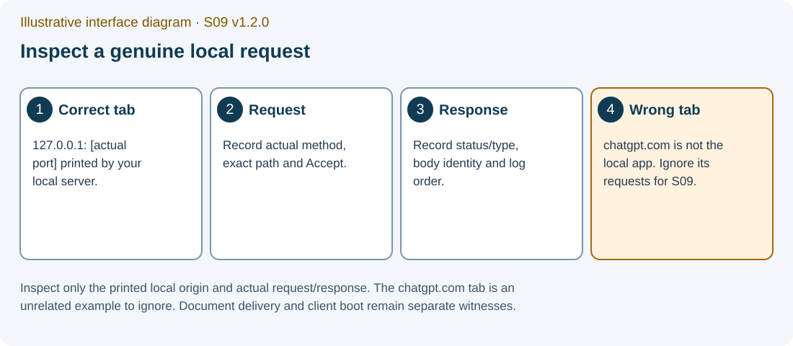

# S09 P03 — Deep-Link Failure Repair

Required individual reproduce–repair–verify portfolio in your one S09 PDF

Version 1.2.1 · EN-GB · PHASE3_LOCAL_REMEDIATION_CANDIDATE_NOT_RUNTIME_QUALIFIED

Application commands below are for your later separately provisioned and authorised teaching environment. No application, test, server, browser or Gemini exchange was executed while producing this candidate.

The matching S09_P03_PORTFOLIO_GUIDE_EN_GB_v1.2.1.docx and S09_P03_PORTFOLIO_GUIDE_EN_GB_v1.2.1.pdf are supplied under student/documents. Use FORM_S09_EN_GB.docx under student/form for genuine captures in your one individual final PDF.

One final individual S09 PDF: TW2026_S09_GROUP_Surname_Firstname.pdf.

## 1. What you must preserve and complete

Change only portfolio/p03/student/server/create-production-app.js. Preserve client-dist, client source, API router, evidence/broken-server.js, server/listen harness, tests, package files and lockfile exactly. The supplied client is already built; build:client is outside this repair.

The source estimate 40–55 minutes is unmeasured. The meeting provides a short hand-off; complete the required individual P03 portfolio later before the actual teacher-set deadline. There is no second P03 upload.

The server decides which HTTP document/resource to send; the client router decides the view only after the application actually boots. A dev-server page or a predicate model does not establish production fallback behaviour.

## 2. Two predictions and an untouched baseline

Write two different falsifiable predictions before collecting any P03 trace: one for nested GET with HTML acceptance across the supplied modes and later repair and one for a missing asset with explicit HTML acceptance. Retain the API-miss control as supplied rather than inventing a broken API response.

Each row records source mode/repair identity, method, path, Accept, before-run prediction, action, actual status/type/body identity/log order, expected–observed difference, evidence class/locator, mechanism and status. Actual observed values begin blank.

### PG-01 — Open the exact assessed P03 file

**WHERE YOU ARE:** Your editor in the extracted assessed portfolio/p03/student directory.

**WHAT TO FIND:** server/create-production-app.js and the neighbouring preserved evidence, API and client-dist files.

**EXACT ACTION:** Open the permitted server/create-production-app.js implementation file.

**WHAT YOU SHOULD SEE:** An incomplete source that delegates to the supplied static-only evidence. The package name/reference heading does not make it a completed repair.

**WHAT TO RECORD:** Allowed path and source/build identities in p03_diff, p03_assets and package_identity.

**DO NOT CONTINUE UNLESS:** You can identify the assessed file and protected fixture without changing the latter.

**IF YOU DO NOT SEE THIS:** Use the assessed directory tree rather than a teacher reference or an older copy.

**STOP CONDITION:** Stop if the client fixture or protected server/API/test would be rewritten to produce the expected contrast.

**CONTINUE WITH:** PG-02: write the two P03 predictions.

### PG-02 — Record the two before-run delivery predictions

**WHERE YOU ARE:** Your evidence record before the later qualified P03 experiment.

**WHAT TO FIND:** p03_prediction and the planned 17-case matrix.

**EXACT ACTION:** Write two predictions with method/path/Accept, mode, expected classification and a falsifying observation.

**WHAT YOU SHOULD SEE:** Two distinct before-run predictions and empty actual-result entries.

**WHAT TO RECORD:** Prediction provenance, exact fixture and mode in p03_case_ledger.

**DO NOT CONTINUE UNLESS:** The prediction is not copied from a recorded trace or silently written retrospectively.

**IF YOU DO NOT SEE THIS:** Mark retrospective notes honestly; choose a new disclosed case for a fresh prediction if needed.

**STOP CONDITION:** Stop a before-run claim whose timing cannot be supported.

**CONTINUE WITH:** PG-03: retain the qualified original-check outputs.

## 3. Execute only in the later qualified environment

Record actual Node/npm, OS and project path. Prescribed Node 24.21.0/npm 11.19.0 are requirements, not observations or claims of current availability. A missing Express/dependency error is BLOCKED/NOT_EXECUTED rather than the intended static-only failure.

The retained optional observer has 13 request entries; the old CSV has 14 including /release.v2. Neither automatically covers the complete planned 17-case contract. Use the original tools only in an explicitly qualified later context and record the exact coverage.

### PG-03A — Retain P03 baseline output

**WHERE YOU ARE:** A later authorised and qualified terminal in portfolio/p03/student.

**WHAT TO FIND:** npm run test:baseline; npm run test:objective; npm run test:regression, each a separate command.

**EXACT ACTION:** Run npm run test:baseline and preserve its actual named output.

**WHAT YOU SHOULD SEE:** Actual baseline/objective/regression results with named assertions. Broken-mode baseline success is evidence that the deliberately broken fixtures behave as designed; it is not a repaired objective PASS.

**WHAT TO RECORD:** Command, cwd, source/test identity, failure class and locator in p03_qualification and record_status_ledger.

**DO NOT CONTINUE UNLESS:** The runner actually completed and you can distinguish a test assertion from environment/reporter failure.

**IF YOU DO NOT SEE THIS:** Preserve the error and leave unexecuted checks pending. Use the separate authorised environment remedy.

**STOP CONDITION:** Stop if the result requires changing protected tests or declaring a missing-dependency error expected.

**CONTINUE WITH:** PG-03B: retain original P03 objective output.

### PG-03B — Retain P03 objective output

**WHERE YOU ARE:** A later authorised and qualified terminal in portfolio/p03/student.

**WHAT TO FIND:** npm run test:baseline; npm run test:objective; npm run test:regression, each a separate command.

**EXACT ACTION:** Run npm run test:objective and preserve its actual named output.

**WHAT YOU SHOULD SEE:** Actual baseline/objective/regression results with named assertions. Broken-mode baseline success is evidence that the deliberately broken fixtures behave as designed; it is not a repaired objective PASS.

**WHAT TO RECORD:** Command, cwd, source/test identity, failure class and locator in p03_qualification and record_status_ledger.

**DO NOT CONTINUE UNLESS:** The runner actually completed and you can distinguish a test assertion from environment/reporter failure.

**IF YOU DO NOT SEE THIS:** Preserve the error and leave unexecuted checks pending. Use the separate authorised environment remedy.

**STOP CONDITION:** Stop if the result requires changing protected tests or declaring a missing-dependency error expected.

**CONTINUE WITH:** PG-03C: retain original P03 regression output.

### PG-03C — Retain P03 regression output

**WHERE YOU ARE:** A later authorised and qualified terminal in portfolio/p03/student.

**WHAT TO FIND:** npm run test:baseline; npm run test:objective; npm run test:regression, each a separate command.

**EXACT ACTION:** Run npm run test:regression and preserve its actual named output.

**WHAT YOU SHOULD SEE:** Actual baseline/objective/regression results with named assertions. Broken-mode baseline success is evidence that the deliberately broken fixtures behave as designed; it is not a repaired objective PASS.

**WHAT TO RECORD:** Command, cwd, source/test identity, failure class and locator in p03_qualification and record_status_ledger.

**DO NOT CONTINUE UNLESS:** The runner actually completed and you can distinguish a test assertion from environment/reporter failure.

**IF YOU DO NOT SEE THIS:** Preserve the error and leave unexecuted checks pending. Use the separate authorised environment remedy.

**STOP CONDITION:** Stop if the result requires changing protected tests or declaring a missing-dependency error expected.

**CONTINUE WITH:** PG-04: start and inspect the current unrepaired source only when qualified; preserve its baseline identity.

### PG-04 — Use the actual server address

**WHERE YOU ARE:** The later qualified terminal in portfolio/p03/student.

**WHAT TO FIND:** npm start, whose harness prints Deep-link server listening at followed by its actual loopback URL.

**EXACT ACTION:** Start the supplied server in that later authorised context and retain the actual printed address.

**WHAT YOU SHOULD SEE:** The actual local loopback server output or a concrete startup error. The terminal remains active until stopped.

**WHAT TO RECORD:** Record the actual current unrepaired source identity, base URL and start outcome. This pre-repair run is not evidence of the later repair.

**DO NOT CONTINUE UNLESS:** The server is running at the recorded local address with the unchanged supplied build.

**IF YOU DO NOT SEE THIS:** Keep the startup error and record NOT_EXECUTED/BLOCKED rather than guessing an address or substituting a dev server.

**STOP CONDITION:** Stop if the address is remote/public, the client was rebuilt or startup is unqualified.

**CONTINUE WITH:** PG-05: collect the declared pre-repair request rows with this source/run identity.

### PG-05 — Collect the method/Accept trace with its actual class

**WHERE YOU ARE:** The authorised local request tool or explicitly gated supplied HTTP observer, not a guessed remote URL.

**WHAT TO FIND:** The planned request row, its method/path/Accept and the exact local base address.

**EXACT ACTION:** Send the chosen local request and preserve the actual response and ordered log.

**WHAT YOU SHOULD SEE:** Actual status, Content-Type, body length/identity and request-log order, or a concrete failure. Browser address-bar navigation alone cannot choose every planned method/Accept combination.

**WHAT TO RECORD:** The complete row in p03_case_ledger with expected–observed difference, class and locator. A loopback HTTP trace does not prove React boot.

**DO NOT CONTINUE UNLESS:** The request really used the declared method/header and source mode and the locator contains actual output.

**IF YOU DO NOT SEE THIS:** Use the qualified local request/harness route with explicit headers. Mark absent rows PENDING; do not invent a header from what a browser probably sent.

**STOP CONDITION:** Stop if a document screenshot is being used as proof of an unobserved HTTP method/header or server log.

**CONTINUE WITH:** PG-06: compare modes and the supplied positive control.

IMG-S09-04 — Illustrative interface diagram. Inspect only the printed local origin and actual request/response. The chatgpt.com tab is an unrelated example to ignore. Document delivery and client boot remain separate witnesses.

## 4. The complete planned request ledger

This is a plan from the source contract. It contains no executed HTTP results. Different source modes and the repaired identity must be stated explicitly. Use literal representative paths here; percent-encoded dots, malformed escapes and case variants remain separately unqualified until actual parser/HTTP evidence is available.

### P03 planned 17 cases

| Case ID | Method/path | Accept | Expected from source, to check later | Observation/status |
| --- | --- | --- | --- | --- |
| P03-NESTED | GET /notes/42 | text/html | static-only:404; universal:index; narrow repaired policy:index HTML; actual browser boot separate | Observed: [blank]; status: PENDING |
| P03-ROOT | GET / | text/html | Built document delivered; exact index body identity | Observed: [blank]; status: PENDING |
| P03-HEAD | HEAD /notes/42 | text/html | Eligible status/headers; empty response body; no inferred React boot | Observed: [blank]; status: PENDING |
| P03-ASSET | GET /assets/app-a1b2c3.js | */* | Existing static bytes/type/cache behaviour; filename is fixed, not proof of content hash | Observed: [blank]; status: PENDING |
| P03-ICON | GET /icon.svg | */* | Actual icon bytes/type preserved | Observed: [blank]; status: PENDING |
| P03-API-MISS | GET /api/missing | text/html | Completing supplied API router returns JSON 404 even in universal broken mode | Observed: [blank]; status: PENDING |
| P03-API-ROOT | GET /api | text/html | Exact API namespace remains outside HTML fallback | Observed: [blank]; status: PENDING |
| P03-API-KNOWN | GET /api/status | application/json | Supplied API response/status/envelope preserved | Observed: [blank]; status: PENDING |
| P03-MISSING-ASSET | GET /assets/missing.js | text/html | Universal broken mode source implies HTML 200 index; narrow policy preserves non-HTML 404 | Observed: [blank]; status: PENDING |
| P03-FILE-LIKE | GET /release.v2 | text/html | Extension-like path excluded, no successful index fallback | Observed: [blank]; status: PENDING |
| P03-METHOD | POST /notes/42 | text/html | No index; stable non-navigation404 or declared policy response, never fabricated success | Observed: [blank]; status: PENDING |
| P03-ACCEPT | GET /notes/42 | application/json | No HTML fallback; record actual content negotiation outcome | Observed: [blank]; status: PENDING |
| P03-NAMESPACE | GET /apiary | text/html | Outside exact/api namespace; canonical startsWith(/api) is documented defect; named private successor eligible navigation | Observed: [blank]; status: PENDING |
| P03-MISSING-INDEX | GET /notes/42 | text/html | Separate missing-index fixture only; sanitised pre-header 500 forwarding, no path/stack leak. This does not witness a post-header stream failure. | Observed: [blank]; status: PENDING |
| P03-POST-HEADER | GET /notes/42 | text/html | Use a separate callback/stream-error fixture. When headersSent is already true, forward the exact error to next(error) without attempting a fresh JSON 500 or second send. Source/captured-callback model and actual Express streaming remain distinct, pending evidence classes. | Observed: [blank]; status: PENDING |
| P03-LATER | GET /notes/42 | text/html | Prior rejection does not poison later eligible request | Observed: [blank]; status: PENDING |
| P03-UNKNOWN-CLIENT | GET /unlisted-client-path | text/html | Narrow server supplies index; actual booted client decides catch-all UI | Observed: [blank]; status: PENDING |

## 5. Repair and verify causality

Describe the boundary order: health/API ownership, real static files, narrowly eligible HTML GET/HEAD navigation and final non-navigation404/error handling. Explain the order using your actual log, not only a generic drawing.

The supplied universal evidence mounts a completing API router first. Its unknown API result can remain JSON 404. Preserve that positive control beside the affected missing-asset case. Do not change middleware to manufacture a different narrative.

The canonical reference’s broad startsWith(/api) rejects /apiary although /apiary is outside the exact /api namespace. Canonical source remains preserved; the active narrow policy distinguishes exact /api and /api/* from the non-API prefix. A source difference is not a current runtime result.

Pre-header missing-index delivery error and post-header stream/callback error require different witnesses. A missing-index fixture cannot prove what happens once headers have already been sent. Sanitised pre-header 500 and exact next(error) delegation after headers must avoid a second response.

### PG-06 — Keep the broken-mode contrast and API control

**WHERE YOU ARE:** The later qualified unchanged static-only and universal fixture experiment.

**WHAT TO FIND:** Nested HTML GET, missing-asset HTML GET and the supplied unknown-API JSON control.

**EXACT ACTION:** Record the actual three contrasts without altering the supplied broken evidence or API router.

**WHAT YOU SHOULD SEE:** Mode-specific actual response classes. The completing API boundary is retained; no API HTML failure is invented.

**WHAT TO RECORD:** p03_static_only, p03_universal, p03_api_control and the corresponding ledger rows.

**DO NOT CONTINUE UNLESS:** The mode/source identity and request headers are known and each actual claim has its own locator.

**IF YOU DO NOT SEE THIS:** Read the supplied middleware order and preserve unresolved rows as PENDING instead of forcing a generic universal-fallback story.

**STOP CONDITION:** Stop if fixtures would be changed to match your initial prediction.

**CONTINUE WITH:** PG-07: implement the one-file repair and explain its decisions.

### PG-07 — Implement only the declared repair file

**WHERE YOU ARE:** The editor at portfolio/p03/student/server/create-production-app.js.

**WHAT TO FIND:** The exact delivery contract and your planned eligibility/error boundaries.

**EXACT ACTION:** Implement your own constrained delivery policy in the permitted file.

**WHAT YOU SHOULD SEE:** Your own source diff using the supplied Express primitives and preserving API/static fixtures. No complete solution is supplied in this public guide.

**WHAT TO RECORD:** p03_diff and p03_middleware: concise cause→request decision→actual witness explanation.

**DO NOT CONTINUE UNLESS:** The change remains one assessed file and does not replace the client catch-all, rebuild assets or add a universal successful fallback.

**IF YOU DO NOT SEE THIS:** Return to the method/Accept/namespace/resource/error cases and explain the unresolved boundary before continuing.

**STOP CONDITION:** Stop if API/build/tests/dependencies are edited or the server would be exposed publicly.

**CONTINUE WITH:** PG-07A: stop the pre-repair server before the original-suite reruns and repaired-source restart.

### PG-07A — Stop the identified pre-repair process

**WHERE YOU ARE:** The terminal of the P03 process started at PG-04, after the permitted file repair has been saved.

**WHAT TO FIND:** That exact local server process and its retained pre-repair source/run identity.

**EXACT ACTION:** Press Ctrl+C in that identified process terminal once.

**WHAT YOU SHOULD SEE:** The process stops and a prompt returns, or a concrete closure block remains.

**WHAT TO RECORD:** Keep the actual stop outcome with the pre-repair record. If no process was started, state NOT_EXECUTED rather than inventing a stop.

**DO NOT CONTINUE UNLESS:** The actual prior process is stopped or its real absent state is known before the repaired-source run.

**IF YOU DO NOT SEE THIS:** Locate the terminal matching PG-04. Preserve an unresolved closure block and do not kill an unrelated process.

**STOP CONDITION:** The process is unrelated, cannot be identified or remains active while a clean restart is being claimed.

**CONTINUE WITH:** PG-07B: rerun the original baseline suite against the saved repair.

### PG-07B — Rerun original P03 baseline after repair

**WHERE YOU ARE:** The qualified terminal in portfolio/p03/student with the permitted repaired file saved and protected source unchanged.

**WHAT TO FIND:** npm run test:baseline from the original supplied package scripts.

**EXACT ACTION:** Run npm run test:baseline once against this saved repair.

**WHAT YOU SHOULD SEE:** The actual named original baseline output or a concrete test/environment block; prior starter output is not reused.

**WHAT TO RECORD:** Retain command, source/test/repair identity, actual status, exact assertion/failure class and a new output locator in p03_qualification.

**DO NOT CONTINUE UNLESS:** This original suite actually completed against the recorded repair, or its truthful block is preserved without a completion claim.

**IF YOU DO NOT SEE THIS:** Preserve failure output and keep required verification pending; modify only create-production-app.js if the contract requires further repair.

**STOP CONDITION:** A protected test/build/API/dependency is altered or pre-repair output is represented as this rerun.

**CONTINUE WITH:** PG-07C: continue the explicit post-repair verification sequence.

### PG-07C — Rerun original P03 objective after repair

**WHERE YOU ARE:** The qualified terminal in portfolio/p03/student with the permitted repaired file saved and protected source unchanged.

**WHAT TO FIND:** npm run test:objective from the original supplied package scripts.

**EXACT ACTION:** Run npm run test:objective once against this saved repair.

**WHAT YOU SHOULD SEE:** The actual named original objective output or a concrete test/environment block; prior starter output is not reused.

**WHAT TO RECORD:** Retain command, source/test/repair identity, actual status, exact assertion/failure class and a new output locator in p03_qualification.

**DO NOT CONTINUE UNLESS:** This original suite actually completed against the recorded repair, or its truthful block is preserved without a completion claim.

**IF YOU DO NOT SEE THIS:** Preserve failure output and keep required verification pending; modify only create-production-app.js if the contract requires further repair.

**STOP CONDITION:** A protected test/build/API/dependency is altered or pre-repair output is represented as this rerun.

**CONTINUE WITH:** PG-07D: continue the explicit post-repair verification sequence.

### PG-07D — Rerun original P03 regression after repair

**WHERE YOU ARE:** The qualified terminal in portfolio/p03/student with the permitted repaired file saved and protected source unchanged.

**WHAT TO FIND:** npm run test:regression from the original supplied package scripts.

**EXACT ACTION:** Run npm run test:regression once against this saved repair.

**WHAT YOU SHOULD SEE:** The actual named original regression output or a concrete test/environment block; prior starter output is not reused.

**WHAT TO RECORD:** Retain command, source/test/repair identity, actual status, exact assertion/failure class and a new output locator in p03_qualification.

**DO NOT CONTINUE UNLESS:** This original suite actually completed against the recorded repair, or its truthful block is preserved without a completion claim.

**IF YOU DO NOT SEE THIS:** Preserve failure output and keep required verification pending; modify only create-production-app.js if the contract requires further repair.

**STOP CONDITION:** A protected test/build/API/dependency is altered or pre-repair output is represented as this rerun.

**CONTINUE WITH:** PG-07E: continue the explicit post-repair verification sequence.

### PG-07E — Start the saved repaired P03 source

**WHERE YOU ARE:** The qualified portfolio/p03/student terminal after the three original-suite reruns and the identified prior process stop.

**WHAT TO FIND:** npm start using the supplied server harness and unchanged client-dist.

**EXACT ACTION:** Run npm start once for the saved repaired source.

**WHAT YOU SHOULD SEE:** The actual server prints its new local address or a concrete startup block.

**WHAT TO RECORD:** Record the new start, repair/source identity and printed base URL; use this run for PG-08/PG-09 ordinary requests and browser observation.

**DO NOT CONTINUE UNLESS:** The identified prior process is stopped, the repair is saved and the actual new local address is retained.

**IF YOU DO NOT SEE THIS:** Preserve a startup failure and keep later HTTP/browser rows pending. Do not reuse a stale server or guess its port.

**STOP CONDITION:** The client is rebuilt, dependencies are installed, the binding is public or an old process is mislabelled the repaired run.

**CONTINUE WITH:** PG-08: collect byte/error witnesses with their separately stated fixture/run identities.

### PG-08 — Retain byte identity and separate error witnesses

**WHERE YOU ARE:** The later qualified request/test evidence with the supplied client-dist untouched.

**WHAT TO FIND:** The existing fixed-name asset, icon, separate missing-index fixture and separate post-header callback/stream fixture.

**EXACT ACTION:** Collect each named byte/error witness separately and retain its actual evidence class.

**WHAT YOU SHOULD SEE:** A real byte comparison or a pending check; independently qualified pre-header/post-header results. app-a1b2c3.js is a fixed configured name rather than a measured content hash.

**WHAT TO RECORD:** p03_assets and p03_qualification with served/local SHA-256 or exact byte equality witness, ordered log, error identity and limits.

**DO NOT CONTINUE UNLESS:** A marker/content-type assertion is not misreported as all-byte equality and a missing-index result is not used for post-header streaming.

**IF YOU DO NOT SEE THIS:** Mark the missing witness PENDING and use a separately named safe fixture later. Keep the original build/evidence exact.

**STOP CONDITION:** Stop if the original fixture would be deleted/changed or a source/callback model is being upgraded to real Express streaming.

**CONTINUE WITH:** PG-09: observe the actual nested browser boot.

## 6. Actual nested browser boot is a separate observation

### PG-09 — Inspect the correct local browser tab

**WHERE YOU ARE:** A real browser tab navigated to the recorded production-loopback base plus /notes/42, after qualified repair.

**WHAT TO FIND:** The actual local address and that tab’s developer tools Network view. Menu labels/shortcuts vary; use your browser’s Developer tools entry if necessary.

**EXACT ACTION:** Inspect the request, loaded local assets and visible route state in that same local tab.

**WHAT YOU SHOULD SEE:** An actual document response followed by actual loaded assets and client view, or a real boot failure. A 200 index response alone is insufficient.

**WHAT TO RECORD:** Initial address, document request, asset evidence, visible Note detail route 42 and evidence locators/class in p03_qualification.

**DO NOT CONTINUE UNLESS:** The tools belong to the local teaching tab rather than Gemini/Moodle/another exercise and the capture reveals no private account data.

**IF YOU DO NOT SEE THIS:** Return to the recorded local tab and reopen its developer tools. If browser observation is unavailable, keep it NOT_EXECUTED and describe the HTTP-only limit.

**STOP CONDITION:** Stop a browser-boot claim from HEAD, marker text, source inspection or a static diagram.

**CONTINUE WITH:** PG-10: include the portfolio and stop the process.

IMG-S09-04 — Illustrative interface diagram. Inspect only the printed local origin and actual request/response. The chatgpt.com tab is an unrelated example to ignore. Document delivery and client boot remain separate witnesses.

IMG-S09-05 — Illustrative interface diagram. Account/token bars are mock redaction labels, not real private data or a runtime screenshot. Capture a safe real region and embed the actual image with its locator in the same PDF.

## 7. One portfolio inside one reviewed S09 PDF

An asset miss disguised as successful HTML can corrupt error indicators in an economic review system. Correct server delivery is necessary for access to a review interface, but does not establish a correct business transaction or user permission.

HTTP/Express, actual browser boot, native Word/PDF review, actual Gemini and Moodle remain different witnesses. The current production phase does not perform them.

### PG-10A — Complete the portfolio record

**WHERE YOU ARE:** Your S09 evidence DOCX/form with P01 and Gemini sections and the terminal you actually started.

**WHAT TO FIND:** p03_prediction through p03_qualification, p03_case_ledger, evidence_index and truthful pending_work.

**EXACT ACTION:** Complete the P03 section of the same individual S09 record using only actual available evidence.

**WHAT YOU SHOULD SEE:** One coherent record using TW2026_S09_GROUP_Surname_Firstname.pdf and an actual process closure outcome. P03 is required; P02 progress remains separate.

**WHAT TO RECORD:** What was falsified, which controls held, source/diff identity, actual checks, untested boundaries and the economic implication.

**DO NOT CONTINUE UNLESS:** The portfolio does not include a private teacher key, a second P03 submission or invented results.

**IF YOU DO NOT SEE THIS:** Preserve the incomplete record as a draft and list the exact remaining work.

**STOP CONDITION:** Stop final technical qualification where required witnesses are absent; use the teacher’s actual remediation/evaluation policy.

**CONTINUE WITH:** PG-10B: stop the actual local process when the observation is finished.

### PG-10B — Stop your local P03 process

**WHERE YOU ARE:** The terminal of the actual P03 local process you started in the qualified activity.

**WHAT TO FIND:** The running local process and that terminal, rather than an unrelated shell.

**EXACT ACTION:** Press Ctrl+C in the terminal of the local P03 process you actually started.

**WHAT YOU SHOULD SEE:** The process stops and the terminal prompt returns, or a concrete unresolved closure error.

**WHAT TO RECORD:** The actual closure outcome where relevant to your reproducible record.

**DO NOT CONTINUE UNLESS:** The process you started is stopped or its actual remaining state is known.

**IF YOU DO NOT SEE THIS:** Check that you selected the correct process terminal and preserve an unresolved closure problem.

**STOP CONDITION:** Stop a claim of clean shutdown while the process remains active or its state is unobserved.

**CONTINUE WITH:** Use the student guide’s SG-21→SG-25 flow: first PDF, reopen every page, then actual Moodle submission and private post-submission status.

