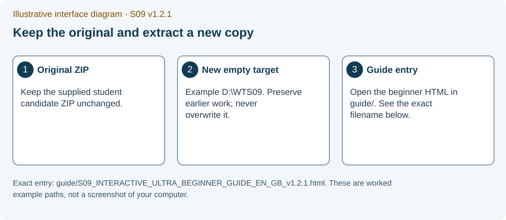
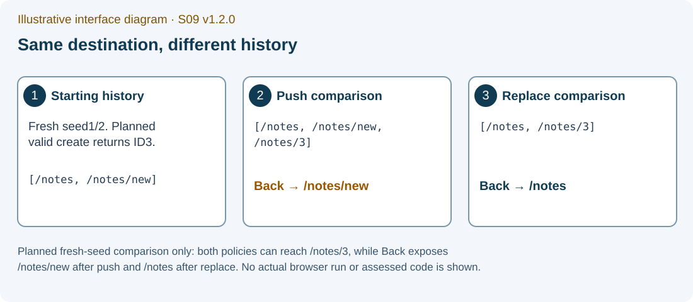
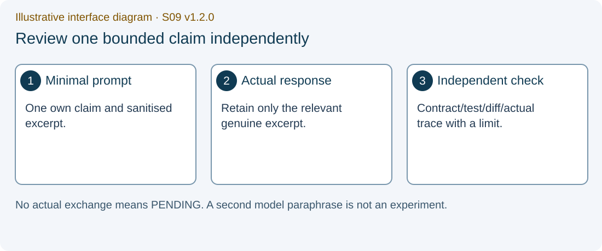
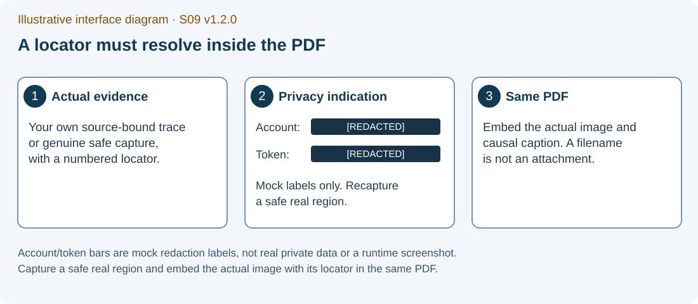
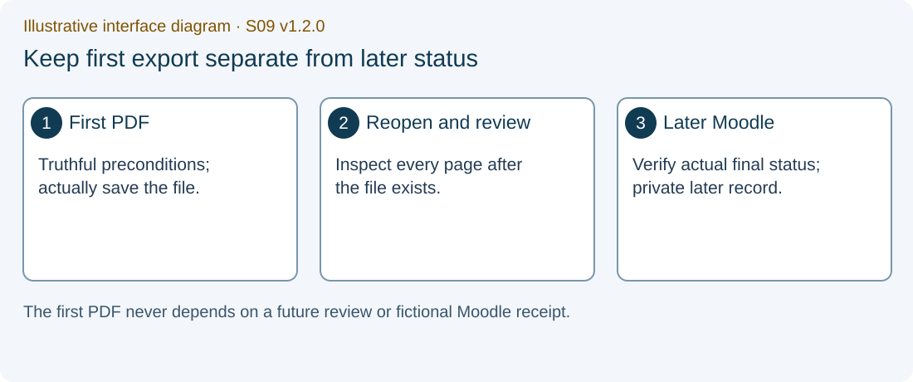

# S09 — Routed Notes Application

Individual P01 work, required P03 repair portfolio and a conceptual P02 transfer

Version 1.2.1 · EN-GB · PHASE3_LOCAL_REMEDIATION_CANDIDATE_NOT_RUNTIME_QUALIFIED

Application commands below are for your later separately provisioned and authorised teaching environment. No application, test, server, browser or Gemini exchange was executed while producing this candidate.

The matching S09_STUDENT_GUIDE_EN_GB_v1.2.1.docx and S09_STUDENT_GUIDE_EN_GB_v1.2.1.pdf are supplied under student/documents. Use FORM_S09_EN_GB.docx under student/form for genuine captures in your one individual final PDF.

One final individual S09 PDF: TW2026_S09_GROUP_Surname_Firstname.pdf.

## 1. Your work and the four owners

P01 Routed Notes is the central complete implementation. P03 Deep-Link Failure Repair is a required individual portfolio in the same final S09 PDF. P02 Full-Stack Notes CRUD is a conceptual transfer to the semester milestone; its complete implementation is not an extra S09 completion gate.

Ask who owns the address, the editable draft, the confirmed resource and the initial HTML document. A correct-looking screen alone cannot answer all four questions.

The source estimates are 55–65 minutes for P01, 40–55 minutes for P03 and 70–90 minutes for later P02 work. These are source estimates rather than measured completion times. Your P01 segment in the meeting is smaller than the entire requirement.

### Assessed boundaries

| Role | Project root | Only assessed file you may implement |
| --- | --- | --- |
| Central complete P01 | projects/p01/student | src/NotesApp.jsx |
| Required individual P03 | portfolio/p03/student | server/create-production-app.js |
| Later capstone P02 | capstone/p02/student | client/src/NotesWorkspace.jsx |

IMG-S09-02 — Illustrative interface diagram. The URL selects the addressed record; editable title/body remain a local draft until a valid write. P01 storage is volatile, with no durability or authorisation claim.

## 2. The meeting and the content STOP

The meeting has 60 content minutes and 30 logistics minutes: attendance and positioning 10, incidents 5, draft/form saving 10 and orientation for later submission 5. The teacher may pause the content clock for logistics. Logistics does not become implementation overflow or dependency-install time.

At content minute 60, stop and save a truthful draft. Complete the remaining required P01, P03 and genuine Gemini work before the actual deadline later set by your teacher. No deadline or Moodle activity is invented by this package.

### 60-minute content route

| Content minutes | Individual activity | Fields to retain |
| --- | --- | --- |
| 00–05 | Identify source and environment; write two P01 predictions | package_identity; actual_environment; fixture; p01_prediction |
| 05–12 | Map route, parameters, view and history | route_owner_map; history_policy |
| 12–30 | Complete an individual implementation segment in the allowed P01 file | permitted_edit; pending_work |
| 30–38 | Collect the available P01 witnesses honestly | p01_case_ledger; p01_test_results; link_history_trace |
| 38–44 | Ask Gemini Web about one actual claim | gemini_mode; gemini_prompt; gemini_claim |
| 44–49 | Check independently, give a verdict and state a limit | independent_check; gemini_verdict; correction_limit |
| 49–55 | Write two P03 predictions; map P02 as later capstone work | p03_prediction; p03_case_ledger; p02_transfer_map |
| 55–60 | Export a truthful draft and stop | pre_export_checklist; pending_work; exit_ticket |

## 3. Keep the source and find your place

### SG-01 — Extract to a new short directory

**WHERE YOU ARE:** Windows File Explorer, looking at the supplied S09 student ZIP. A later authorised teaching setup is assumed.

**WHAT TO FIND:** The original ZIP and a new empty destination such as D:\TW2026\S09_v1.2.1. The example is a destination, not a mandatory existing folder.

**EXACT ACTION:** Use the ZIP extraction command, commonly Extract All and choose the new destination. Labels may vary with your Windows configuration.

**WHAT YOU SHOULD SEE:** An ordinary extracted directory containing the student start files and the guide, form, projects, portfolio and capstone directories.

**WHAT TO RECORD:** The original ZIP name and the exact extracted path in package_identity. Keep the original ZIP.

**DO NOT CONTINUE UNLESS:** You are reading the extracted files rather than working inside the ZIP and the destination did not overwrite older work.

**IF YOU DO NOT SEE THIS:** Return to the extraction result and locate the actual student root. Use a fresh destination if you chose an existing exercise folder.

**STOP CONDITION:** Stop if extraction failed, files are missing or existing source files would be overwritten.

**CONTINUE WITH:** SG-02: open the offline guide.

### SG-02 — Open the offline learning route

**WHERE YOU ARE:** The extracted student root in File Explorer.

**WHAT TO FIND:** guide/S09_INTERACTIVE_ULTRA_BEGINNER_GUIDE_EN_GB_v1.2.1.html.

**EXACT ACTION:** Open that HTML file in your browser.

**WHAT YOU SHOULD SEE:** The S09 ultra-beginner guide with its contents, progress controls and the current-step explanation. Opening this document does not start React or Express.

**WHAT TO RECORD:** The source/version you are reading. A figure caption saying Illustrative interface diagram is not your runtime evidence.

**DO NOT CONTINUE UNLESS:** The page identifies S09 v1.2.1 and its relative project/form paths match the extracted package.

**IF YOU DO NOT SEE THIS:** Use the extracted directory, not an older browser tab or a ZIP preview. If script features are unavailable, read the static companion or DOCX.

**STOP CONDITION:** Stop an application claim if you opened a Vite entry HTML file by double-clicking; that is not a Vite build or server observation.

**CONTINUE WITH:** SG-03: open the assessed source in your editor.

IMG-S09-01 — Illustrative interface diagram. Exact entry: guide/S09_INTERACTIVE_ULTRA_BEGINNER_GUIDE_EN_GB_v1.2.1.html. These are worked example paths, not a screenshot of your computer.

## 4. Editor, terminal and truthful environment

The historical project README and spec files remain byte-preserved. Their old implementation-sized Gemini tasks and dependency-acquisition instructions do not define this active bounded teaching route. Package names containing reference also do not turn the supplied incomplete starter into a completed solution.

Keep stores, adapters, fixtures, tests, entry files, CSS, package files and lockfiles exact. P03 consumes client-dist exactly as supplied. A boundary-only integrity verdict is independent of the correctness of your implementation.

### SG-03 — Open the permitted P01 file

**WHERE YOU ARE:** Your editor with the extracted student directory open as a folder.

**WHAT TO FIND:** projects/p01/student/src/NotesApp.jsx and the neighbouring protected files.

**EXACT ACTION:** Open src/NotesApp.jsx in the P01 assessed tree.

**WHAT YOU SHOULD SEE:** An intentionally incomplete starter. Reading the file is not a passing objective test.

**WHAT TO RECORD:** The exact permitted path in permitted_edit. Record your concise allowed-file diff later.

**DO NOT CONTINUE UNLESS:** The file is inside the assessed projects/p01/student tree and you have read its contract and exact spec.

**IF YOU DO NOT SEE THIS:** Use the editor folder tree to locate the assessed P01 tree. A teacher reference or another version is not the starter.

**STOP CONDITION:** Stop if completing the task would require editing a protected file or copying a complete teacher implementation.

**CONTINUE WITH:** SG-04: open a terminal in the project directory.

### SG-04 — Start a terminal in the correct folder

**WHERE YOU ARE:** File Explorer at projects/p01/student inside the extracted student package.

**WHAT TO FIND:** The folder address bar. On Windows, typing cmd there is one way to open Command Prompt at that path.

**EXACT ACTION:** Enter cmd in that folder address bar and press Enter, or use your editor’s equivalent terminal-in-folder action.

**WHAT YOU SHOULD SEE:** A terminal whose working directory is projects/p01/student. The exact terminal UI can differ.

**WHAT TO RECORD:** The actual project path in actual_environment. On macOS/Linux, use your terminal or editor and confirm the equivalent path.

**DO NOT CONTINUE UNLESS:** The prompt or working-directory display refers to the correct project rather than its parent folder.

**IF YOU DO NOT SEE THIS:** Close the wrongly located terminal and reopen it from the assessed project directory. Do not copy commands into an unrelated folder.

**STOP CONDITION:** Stop if you cannot establish the working directory or the folder is read-only.

**CONTINUE WITH:** SG-05: record the actual runtime before any application run.

### SG-05A — Record actual Node

**WHERE YOU ARE:** The qualified teaching terminal in projects/p01/student, before an application command.

**WHAT TO FIND:** node --version. The prescribed Node version is 24.21.0.

**EXACT ACTION:** Run node --version and retain its actual output.

**WHAT YOU SHOULD SEE:** Actual version output or a concrete missing-command error. A prescribed version string is not an observation or proof of current availability.

**WHAT TO RECORD:** Actual Node/npm, operating system, project path and browser where used in actual_environment. Record a block in environment_limit.

**DO NOT CONTINUE UNLESS:** The separately provisioned environment satisfies the actual teaching requirement and needed dependencies are already available.

**IF YOU DO NOT SEE THIS:** Preserve the error and draft as NOT_EXECUTED/BLOCKED. Ask for the separately authorised environment remedy at the later appropriate gate.

**STOP CONDITION:** Stop application runs for missing or unqualified dependencies/runtime. This guide does not authorise an installation or an environment replacement.

**CONTINUE WITH:** SG-05B: record the actual npm version.

### SG-05B — Record actual npm

**WHERE YOU ARE:** The qualified teaching terminal in projects/p01/student, before an application command.

**WHAT TO FIND:** npm --version. The prescribed npm version is 11.19.0.

**EXACT ACTION:** Run npm --version and retain its actual output.

**WHAT YOU SHOULD SEE:** Actual version output or a concrete missing-command error. A prescribed version string is not an observation or proof of current availability.

**WHAT TO RECORD:** Actual Node/npm, operating system, project path and browser where used in actual_environment. Record a block in environment_limit.

**DO NOT CONTINUE UNLESS:** The separately provisioned environment satisfies the actual teaching requirement and needed dependencies are already available.

**IF YOU DO NOT SEE THIS:** Preserve the error and draft as NOT_EXECUTED/BLOCKED. Ask for the separately authorised environment remedy at the later appropriate gate.

**STOP CONDITION:** Stop application runs for missing or unqualified dependencies/runtime. This guide does not authorise an installation or an environment replacement.

**CONTINUE WITH:** SG-06: write predictions before the first P01 experiment.

## 5. Predict ownership before running

The supplied P01 store starts with ID 1 “URL state” and body “The address identifies the current screen.” ID 2 is “Controlled forms” with body “React state owns editable values.” Its fresh deterministic counter starts at ID 3.

The store is synchronous and volatile. A genuinely new store returns to seed 1/2. That reset does not disprove a completed create in the earlier store and does not provide database persistence.

Write at least two distinct P01 predictions before observation. One concerns successful create from an explicit list/new history; the other concerns whitespace-title rejection with no write or navigation. State an initial condition, predicted mechanism and observation that would falsify each claim. Label retrospective entries explicitly.

### SG-06 — Write two P01 predictions

**WHERE YOU ARE:** The evidence form or FORM_S09_EN_GB.docx, before running P01.

**WHAT TO FIND:** p01_prediction, fixture and history_policy.

**EXACT ACTION:** Write your two before-run P01 predictions with falsifiers and the exact initial seed/history.

**WHAT YOU SHOULD SEE:** Two different predictions and still-blank observed fields. From a fresh seed, the first valid create returns ID 3; do not assume ID 3 after earlier creates.

**WHAT TO RECORD:** Prediction time/order, seed/store lifetime and explicit stack/index where relevant. Use p01_case_ledger for individual cases.

**DO NOT CONTINUE UNLESS:** The predictions precede the related observations and do not copy observed values from an expected-result table.

**IF YOU DO NOT SEE THIS:** Keep the observation blank/PENDING and complete the prediction. If a run already happened, mark that entry retrospective and use a fresh, disclosed experiment for a new prediction.

**STOP CONDITION:** Stop a claim of before-run provenance if the prediction was written afterwards.

**CONTINUE WITH:** SG-07: map the address and the form owners.

### SG-07 — Map route, parameter and view ownership

**WHERE YOU ARE:** Your form and the exact P01 contract/spec, without implementing another route owner.

**WHAT TO FIND:** The list, new, detail, edit, missing-note and unknown-page states.

**EXACT ACTION:** Fill route_owner_map and form_owner_map with the owner of each relevant value.

**WHAT YOU SHOULD SEE:** The URL owns route and noteId; the form owns temporary title/body; the supplied store owns its local confirmed notes. Missing data and unknown route remain separate.

**WHAT TO RECORD:** An exact route/parameter/view table and one stale-identity risk. Do not deduce authorisation from a URL.

**DO NOT CONTINUE UNLESS:** The editable draft is separate from the addressed note and a form body cannot override resource identity.

**IF YOU DO NOT SEE THIS:** Return to the four-owner question and the supplied store contract. Explain the distinction before adding implementation code.

**STOP CONDITION:** Stop if noteId is mirrored as a competing component-state owner or if the protected store is being changed.

**CONTINUE WITH:** SG-08: identify the original check outcomes truthfully.

IMG-S09-02 — Illustrative interface diagram. The URL selects the addressed record; editable title/body remain a local draft until a valid write. P01 storage is volatile, with no durability or authorisation claim.

IMG-S09-03 — Illustrative interface diagram. Planned fresh-seed comparison only: both policies can reach /notes/3, while Back exposes /notes/new after push and /notes after replace. No actual browser run or assessed code is shown.

## 6. Implement and observe P01 individually

Implement the complete assessed requirements only in NotesApp.jsx: semantic list links and empty state, URL-param detail/edit identity, a shared controlled NoteForm, trim/blank validation, successful create/edit replacement, declarative no-write Cancel, root replacement, stable missing-note view and distinct unknown-page view.

The original objective suite includes named route, form, identity and target-reset checks. Its end-address assertions do not independently prove all history replacement. Keep exact command/test names and use the separate stack-sensitive witness.

### SG-08A — Retain P01 baseline output

**WHERE YOU ARE:** A separately provisioned and authorised terminal at projects/p01/student.

**WHAT TO FIND:** npm run test:baseline; npm run test:objective; npm run test:regression. Run each as a separate command.

**EXACT ACTION:** Run npm run test:baseline and preserve its actual named output.

**WHAT YOU SHOULD SEE:** The actual reporter output and named assertions. The starter is intentionally incomplete; an unavailable objective is different from parser failure, missing dependency, timeout or crash.

**WHAT TO RECORD:** Command, path, source/test identity, assertion name, actual outcome and locator in p01_test_results and record_status_ledger.

**DO NOT CONTINUE UNLESS:** You can identify what actually ran and the exact failure class. Neither a generic FAIL nor an intended starter boundary excuses an unrelated technical error.

**IF YOU DO NOT SEE THIS:** Preserve the concrete error and keep that check NOT_EXECUTED/BLOCKED where appropriate. Use the qualified environment remedy rather than editing tests.

**STOP CONDITION:** Stop if the reporter did not run correctly, a protected file changed or a failed technical run is being relabelled expected.

**CONTINUE WITH:** SG-08B: retain the original P01 objective output.

### SG-08B — Retain P01 objective output

**WHERE YOU ARE:** A separately provisioned and authorised terminal at projects/p01/student.

**WHAT TO FIND:** npm run test:baseline; npm run test:objective; npm run test:regression. Run each as a separate command.

**EXACT ACTION:** Run npm run test:objective and preserve its actual named output.

**WHAT YOU SHOULD SEE:** The actual reporter output and named assertions. The starter is intentionally incomplete; an unavailable objective is different from parser failure, missing dependency, timeout or crash.

**WHAT TO RECORD:** Command, path, source/test identity, assertion name, actual outcome and locator in p01_test_results and record_status_ledger.

**DO NOT CONTINUE UNLESS:** You can identify what actually ran and the exact failure class. Neither a generic FAIL nor an intended starter boundary excuses an unrelated technical error.

**IF YOU DO NOT SEE THIS:** Preserve the concrete error and keep that check NOT_EXECUTED/BLOCKED where appropriate. Use the qualified environment remedy rather than editing tests.

**STOP CONDITION:** Stop if the reporter did not run correctly, a protected file changed or a failed technical run is being relabelled expected.

**CONTINUE WITH:** SG-08C: retain the original P01 regression output.

### SG-08C — Retain P01 regression output

**WHERE YOU ARE:** A separately provisioned and authorised terminal at projects/p01/student.

**WHAT TO FIND:** npm run test:baseline; npm run test:objective; npm run test:regression. Run each as a separate command.

**EXACT ACTION:** Run npm run test:regression and preserve its actual named output.

**WHAT YOU SHOULD SEE:** The actual reporter output and named assertions. The starter is intentionally incomplete; an unavailable objective is different from parser failure, missing dependency, timeout or crash.

**WHAT TO RECORD:** Command, path, source/test identity, assertion name, actual outcome and locator in p01_test_results and record_status_ledger.

**DO NOT CONTINUE UNLESS:** You can identify what actually ran and the exact failure class. Neither a generic FAIL nor an intended starter boundary excuses an unrelated technical error.

**IF YOU DO NOT SEE THIS:** Preserve the concrete error and keep that check NOT_EXECUTED/BLOCKED where appropriate. Use the qualified environment remedy rather than editing tests.

**STOP CONDITION:** Stop if the reporter did not run correctly, a protected file changed or a failed technical run is being relabelled expected.

**CONTINUE WITH:** SG-09: continue your allowed-file implementation segment.

### SG-09 — Work in the one permitted implementation file

**WHERE YOU ARE:** The editor at projects/p01/student/src/NotesApp.jsx and your route/form owner map.

**WHAT TO FIND:** The exact P01 spec and the planned 11-case ledger below.

**EXACT ACTION:** Implement the next contract requirement in the allowed file and retain a concise causal change note.

**WHAT YOU SHOULD SEE:** Your own implementation progress, not an automatic completed project. The meeting allows an 18-minute segment here.

**WHAT TO RECORD:** Allowed-file diff, the behaviour you intended to change and remaining work in pending_work.

**DO NOT CONTINUE UNLESS:** Protected source and tests remain exact, the change matches the contract and you can explain the owner of each state.

**IF YOU DO NOT SEE THIS:** Revisit the specification and your ownership map. Record the unresolved step; use the teacher’s bounded support route later if necessary.

**STOP CONDITION:** Stop at content minute 60 even if the implementation is incomplete. A draft is the truthful meeting outcome.

**CONTINUE WITH:** SG-09A: start the qualified P01 development process.

### SG-09A — Start the qualified P01 development process

**WHERE YOU ARE:** The qualified terminal in projects/p01/student after saving your permitted-file work.

**WHAT TO FIND:** npm run dev and the terminal of this exact supplied P01 project.

**EXACT ACTION:** Run npm run dev once.

**WHAT YOU SHOULD SEE:** The actual Vite process prints its local address, or a concrete startup block appears.

**WHAT TO RECORD:** Record command, cwd, source identity, actual address and process terminal in p01_test_results and actual_environment.

**DO NOT CONTINUE UNLESS:** The runtime/dependencies are already qualified and this exact process has actually started.

**IF YOU DO NOT SEE THIS:** Preserve a startup error and keep browser cases NOT_EXECUTED. If this same qualified process is already running, retain its actual start/address record without launching another.

**STOP CONDITION:** A hidden install, protected configuration edit, remote binding or a second unrelated process would be needed.

**CONTINUE WITH:** SG-09B: open the printed P01 address in a dedicated tab.

### SG-09B — Open the printed P01 address

**WHERE YOU ARE:** The terminal displaying the qualified P01 process address.

**WHAT TO FIND:** The exact local URL printed by that process, including its actual port.

**EXACT ACTION:** Open that printed URL in a dedicated browser tab.

**WHAT YOU SHOULD SEE:** The current P01 implementation or honest unavailable starter state appears at the matching local origin.

**WHAT TO RECORD:** Record the initial address/view, source identity and store lifetime; prepare each case using its declared fixture and record any additional navigation.

**DO NOT CONTINUE UNLESS:** The browser tab belongs to this actual P01 run and the first observation has its disclosed starting state.

**IF YOU DO NOT SEE THIS:** Use the printed address rather than a guessed default port. Keep a wrong-tab or startup block visible and use the ultra-beginner module07/08 route for exact case setup.

**STOP CONDITION:** A source HTML file, stale localhost process, remote page or unrecorded history would be substituted for this run.

**CONTINUE WITH:** SG-10A: observe the prepared valid create; keep its immediate Back/Forward witness next.

### SG-10A — Observe one valid trimmed create

**WHERE YOU ARE:** The actual running local P01 browser page, reached through the URL printed by npm run dev in the authorised environment.

**WHAT TO FIND:** The /notes list, New note link and the Title, Body, Save note and Cancel controls.

**EXACT ACTION:** With your planned valid Title/Body entered and initial state recorded, activate Save note once.

**WHAT YOU SHOULD SEE:** The actual created-detail view with the returned store identity and trimmed values. The first create in a disclosed fresh seed returns ID 3; later creates need their actual returned ID.

**WHAT TO RECORD:** Input, action, actual address/content, difference, write witness, evidence class and locator in create_trace and p01_case_ledger. An observed blank field stays blank until this happens.

**DO NOT CONTINUE UNLESS:** The before/after state and source identity are known. A visible error alone does not prove zero writes.

**IF YOU DO NOT SEE THIS:** Record the actual difference or missing witness and keep the case pending. Do not fill the observed column from this guide.

**STOP CONDITION:** Stop if the browser tab belongs to a different exercise, the server is unavailable or a model is being described as an actual browser run.

**CONTINUE WITH:** SG-11A: observe Back immediately after this successful save, before other form experiments.

### SG-11A — Observe Back after the planned successful save

**WHERE YOU ARE:** Your actual P01 route experiment or the named MemoryRouter test, with the evidence class labelled.

**WHAT TO FIND:** An explicit initial list/new stack and the successful save destination. Also plan root and edit replacement separately.

**EXACT ACTION:** Use Back once after the successful save from your explicit recorded history.

**WHAT YOU SHOULD SEE:** Your actual previous history entry after Back. Compare it with the explicit successful-save replacement policy for the recorded initial stack.

**WHAT TO RECORD:** link_history_trace, history_policy and P01-CREATE or the other relevant case. Label MemoryRouter/component evidence separately from REAL_BROWSER.

**DO NOT CONTINUE UNLESS:** You can reconstruct the starting history and distinguish navigation history from a fresh store/document start.

**IF YOU DO NOT SEE THIS:** Begin a disclosed fresh history experiment. Preserve the earlier result as limited rather than silently assuming what the history contained.

**STOP CONDITION:** Stop a replacement conclusion based only on the ending URL or a source keyword.

**CONTINUE WITH:** SG-11B: observe Forward after this recorded Back action.

### SG-11B — Observe Forward afterwards

**WHERE YOU ARE:** The same running P01 history experiment immediately after its recorded Back action.

**WHAT TO FIND:** An explicit initial list/new stack and the successful save destination. Also plan root and edit replacement separately.

**EXACT ACTION:** Use Forward once after the recorded Back observation.

**WHAT YOU SHOULD SEE:** Your actual next history entry after Forward. Keep the returned detail identity and its visible content alongside the address.

**WHAT TO RECORD:** link_history_trace, history_policy and P01-CREATE or the other relevant case. Label MemoryRouter/component evidence separately from REAL_BROWSER.

**DO NOT CONTINUE UNLESS:** You can reconstruct the starting history and distinguish navigation history from a fresh store/document start.

**IF YOU DO NOT SEE THIS:** Begin a disclosed fresh history experiment. Preserve the earlier result as limited rather than silently assuming what the history contained.

**STOP CONDITION:** Stop a replacement conclusion based only on the ending URL or a source keyword.

**CONTINUE WITH:** SG-10B: prepare and disclose the separate whitespace-title case after preserving this Back/Forward pair.

### SG-10B — Observe whitespace-title rejection

**WHERE YOU ARE:** A separately prepared and recorded P01 new/edit form in this qualified local run; this is not the preceding successful-save history witness.

**WHAT TO FIND:** The /notes list, New note link and the Title, Body, Save note and Cancel controls.

**EXACT ACTION:** With a whitespace-only Title in the recorded new/edit state, activate Save note once.

**WHAT YOU SHOULD SEE:** An accessible validation error, unchanged address/store and zero create/update calls. Retain the draft rather than confirming a write.

**WHAT TO RECORD:** Input, action, actual address/content, difference, write witness, evidence class and locator in create_trace and p01_case_ledger. An observed blank field stays blank until this happens.

**DO NOT CONTINUE UNLESS:** The before/after state and source identity are known. A visible error alone does not prove zero writes.

**IF YOU DO NOT SEE THIS:** Record the actual difference or missing witness and keep the case pending. Do not fill the observed column from this guide.

**STOP CONDITION:** Stop if the browser tab belongs to a different exercise, the server is unavailable or a model is being described as an actual browser run.

**CONTINUE WITH:** SG-10C: observe the separate no-write Cancel case.

### SG-10C — Observe no-write Cancel

**WHERE YOU ARE:** The recorded new/edit form after the separate whitespace-title case, with its retained unsaved draft.

**WHAT TO FIND:** The /notes list, New note link and the Title, Body, Save note and Cancel controls.

**EXACT ACTION:** With an unsaved draft in the recorded new/edit state, activate the declarative Cancel link once.

**WHAT YOU SHOULD SEE:** New-form Cancel goes to the list; existing-edit Cancel goes to the addressed detail. Store content is unchanged.

**WHAT TO RECORD:** Input, action, actual address/content, difference, write witness, evidence class and locator in create_trace and p01_case_ledger. An observed blank field stays blank until this happens.

**DO NOT CONTINUE UNLESS:** The before/after state and source identity are known. A visible error alone does not prove zero writes.

**IF YOU DO NOT SEE THIS:** Record the actual difference or missing witness and keep the case pending. Do not fill the observed column from this guide.

**STOP CONDITION:** Stop if the browser tab belongs to a different exercise, the server is unavailable or a model is being described as an actual browser run.

**CONTINUE WITH:** SG-12A: check the separate edit-target transition witness.

### SG-12A — Record same-router edit-target change

**WHERE YOU ARE:** The named P01 component tests and, separately, the authorised local browser route where available.

**WHAT TO FIND:** The original test “navigating between edit IDs reinitialises the route-owned form”, missing detail/edit 99 and unknown client path cases.

**EXACT ACTION:** Record the exact output of the named same-router edit-target-change witness.

**WHAT YOU SHOULD SEE:** The named same-router edit 1→edit 2 witness records fields belonging to note 2 or an actual failure. The test harness control Edit second is test-only.

**WHAT TO RECORD:** edit_trace, unknown_route_trace and relevant p01_case_ledger rows, including initial path, exact visible content and source identity.

**DO NOT CONTINUE UNLESS:** A full document reload is distinguished from a same-router target transition and a client view is not labelled HTTP 404 without an HTTP witness.

**IF YOU DO NOT SEE THIS:** Use the named component witness for the same-router condition and state a browser limitation if that exact transition has not been observed there.

**STOP CONDITION:** Stop if a test-only control is assumed to exist in the browser or if another note’s form appears for a missing target.

**CONTINUE WITH:** SG-12B: record missing detail/edit targets separately.

### SG-12B — Record a missing-note route

**WHERE YOU ARE:** The named P01 component tests and, separately, the authorised local browser route where available.

**WHAT TO FIND:** The original test “navigating between edit IDs reinitialises the route-owned form”, missing detail/edit 99 and unknown client path cases.

**EXACT ACTION:** Observe one declared missing-note route and retain its actual visible state. Record detail 99 and edit 99 separately when applying this step to each.

**WHAT YOU SHOULD SEE:** A stable Note not found view for the missing addressed record, with no unintended edit form, write or crash.

**WHAT TO RECORD:** edit_trace, unknown_route_trace and relevant p01_case_ledger rows, including initial path, exact visible content and source identity.

**DO NOT CONTINUE UNLESS:** A full document reload is distinguished from a same-router target transition and a client view is not labelled HTTP 404 without an HTTP witness.

**IF YOU DO NOT SEE THIS:** Use the named component witness for the same-router condition and state a browser limitation if that exact transition has not been observed there.

**STOP CONDITION:** Stop if a test-only control is assumed to exist in the browser or if another note’s form appears for a missing target.

**CONTINUE WITH:** SG-12C: record the distinct unknown-page view.

### SG-12C — Record the unknown client page

**WHERE YOU ARE:** The named P01 component tests and, separately, the authorised local browser route where available.

**WHAT TO FIND:** The original test “navigating between edit IDs reinitialises the route-owned form”, missing detail/edit 99 and unknown client path cases.

**EXACT ACTION:** Observe /unknown in the already booted client or named MemoryRouter witness and retain its actual view.

**WHAT YOU SHOULD SEE:** A Page not found client view distinct from missing note data. It is not an HTTP 404 claim without an HTTP response witness.

**WHAT TO RECORD:** edit_trace, unknown_route_trace and relevant p01_case_ledger rows, including initial path, exact visible content and source identity.

**DO NOT CONTINUE UNLESS:** A full document reload is distinguished from a same-router target transition and a client view is not labelled HTTP 404 without an HTTP witness.

**IF YOU DO NOT SEE THIS:** Use the named component witness for the same-router condition and state a browser limitation if that exact transition has not been observed there.

**STOP CONDITION:** Stop if a test-only control is assumed to exist in the browser or if another note’s form appears for a missing target.

**CONTINUE WITH:** SG-13: record build and qualified browser status independently.

### SG-13A — Retain the actual P01 build result

**WHERE YOU ARE:** The qualified P01 terminal and your own evidence record.

**WHAT TO FIND:** npm run build and the actual local URL printed by npm run dev, run only when authorised and available.

**EXACT ACTION:** Run npm run build and preserve its actual output.

**WHAT YOU SHOULD SEE:** A real build result or a concrete block. Build completion alone does not establish browser history or production P03 document delivery.

**WHAT TO RECORD:** Named BUILD output and REAL_BROWSER status/locators in p01_test_results. Use truthful NOT_EXECUTED or BLOCKED for absent witnesses.

**DO NOT CONTINUE UNLESS:** Each conclusion is supported by the correct evidence class and no unexecuted check is marked PASS.

**IF YOU DO NOT SEE THIS:** Retain the source/record and list the exact missing witness in pending_work rather than substituting a model.

**STOP CONDITION:** Stop a technical-completion claim when required evidence is still absent; the record may still be exported honestly.

**CONTINUE WITH:** SG-13B: verify the current P01 development process identity without starting a second process.

### SG-13B — Verify the current P01 development process identity

**WHERE YOU ARE:** The P01 process terminal already identified at SG-09A/SG-09B, and the dedicated local browser tab.

**WHAT TO FIND:** The recorded npm run dev start/address and the actual still-running process for that same source identity.

**EXACT ACTION:** Compare the current process/tab identity with the saved start/address record.

**WHAT YOU SHOULD SEE:** The matching local process and origin remain identifiable, or an actual stopped/stale process is reported. Do not start a second process automatically.

**WHAT TO RECORD:** Retain the actual start record and source/run identity; label browser checks separately from the build result.

**DO NOT CONTINUE UNLESS:** Each conclusion is supported by the correct evidence class and no unexecuted check is marked PASS.

**IF YOU DO NOT SEE THIS:** If the intended process has stopped, return to SG-09A for a disclosed new start and record the new run identity before repeating a browser case.

**STOP CONDITION:** Stop a technical-completion claim when required evidence is still absent; the record may still be exported honestly.

**CONTINUE WITH:** SG-14: write the required P03 hand-off predictions.

### P01 planned cases — never prefilled observations

| Case ID | Initial condition and action | Expected from source, to check later | Observation/status |
| --- | --- | --- | --- |
| P01-ROOT | explicit stack ['/unknown', '/'] with index 1 → Initialise at / | /notes rendered; root transition replaces the root entry; Back exposes /unknown without an intervening root entry | Observed: [blank]; status: PENDING |
| P01-DIRECT | Fresh supplied store: note 1 URL state; note 2 Controlled forms → Direct initialisation /notes/1 then independent /notes/2/edit | Exact addressed note title/body; edit values belong to note 2 | Observed: [blank]; status: PENDING |
| P01-CREATE | Fresh seed 1/2; history ['/notes', '/notes/new']; index 1 → Submit title "  Budget note  " and body "  Revised estimate  "; Back then Forward | One create with trimmed strings; deterministic new ID 3 in fresh store; /notes/3 replaces form; Back /notes then Forward /notes/3 | Observed: [blank]; status: PENDING |
| P01-EDIT | Seed note 2; history ['/notes', '/notes/2', '/notes/2/edit']; index 2 → Submit trimmed update then Back/Forward | One update of addressed2; route /notes/2; prior edit URL replaced; Back earlier /notes/2 then Forward revised /notes/2 | Observed: [blank]; status: PENDING |
| P01-BLANK | /notes/new or existing edit route; before-store snapshot → Submit whitespace-only title | Accessible validation error; zero create/update; no navigation; draft retained | Observed: [blank]; status: PENDING |
| P01-CANCEL | /notes/new and separately /notes/2/edit; unsaved draft and before-store snapshot → Activate declarative Cancel link | New→/notes; edit→/notes/2; no mutation | Observed: [blank]; status: PENDING |
| P01-TARGET-CHANGE | /notes/1/edit with modified unsaved draft → Navigate within the same running router to /notes/2/edit | Fields initialise from note 2; no stale note 1 draft or write | Observed: [blank]; status: PENDING |
| P01-MISSING | Fresh seed 1/2; no99 → Direct initialise /notes/99 and separately /notes/99/edit | Stable same note-not-found state; edit does not show another record/form | Observed: [blank]; status: PENDING |
| P01-UNKNOWN | /unknown in already booted client or MemoryRouter → Resolve unknown route | Page-not-found client view distinct from missing note | Observed: [blank]; status: PENDING |
| P01-PUSH-COUNTEREXAMPLE | Compare whether an end-address observation can distinguish two history policies. Design your own before-run falsifier. | The assessed successful-save contract requires replacement. Record an independent discriminator rather than borrowing a teacher answer. | Observed: [blank]; status: PENDING |
| P01-STORE-LIFETIME | Create3 in one supplied store then initialise a genuinely new store → Compare direct /notes/3 before/after new store lifetime | Fresh store seed has1/2, so new3 absent; no durable persistence claimed | Observed: [blank]; status: PENDING |

## 7. Required P03 and conceptual P02 hand-off

### SG-14 — Write two P03 predictions before the later run

**WHERE YOU ARE:** Your evidence draft at the P03 hand-off, before any P03 observation.

**WHAT TO FIND:** p03_prediction and the portfolio guide’s 17 planned cases.

**EXACT ACTION:** Write two falsifiable P03 predictions with explicit method, path, Accept, source mode and body/status expectation.

**WHAT YOU SHOULD SEE:** One prediction compares nested HTML document delivery across the supplied modes and later repair; the other concerns the missing-asset case with the supplied API miss kept as a control.

**WHAT TO RECORD:** Prediction provenance in p03_prediction and future case rows in p03_case_ledger. Actual status/type/body/log remain blank/PENDING.

**DO NOT CONTINUE UNLESS:** The two predictions precede the relevant HTTP observations and do not assume that a document response proves client boot.

**IF YOU DO NOT SEE THIS:** Read the separate P03 portfolio guide. If already observed, mark the old prediction retrospective and plan a new disclosed case.

**STOP CONDITION:** Stop if broken source/build/API would be modified to make an expected contrast appear.

**CONTINUE WITH:** Continue with S09_P03_PORTFOLIO_GUIDE_EN_GB_v1.2.1; P03 stays required in the same S09 PDF.

### SG-15 — Map P02 without claiming a second implementation

**WHERE YOU ARE:** The form’s P02 transfer section and the P02 transfer companion.

**WHAT TO FIND:** p02_transfer_map, p02_integration_status and economic_informatics_transfer.

**EXACT ACTION:** Write a conceptual mapping between confirmed notes, an unsaved revision draft and submission status.

**WHAT YOU SHOULD SEE:** A real capstone status, including NOT_STARTED where true. The adapter provides list/create/update/remove; it has no individual get operation.

**WHAT TO RECORD:** A cause→observable consequence→economic implication→limit paragraph for an order or invoice review workflow.

**DO NOT CONTINUE UNLESS:** P02’s later 70–90-minute implementation is separate from S09 completion and an in-memory server is not a durable database.

**IF YOU DO NOT SEE THIS:** Use the transfer companion’s ownership table and state the actual progress instead of inventing a completed milestone.

**STOP CONDITION:** Stop if full P02 implementation or a second P03 upload is being added as a hidden S09 requirement.

**CONTINUE WITH:** SG-16: make the genuine bounded Gemini critique.

## 8. A real bounded Gemini critique

The prepared flawed claims are authored challenges, not Gemini responses. Your required record comes from an actual minimal Gemini Web exchange about one claim in your own work. Keep the relevant excerpt rather than an entire conversation. A same-model paraphrase is not an independent check.

A genuine answer may have a justified UNKNOWN verdict. UNKNOWN about the AI claim does not establish technical completion. No exchange means PENDING. An alternative requires an actual prior teacher decision; a text field or selector cannot grant or authenticate it.

### SG-16 — Review the exact text before sending

**WHERE YOU ARE:** A new Gemini Web conversation in the later authorised personal activity, with student/ai/GEMINI_PROMPT_EN_GB.txt available.

**WHAT TO FIND:** One claim and a minimal source/diff/trace excerpt from your own record.

**EXACT ACTION:** Review the prepared prompt and excerpt for private or irrelevant information before sending anything.

**WHAT YOU SHOULD SEE:** Only the bounded claim and necessary sanitised material. No credentials, tokens, cookies, private paths, personal records, Moodle details or full conversation.

**WHAT TO RECORD:** privacy_check and the actual sanitised gemini_prompt. Store no account credentials in the evidence.

**DO NOT CONTINUE UNLESS:** The teacher-authorised service/activity is available and the exact outgoing text is safe and limited.

**IF YOU DO NOT SEE THIS:** Remove the unnecessary data or keep the activity PENDING if a safe real exchange is not possible.

**STOP CONDITION:** Stop if you would send the complete assessed-solution request or sensitive material.

**CONTINUE WITH:** SG-17: send the one minimal prompt in the actual new conversation.

### SG-17 — Record the relevant actual response

**WHERE YOU ARE:** The actual new Gemini Web conversation after your privacy review.

**WHAT TO FIND:** The minimal prompt and the response’s relevant claim only; interface labels may vary.

**EXACT ACTION:** Send the single bounded prompt and retain the relevant actual answer excerpt.

**WHAT YOU SHOULD SEE:** An actual response or a real service block. The prepared challenge text is not an observed AI answer.

**WHAT TO RECORD:** gemini_mode=ACTUAL_RECORDED only after the real exchange, plus gemini_prompt and gemini_claim. Otherwise record PENDING and the block.

**DO NOT CONTINUE UNLESS:** You can identify the actual exchanged excerpt without fabricating a dialogue or asking for the whole implementation.

**IF YOU DO NOT SEE THIS:** Keep PENDING and list the real outstanding activity. Follow a separately recorded prior teacher decision only if one exists.

**STOP CONDITION:** Stop if an authored/synthetic answer is about to be attributed to Gemini or another person.

**CONTINUE WITH:** SG-18: independently check the claim.

### SG-18 — Give a supported verdict and correction

**WHERE YOU ARE:** Your own contract, source diff, named test output or actual observation, outside the model conversation.

**WHAT TO FIND:** A falsifiable check that directly addresses the chosen claim.

**EXACT ACTION:** Compare the claim with that independent witness and record ACCEPTED, REJECTED, PARTIALLY_ACCEPTED or UNKNOWN.

**WHAT YOU SHOULD SEE:** A bounded verdict supported by an inspectable locator, with a correction and a remaining limit. A second model paraphrase does not qualify.

**WHAT TO RECORD:** independent_check, gemini_verdict, correction_limit and counterexample_record where relevant. State SOURCE/MODEL/REACT_TEST/HTTP_LOOPBACK/REAL_BROWSER accurately.

**DO NOT CONTINUE UNLESS:** The witness tests the particular claim and its class supports only the conclusion actually made.

**IF YOU DO NOT SEE THIS:** Use UNKNOWN where the witness cannot settle the claim and preserve the missing evidence. Do not upgrade source reasoning to a browser observation.

**STOP CONDITION:** Stop an unsupported completion claim or a verdict whose only support is another model response.

**CONTINUE WITH:** SG-19: prepare the individual evidence draft.

IMG-S09-06 — Illustrative interface diagram. Bounded Gemini claim and independent check. This is a teaching diagram, not a screenshot or a completed experiment.

## 9. Keep genuine captures and a portable draft

### SG-19 — Insert genuine evidence where the PDF can contain it

**WHERE YOU ARE:** FORM_S09_EN_GB.docx in student/form, or the text-only HTML form for a textual draft.

**WHAT TO FIND:** The real capture/log excerpt and its evidence_index entry.

**EXACT ACTION:** Insert the actual image or relevant text into the DOCX evidence record and add a numbered caption/locator.

**WHAT YOU SHOULD SEE:** The capture is genuinely included in the record. Typing a filename into an HTML text field does not attach an image.

**WHAT TO RECORD:** Evidence figure/page locator, action/source identity and what the capture does and does not show.

**DO NOT CONTINUE UNLESS:** Private browser details, account names, personal paths and credentials are removed or excluded and the caption states the correct evidence class.

**IF YOU DO NOT SEE THIS:** Crop/redact a copy or use a less revealing real excerpt. Keep an illustrative guide diagram labelled as a diagram.

**STOP CONDITION:** Stop if the figure is missing, confidential or presented as a real run when it is an illustration.

**CONTINUE WITH:** SG-20: export the portable JSON draft and list unfinished work.

### SG-20A — Request the portable JSON export

**WHERE YOU ARE:** The HTML form’s draft controls after entering your record, or a saved editable DOCX copy.

**WHAT TO FIND:** Export JSON in the HTML route and pending_work, record_status_ledger and exit_ticket.

**EXACT ACTION:** Activate Export JSON to request a portable data-only draft copy.

**WHAT YOU SHOULD SEE:** The actual browser export/save interaction or a visible error. An export request alone does not prove that the file was saved.

**WHAT TO RECORD:** The draft filename/location and truthful per-case status. Required P01/P03/Gemini work is separate from later capstone work.

**DO NOT CONTINUE UNLESS:** The actual request outcome is known and the record remains available.

**IF YOU DO NOT SEE THIS:** Use a saved DOCX copy if JSON export is unavailable, preserve the error and keep the previous saved copy before replacing fields.

**STOP CONDITION:** Stop overwriting work without a portable copy. Clearing browser fields cannot delete all exported files/backups.

**CONTINUE WITH:** SG-20B: confirm the exported draft file exists.

### SG-20B — Confirm the portable file was actually saved

**WHERE YOU ARE:** Your actual download destination after requesting the JSON draft export.

**WHAT TO FIND:** The newly saved S09 JSON draft file and its real filename.

**EXACT ACTION:** Locate the exported JSON file in your actual browser download destination.

**WHAT YOU SHOULD SEE:** An actual portable JSON file, or a concrete absent/cancelled/failed download.

**WHAT TO RECORD:** The draft filename/location and truthful per-case status. Required P01/P03/Gemini work is separate from later capstone work.

**DO NOT CONTINUE UNLESS:** The saved draft exists and you can locate it. Import is a never-verified draft, not re-execution.

**IF YOU DO NOT SEE THIS:** Use a saved DOCX copy if JSON export is unavailable, preserve the error and keep the previous saved copy before replacing fields.

**STOP CONDITION:** Stop overwriting work without a portable copy. Clearing browser fields cannot delete all exported files/backups.

**CONTINUE WITH:** At content minute 60, STOP. Later use SG-21 for the first PDF when the record is ready.

IMG-S09-05 — Illustrative interface diagram. Account/token bars are mock redaction labels, not real private data or a runtime screenshot. Capture a safe real region and embed the actual image with its locator in the same PDF.

## 10. First PDF, then review, then actual Moodle

Record completeness is different from technical qualification and teacher assessment. A truthful record may contain BLOCKED or NOT_EXECUTED with limitations; the validator does not certify runtime, award a mark or accept Moodle submission. Missing required evidence remains pending under the actual teaching policy.

Use the one filename TW2026_S09_GROUP_Surname_Firstname.pdf. Deadline and size limits are those actually published by your teacher. The first export does not require an already saved/reopened PDF or a Moodle receipt. Later observations are recorded privately after they happen.

### SG-21 — Check the pre-export record

**WHERE YOU ARE:** Your own evidence record, before the first PDF has been saved.

**WHAT TO FIND:** Identity/name, internal evidence index, readable captures, truthful statuses/limits, privacy_check and declaration.

**EXACT ACTION:** Complete pre_export_checklist using the record you can actually inspect now.

**WHAT YOU SHOULD SEE:** A truthful first-export candidate. Saved-file review and Moodle status are not preconditions at this point.

**WHAT TO RECORD:** The real pre-export checks and personal accuracy declaration. Keep absent observations pending rather than forcing every outcome to PASS.

**DO NOT CONTINUE UNLESS:** The candidate is internally readable and honest and missing required work is explicit.

**IF YOU DO NOT SEE THIS:** Correct the record, caption or private-data issue and recheck this same pre-export list.

**STOP CONDITION:** Stop export of a misleading or private record; do not invent a later submission receipt to satisfy a checklist.

**CONTINUE WITH:** SG-22: save the first PDF.

### SG-22 — Save the first PDF candidate

**WHERE YOU ARE:** The evidence DOCX or the HTML print/export route with pre-export checks complete.

**WHAT TO FIND:** Your application’s PDF save/export destination and the exact final naming convention.

**EXACT ACTION:** Save the first PDF using TW2026_S09_GROUP_Surname_Firstname.pdf with your actual group, surname and first name substituted.

**WHAT YOU SHOULD SEE:** An actual saved PDF file, not merely an open print dialog. Its printed state can truthfully say FIRST_EXPORT_CANDIDATE_NOT_YET_REVIEWED.

**WHAT TO RECORD:** The actual saved filename/location separately after the save. Do not claim it opens before opening it.

**DO NOT CONTINUE UNLESS:** You can locate the newly saved PDF and its name uses your real identity under the teacher’s published convention.

**IF YOU DO NOT SEE THIS:** Return to the save/export dialog and select a known destination. Keep the draft; a cancelled print request is not an export.

**STOP CONDITION:** Stop a PDF-exists claim if no file was actually saved.

**CONTINUE WITH:** SG-23: reopen the exact saved file.

### SG-23 — Inspect every page of the saved PDF

**WHERE YOU ARE:** The exact PDF file you just saved, opened in a PDF reader.

**WHAT TO FIND:** Every page, text block, table, capture, caption, filename and evidence locator.

**EXACT ACTION:** Review every saved page for clipping, missing captures, unreadable text and privacy issues.

**WHAT YOU SHOULD SEE:** A readable inspected file or actual defects to correct. The saved snapshot need not already contain a later review declaration.

**WHAT TO RECORD:** File identity and review outcome in a separate personal/local record after inspection.

**DO NOT CONTINUE UNLESS:** All cited evidence is actually present and every page is readable.

**IF YOU DO NOT SEE THIS:** Correct the editable record, renew its declaration, save a successor PDF and inspect that successor before upload.

**STOP CONDITION:** Stop upload if any page/evidence is missing, clipped, private or unreadable.

**CONTINUE WITH:** SG-24: use the actual private S09 Assignment later.

### SG-24 — Attach the reviewed PDF to the actual S09 activity

**WHERE YOU ARE:** The actual later authorised personal Moodle activity on online.ase.ro, after PDF review.

**WHAT TO FIND:** The teacher’s private S09 Assignment, actual deadline/size rules and your one reviewed PDF. Labels are representative and may differ.

**EXACT ACTION:** Use the activity’s file-submission controls, commonly Add submission, to attach the single reviewed PDF.

**WHAT YOU SHOULD SEE:** The correct S09 activity shows the actual PDF filename and completed upload. Attaching alone may still leave a draft.

**WHAT TO RECORD:** Your own actual filename and upload observation privately. No separate P03 PDF, C09 Assignment or default ZIP is required here.

**DO NOT CONTINUE UNLESS:** The correct activity and file are confirmed and the upload has finished.

**IF YOU DO NOT SEE THIS:** Return to the correct activity and attach the correct reviewed file. Preserve the error if the published limit or connection blocks upload.

**STOP CONDITION:** Stop if the activity, deadline or limit is unknown, the wrong file is attached or the upload is still in progress.

**CONTINUE WITH:** SG-25: complete the actual final submission action.

### SG-25A — Complete the activity’s final submission action

**WHERE YOU ARE:** The actual S09 Moodle activity after attachment.

**WHAT TO FIND:** The real Save changes/Submit/confirmation controls available for that activity and its resulting status.

**EXACT ACTION:** Complete the actual final submission/confirmation action offered by the configured S09 activity.

**WHAT YOU SHOULD SEE:** The actual submission/confirmation transition offered by this activity. Final status is inspected in the next step rather than assumed.

**WHAT TO RECORD:** The personal/private post-submission observation after it happens. It is separate from the pre-upload PDF snapshot.

**DO NOT CONTINUE UNLESS:** The activity’s real status establishes final submission under its configured workflow.

**IF YOU DO NOT SEE THIS:** Complete the remaining actual controls if still in Draft. If unavailable, preserve the real block and follow the teacher’s actual procedure.

**STOP CONDITION:** Stop a submitted claim while the status is Draft, incomplete or unobserved.

**CONTINUE WITH:** SG-25B: inspect the resulting actual activity state.

### SG-25B — Observe the resulting actual activity status

**WHERE YOU ARE:** The actual S09 Moodle activity after attachment.

**WHAT TO FIND:** The real Save changes/Submit/confirmation controls available for that activity and its resulting status.

**EXACT ACTION:** Return to the actual activity status view and inspect its final-submission state, filename and timestamp.

**WHAT YOU SHOULD SEE:** An actual final-submission state, filename and timestamp, or an explicit Draft/incomplete state. No exact label is claimed to be verified by this package.

**WHAT TO RECORD:** The personal/private post-submission observation after it happens. It is separate from the pre-upload PDF snapshot.

**DO NOT CONTINUE UNLESS:** The activity’s real status establishes final submission under its configured workflow.

**IF YOU DO NOT SEE THIS:** Complete the remaining actual controls if still in Draft. If unavailable, preserve the real block and follow the teacher’s actual procedure.

**STOP CONDITION:** Stop a submitted claim while the status is Draft, incomplete or unobserved.

**CONTINUE WITH:** SG-26: close any local process you started.

IMG-S09-07 — Illustrative interface diagram. First PDF then reopen then Moodle. This is a teaching diagram, not a screenshot or a completed experiment.

## 11. Close the process and explain your transfer

Explain one cause→observable consequence→economic implication→limit from your own P01/P03 witness. A stale address identity can lead an invoice reviewer to edit the wrong record; an unsaved draft is not a confirmed revision; a false successful document response can distort access/error indicators.

Do not deduce permissions from a URL, durable accounting state from the volatile P01 store, transaction correctness from an HTTP 200 response or a React view from a HEAD response.

### SG-26 — Stop your local teaching server

**WHERE YOU ARE:** The terminal of an actual local P01/P03 process you started in the qualified later activity.

**WHAT TO FIND:** The server terminal rather than an unrelated shell or the offline HTML guide.

**EXACT ACTION:** Press Ctrl+C in that process’s terminal when the observation is finished.

**WHAT YOU SHOULD SEE:** The local process stops and the prompt returns, or the actual error remains visible.

**WHAT TO RECORD:** The closure outcome if relevant to your reproducible experiment. Opening the offline guide alone did not start a server.

**DO NOT CONTINUE UNLESS:** The process you started is stopped or its real remaining state is known.

**IF YOU DO NOT SEE THIS:** Check that you selected the correct terminal and preserve an unresolved closure problem.

**STOP CONDITION:** Stop claiming a clean shutdown if the process is still running or its state is unknown.

**CONTINUE WITH:** Finish the reflection and retain the reviewed PDF and portable draft.

### Four-owner glossary

| Term | Meaning here | Limit |
| --- | --- | --- |
| URL/parameter | Addressed route and note identity | Does not establish permission or confirmed data |
| Controlled draft | Temporary editable title/body | Cancel/blank rejection does not confirm a write |
| Confirmed resource | Supplied local-store result or later server-returned note | Local store and in-memory server are not durable databases |
| Initial HTML document | Server-delivered entry for later client routing | HTTP 200/index bytes alone do not establish client boot |

## 12. How the record is assessed

The six groups total 10 points: experiment and technical result 3.0, reproducible evidence 2.0, explanation of mechanism 2.0, critical Gemini audit 1.5, limitations and reflection 1.0 and completeness and format 0.5. A PASS string earns no automatic mark.

A real external block is recorded for remediation or an actual institutional decision. It does not automatically award completion, fabricate missing evidence or imply an automatic zero. Criteria needing absent evidence remain PENDING_EVIDENCE and the final grade remains NOT_FINAL until the actual policy resolves them.

Keep source, model, component test, HTTP loopback, real browser, native Word/PDF review and actual Moodle observations distinct. The original source and historical records remain preserved. R3B-6 remains suspended; this package grants no sandbox experiment or live publication.

