# S11 Role Protected Moderation Operation

Version 1.2.1 CANDIDATE / WIP/PREVIEW_NOT_FINAL. Individual work;60 content minutes with a truthful draft and STOP.

Start with [S11_INTERACTIVE_ULTRA_BEGINNER_GUIDE_EN_GB_v1.2.1.html](S11_INTERACTIVE_ULTRA_BEGINNER_GUIDE_EN_GB_v1.2.1.html) for the self-contained illustrated guide. The required P02 implementation and reduced CORS/CSRF portfolio continue before the real teacher-set deadline. P01 is transfer, not a second full in-class implementation.

## The realistic route

- 00–05: Scope, identity and actual environment.
- 05–12: Trust map and predictions.
- 12–30: Own P02 implementation segment.
- 30–39: Protective observations and limits.
- 39–45: Bounded real Gemini critique or access block.
- 45–50: Independent verdict and correction.
- 50–55: Reduced portfolio and P01 transfer plan.
- 55–60: Honest draft and STOP.

## 01 Identify the student archive

00–05

**WHERE YOU ARE** Your file manager, before opening a project or terminal.

**WHAT TO FIND** The supplied TW2026_S11_STUDENT_EN_GB_v1.2.1_CANDIDATE.zip. On Windows the suggested download location is D:\#___MY_SPACE\Downloads.

**EXACT ACTION** Select that one student archive. Read its complete filename, including .zip, before extracting it.

**WHAT YOU SHOULD SEE** A ZIP archive with the S11 student version. A teacher kit, QA archive or older v1.1.0 package is a different object.

**WHAT TO RECORD** In package_identity, record the archive filename and v1.2.1. Do not copy an unmeasured hash or claim a GitHub publication.

**DO NOT CONTINUE UNLESS** The filename identifies S11, STUDENT and v1.2.1. Keep the supplied SHA256 sidecar beside the archive if present.

**IF YOU DO NOT SEE THIS** Make filename extensions visible in your file manager or read the file properties. Ask the teacher for the current student archive if only a teacher kit or an older release is available.

**STOP CONDITION** Stop if the archive is damaged, missing, ambiguous or unexpectedly contains private teacher/reference content.

**CONTINUE WITH** Step 02

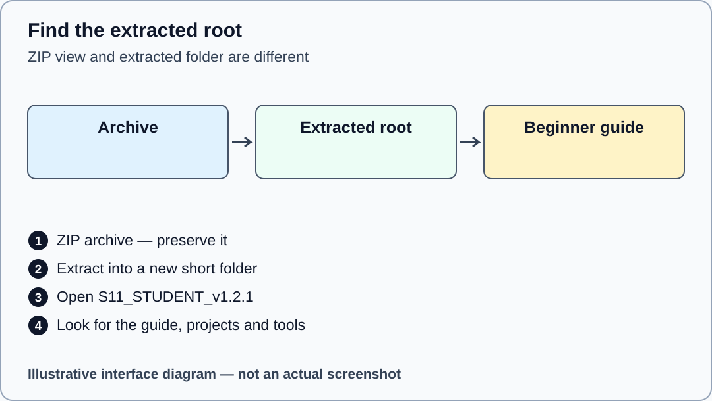

Illustrative interface diagram. Package location and extraction; not an actual Windows screenshot.

## 02 Extract into a new short folder

00–05

**WHERE YOU ARE** The file manager showing the selected archive; the ZIP is still compressed.

**WHAT TO FIND** On Windows, the archive context menu and Extract All. Use a new destination D:\WTS11 rather than extracting over an earlier package.

**EXACT ACTION** Right-click the ZIP, choose Extract All, set D:\WTS11 as destination and complete extraction. On macOS/Linux use the available archive manager to extract into a new short folder, keeping the supplied inner root.

**WHAT YOU SHOULD SEE** The extracted root D:\WTS11\S11_STUDENT_v1.2.1 contains README.md, tools, projects, portfolio and the beginner guide. Opening the ZIP as a virtual folder is not extraction.

**WHAT TO RECORD** Add the actual extracted root to source_revision. Your macOS/Linux path may differ; record it exactly.

**DO NOT CONTINUE UNLESS** The root contains projects/p02/student/src/authorization-policy.js and the exact beginner-guide filename. Do not edit files while they are still inside a ZIP view.

**IF YOU DO NOT SEE THIS** If there is an extra nesting level, open the inner S11_STUDENT_v1.2.1 folder. If files are missing, repeat extraction into another new folder from the original archive.

**STOP CONDITION** Stop on an extraction error, unsafe overwrite prompt or files that do not match the current package.

**CONTINUE WITH** Step 03


Illustrative interface diagram. Package location and extraction; not an actual Windows screenshot.

## 03 Open the offline beginner guide

00–05

**WHERE YOU ARE** Inside the extracted package root in the file manager.

**WHAT TO FIND** OPEN_BEGINNER_GUIDE.cmd on Windows, OPEN_BEGINNER_GUIDE.sh on macOS/Linux or the exact HTML file named above.

**EXACT ACTION** On Windows double-click OPEN_BEGINNER_GUIDE.cmd. If the launcher is blocked or on another platform, double-click the HTML guide itself and open it in an already available browser.

**WHAT YOU SHOULD SEE** The browser displays S11 Role Protected Moderation Operation with WIP/PREVIEW_NOT_FINAL. Its address normally begins file:// and names this extracted guide.

**WHAT TO RECORD** Record the browser and visible package version in actual_environment. This is viewing a document, not running Express.

**DO NOT CONTINUE UNLESS** The title says S11 and v1.2.1, and you opened the extracted file rather than a preview from the archive.

**IF YOU DO NOT SEE THIS** Use the file manager to find the exact HTML filename. If the default browser cannot open it, use Open with and choose an already installed supported browser.

**STOP CONDITION** Stop if you are asked to install software or if the file you opened is a private teacher console.

**CONTINUE WITH** Step 04

## 04 Choose the honest evidence lane

00–05

**WHERE YOU ARE** This guide, with its left contents panel and the status paragraph.

**WHAT TO FIND** The distinction between source reading, pure functions, callback models, actual Express, browser and TLS evidence.

**EXACT ACTION** Select an execution_status matching what you can actually do. Use SOURCE_ONLY or BLOCKED while the prescribed environment or dependencies are unavailable.

**WHAT YOU SHOULD SEE** A truthful draft can continue through predictions and source locators. It does not become normal final completion by selecting a different label.

**WHAT TO RECORD** Record the actual available tools, real versions or their absence in actual_environment, and the limitation in execution_status.

**DO NOT CONTINUE UNLESS** You can explain which observations have happened and which remain pending. A progress tick in this guide means reviewed step, not proof of execution.

**IF YOU DO NOT SEE THIS** Read the evidence-class glossary below. Keep unknown values explicitly unknown; ask the teacher about a genuine prior assessment alternative rather than granting it yourself.

**STOP CONDITION** Stop any execution lane that requires installation, external systems, credentials or an authoring-only override.

**CONTINUE WITH** Step 05

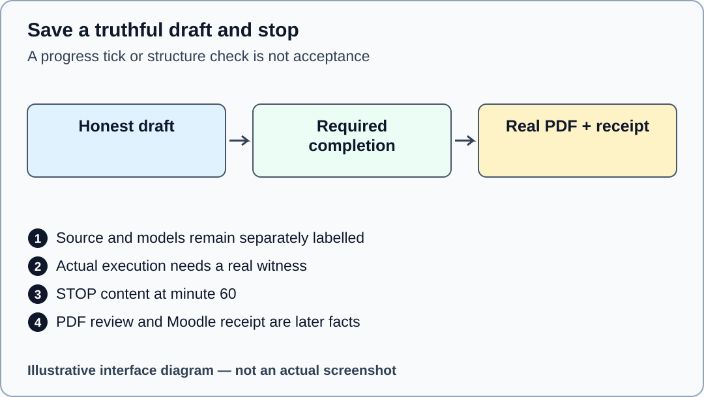

Illustrative interface diagram. No actual execution, saved PDF or submission is fabricated.

Mechanism check after prediction: A file hash establishes byte identity. It does not prove that a policy ran or that its decision is correct.

## 05 Start your individual evidence draft

00–05

**WHERE YOU ARE** The extracted root; the guide can remain open in its own browser tab.

**WHAT TO FIND** OPEN_MOODLE_FORM.cmd or OPEN_MOODLE_FORM.sh, whose target is S11_EVIDENCE_FORM.html. The name is a local launcher, not a Moodle login or upload.

**EXACT ACTION** Open S11_EVIDENCE_FORM.html in another tab. Enter your teacher-agreed alias, teaching group, package identity and actual environment in the identity section.

**WHAT YOU SHOULD SEE** A blank individual form with 48 fields in seven sections. The proposed filename uses TW2026_S11_GROUP_ALIAS.pdf; the teacher keeps the private alias mapping.

**WHAT TO RECORD** Complete student_alias, group, package_identity, actual_environment, execution_status and source_revision using your own facts.

**DO NOT CONTINUE UNLESS** The identity belongs to your own work. No passwords, cookies, session IDs, CSRF token values or unnecessary personal data have been entered.

**IF YOU DO NOT SEE THIS** If the launcher cannot open the form, open its exact HTML file directly. Use S11_EVIDENCE_FORM.docx for the documented capture route if browser drafting is unavailable.

**STOP CONDITION** Stop if private material appears or you cannot identify your own draft. Do not submit a blank or imported example as completed work.

**CONTINUE WITH** Step 06

## 06 Open the exact folder in VS Code

00–05

**WHERE YOU ARE** An already available VS Code window; no project terminal command has been run.

**WHAT TO FIND** File, then Open Folder, and the extracted S11_STUDENT_v1.2.1 root. The Explorer is the file tree on the left.

**EXACT ACTION** Choose File > Open Folder and select the extracted root, not projects/p02 alone. Expand projects, p02, student and src in the Explorer.

**WHAT YOU SHOULD SEE** The tree shows authorization-policy.js alongside supplied authentication, csrf, permissions and repository files. The root also shows tools and portfolio.

**WHAT TO RECORD** In source_revision record the exact allowed P02 path. The additional reduced portfolio has its own allowed file, used later.

**DO NOT CONTINUE UNLESS** You can locate projects/p02/student/src/authorization-policy.js and the root tools folder without guessing.

**IF YOU DO NOT SEE THIS** If VS Code shows only an unrelated project, close that folder view and reopen the correct root. If a workspace-trust decision is unclear, ask the teacher; do not trust unrelated folders.

**STOP CONDITION** Stop if VS Code is unavailable or opening the folder would require an installation. Continue with source reading in an available text viewer.

**CONTINUE WITH** Step 07

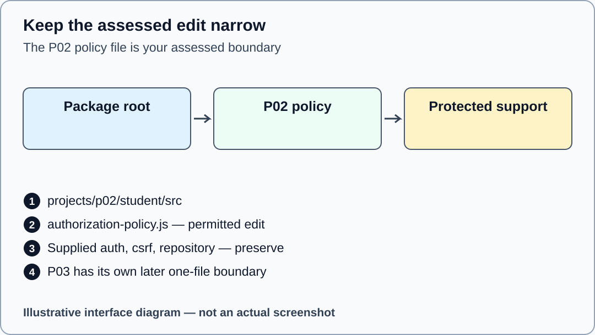

Illustrative interface diagram. The diagram does not expose a completed policy solution.

## 07 Open a terminal at the package root

00–05

**WHERE YOU ARE** VS Code showing the extracted root; this step is for an already available terminal.

**WHAT TO FIND** Terminal > New Terminal. The terminal panel appears below the editor and displays a working-directory prompt.

**EXACT ACTION** Open Terminal > New Terminal and check that its prompt names the extracted root. If it names another folder, use the quoted change-directory command for your real root before any verifier.

**WHAT YOU SHOULD SEE** The terminal is at S11_STUDENT_v1.2.1, where tools/verify-package.mjs exists. Commands below are entered one at a time, followed by Enter.

**WHAT TO RECORD** Record the root path and terminal availability in actual_environment. Do not record an illustrative prompt as measured output.

**DO NOT CONTINUE UNLESS** The working directory is the extracted root, not the compressed archive, home directory or a different seminar.

**IF YOU DO NOT SEE THIS** On Windows the example command is cd "D:\WTS11\S11_STUDENT_v1.2.1". On macOS/Linux quote your own path. If Node is absent, record BLOCKED and use source reading.

**STOP CONDITION** Stop if the terminal reports that the folder does not exist. Check extraction instead of creating guessed directories.

**CONTINUE WITH** Step 08

```text
cd "D:\WTS11\S11_STUDENT_v1.2.1"
```

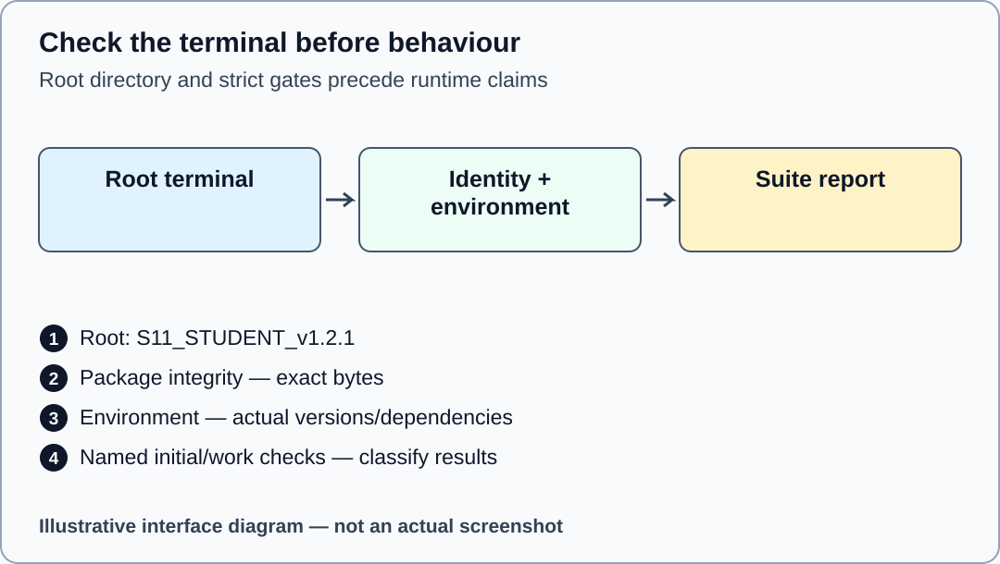

Illustrative interface diagram. No terminal output is depicted as an actual execution result.

## 08 Verify the unchanged package bytes

00–05

**WHERE YOU ARE** The package-root terminal, before any assessed edit.

**WHAT TO FIND** tools/verify-package.mjs and the supplied manifest/identity files.

**EXACT ACTION** Enter the read-only package command below once. Retain its real report and exit result; do not edit the manifest to make a mismatch disappear.

**WHAT YOU SHOULD SEE** PACKAGE_IDENTITY_PASS means the unchanged package exact file set and hashes were accepted. A refusal identifies a real integrity problem; it is not an intended starter failure.

**WHAT TO RECORD** Put the report filename or a redacted output locator in package_identity/source_revision. Byte identity is one evidence class only.

**DO NOT CONTINUE UNLESS** The verifier accepts the supplied unchanged package. Any missing, added, modified or linked path is resolved before project execution.

**IF YOU DO NOT SEE THIS** If Node cannot be found, record the environment block. If a package hash or file-set check fails, preserve the report and extract a fresh copy rather than weakening the checker.

**STOP CONDITION** Stop on integrity refusal or an unexpected file. Do not replace expected hashes with hashes of your altered files.

**CONTINUE WITH** Step 09

```text
node tools/verify-package.mjs
```

## 09 Check the prescribed environment strictly

00–05

**WHERE YOU ARE** The same package-root terminal, with no installation action authorised.

**WHAT TO FIND** tools/check-environment.mjs. The required pair is Node 24.21.0 and npm 11.19.0; P02 needs its separately provisioned Express dependency.

**EXACT ACTION** Run the strict environment command below. Read the actually detected versions and dependency result; never copy the required pin as a measurement.

**WHAT YOU SHOULD SEE** ENVIRONMENT_PASS accepts the strict prescribed pair and required dependencies. ENVIRONMENT_BLOCKED, exit 2, stops the runtime lane. A mismatch, missing dependency or inherited NODE_OPTIONS, NODE_PATH or test-injection flag is an infrastructure block, not an objective assertion failure.

**WHAT TO RECORD** Record the actual versions, platform and refusal reason in actual_environment and execution_status.

**DO NOT CONTINUE UNLESS** The strict report accepts the actual environment. No student override, npm install, npm ci, npx or dependency download has been used to bypass it.

**IF YOU DO NOT SEE THIS** Retain the strict report and continue with SOURCE_ONLY predictions. Do not remove or override runtime-injection flags to manufacture a student PASS. The teacher must diagnose the actual teaching environment; provisioning is a separate operation outside this package and this local production phase.

**STOP CONDITION** Stop the runtime lane on any environment/dependency refusal. Do not improvise with a different stack.

**CONTINUE WITH** Step 10

```text
node tools/check-environment.mjs
```


Illustrative interface diagram. No terminal output is depicted as an actual execution result.

## 10 Classify the initial starter checks

05–12

**WHERE YOU ARE** The package-root terminal, only when integrity and strict environment gates have accepted.

**WHAT TO FIND** tools/verify-initial-state.mjs and the P02/P03 source test categories: baseline, objective and regression.

**EXACT ACTION** Run the initial-state verifier below before editing. Read its named-suite report and exact expected starter-failure classification, keeping P02 and P03 separate.

**WHAT YOU SHOULD SEE** INITIAL_STATE_PASS accepts the complete mandatory initial contract. Canonical P02: baseline 2 PASS, regression 3 PASS, objective 5 named intended assertion failures. Canonical reduced P03: baseline 2 PASS, regression 2 PASS, objective 4 with 1 PASS and 3 named intended assertion failures. Additional successor suites: P02 infrastructure 10 PASS; P03 infrastructure 6 PASS and successorInputs 12 with 6 PASS and 6 exact intended assertion failures. These are contract counts, not measurements supplied by this guide. INITIAL_STATE_BLOCKED stops this lane.

**WHAT TO RECORD** Record the real suite names, counts, result class and report locator in p02_checks. If execution is blocked, record NOT_EXECUTED; source reading is not canonical Express execution.

**DO NOT CONTINUE UNLESS** The initial-state verifier accepts the exact starter contract, including every count and failure signature. A generic nonzero exit is insufficient.

**IF YOU DO NOT SEE THIS** If the environment gate is blocked, do not run this command; read the documented tests as source instead. Preserve any unexpected failure report and return it to the teacher.

**STOP CONDITION** Stop on an unclassified failure, skipped/cancelled test, unexpected process exit or altered support. P01 objective starter faults are separately scheduled transfer, not mandatory S11 acceptance.

**CONTINUE WITH** Step 11

```text
node tools/verify-initial-state.mjs
```

## 11 Trace principal action and resource

05–12

**WHERE YOU ARE** VS Code, reading supplied P02 source files without editing support.

**WHAT TO FIND** projects/p02/student/src/authentication.js, app.js, permissions.js and report-repository.js, plus the active project specification.

**EXACT ACTION** For one supplied moderation route, write where its principal comes from, which action is fixed by the route and how the server loads the report.

**WHAT YOU SHOULD SEE** Three different trusted sources can be identified. Request-body fields are proposed domain input and do not become principal role or server ownership facts.

**WHAT TO RECORD** Complete principal_provenance, action_resource and trust_map using file/function locators. Omit raw fixture-session values from the submitted evidence.

**DO NOT CONTINUE UNLESS** Your map names the owner of each decision and distinguishes supplied infrastructure from your assessed policy.

**IF YOU DO NOT SEE THIS** If a term is unclear, use the glossary and read the contract before following more code. P01 explains the principal model conceptually; you need not implement P01 now.

**STOP CONDITION** Stop if you are about to change authentication, CSRF, permission maps, repositories or tests to make your policy easier.

**CONTINUE WITH** Step 12

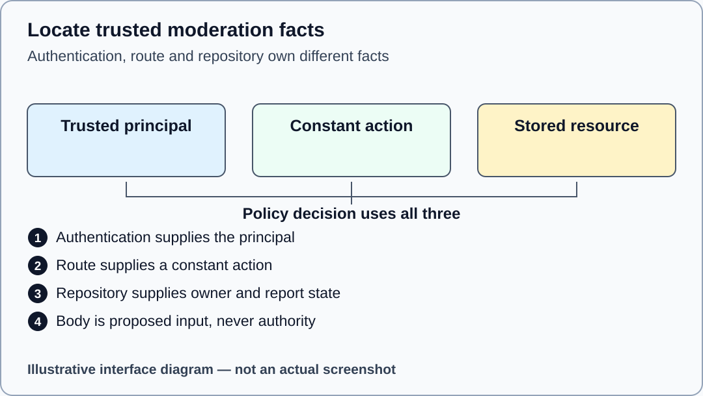

Illustrative interface diagram. A conceptual provenance diagram, not authentication acceptance.

Mechanism check after prediction: Authentication establishes a principal. Authorisation then asks whether that principal may perform this constant action on this stored resource.

## 12 Predict permission and disclosure outcomes

05–12

**WHERE YOU ARE** Your own evidence form and the active P02 specification, before measuring outcomes.

**WHAT TO FIND** The documented role/ownership rules and the route option for concealment.

**EXACT ACTION** Choose one legitimate allowed case, one ordinary forbidden case and one concealed case from the supplied synthetic fixtures. Write a prediction and the source reason before running the relevant check.

**WHAT YOU SHOULD SEE** A prediction matrix with your own unmeasured rows. It can be wrong; keep the original prediction and explain the correction after evidence.

**WHAT TO RECORD** Use policy_prediction, threat_table and your later allow_observation, forbid_observation and conceal_observation records. Include route/action and fixture category without credential values.

**DO NOT CONTINUE UNLESS** Each row has a predicted outcome and a precise source locator. Refusing every request is not a successful implementation because the normal allowed control must also work.

**IF YOU DO NOT SEE THIS** Use a small set of cases rather than copying a complete solution matrix from AI. Read the supplied tests for their intended properties, not as proof they ran.

**STOP CONDITION** Stop if a result has been filled in before you observed or source-classified it.

**CONTINUE WITH** Step 13

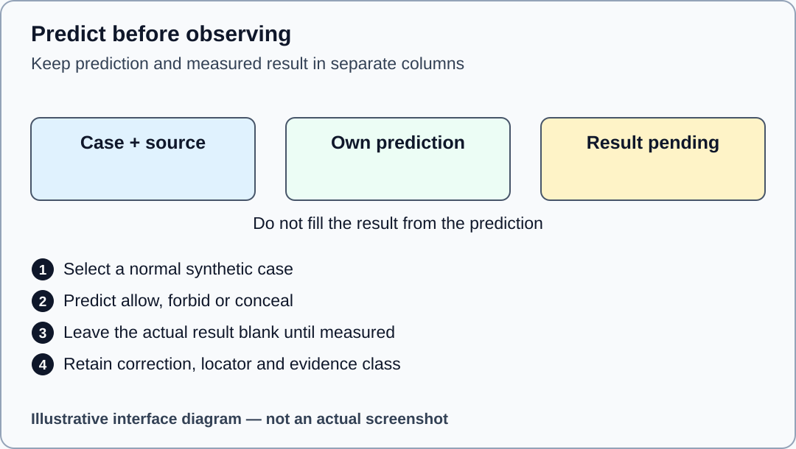

Illustrative interface diagram. Prediction slots are illustrative and contain no completed assessment matrix.

## 13 Edit only the assessed P02 policy

12–30

**WHERE YOU ARE** VS Code with projects/p02/student/src/authorization-policy.js open.

**WHAT TO FIND** The existing export signature, TODOs and supported action vocabulary in the active one-file contract.

**EXACT ACTION** Implement your own policy inside this file only, using the supplied trusted principal, permission map and injected loader. Save the file using File > Save.

**WHAT YOU SHOULD SEE** Your bounded code change, with support files, tests, dependencies and fixtures unchanged. The policy remains deny by default while you work.

**WHAT TO RECORD** Record the changed path and a narrow diff/hash locator in p02_diff, plus IN_PROGRESS or BLOCKED in p02_completion until all final requirements actually pass.

**DO NOT CONTINUE UNLESS** You have not moved identity, origin, state or support repairs into the assessed file. Do not ask Gemini for the complete implementation.

**IF YOU DO NOT SEE THIS** If you accidentally changed another file, keep a copy of your own assessed work and restore the support file from the verified clean package, then rerun the boundary check.

**STOP CONDITION** Stop on an unclear source contract or any need to modify protected files. Report an infrastructure incident separately.

**CONTINUE WITH** Step 14


Illustrative interface diagram. The diagram does not expose a completed policy solution.

## 14 Check the edit boundary and progress

12–30

**WHERE YOU ARE** The package-root terminal after saving your permitted P02 edit.

**WHAT TO FIND** tools/verify-boundary.mjs and the project identifier p02.

**EXACT ACTION** Run the read-only boundary command below. Use its path report to confirm the assessed edit is confined to the single policy file.

**WHAT YOU SHOULD SEE** BOUNDARY_ONLY_PASS confirms the permitted edit boundary. It does not establish correct policy behaviour, actual canonical execution or secure deployment.

**WHAT TO RECORD** Put the boundary report locator in p02_diff/source_revision. Record unresolved behavioural obligations separately in p02_unresolved.

**DO NOT CONTINUE UNLESS** Only the permitted assessed P02 file differs from its baseline and any explicitly documented generated output exclusion remains within the checker contract.

**IF YOU DO NOT SEE THIS** If it reports another changed file, restore that file from the clean package and retain the incident. Do not enlarge an allowlist or edit baseline metadata.

**STOP CONDITION** Stop on a symlink, unexpected support change, altered boundary declaration or unverifiable baseline.

**CONTINUE WITH** Step 15

```text
node tools/verify-boundary.mjs p02
```

## 15 Observe a normal allowed path

30–39

**WHERE YOU ARE** The available qualified evidence lane: named canonical suite report when executed, otherwise source reading with NOT_EXECUTED clearly retained.

**WHAT TO FIND** The root TEST_P02.cmd or TEST_P02.sh launcher and the objective check read allows owner/moderator/admin and conceals unrelated or missing reports. The frozen suite names and counts are in tools/PROJECT_SUITE_CONTRACT.json.

**EXACT ACTION** Only after the strict environment gate accepts, double-click TEST_P02.cmd on Windows, or enter sh ./TEST_P02.sh at the package root on macOS/Linux. Keep its complete named-suite report. Compare your original allowed-case prediction with its corresponding real assertion result. An incomplete implementation can retain objective failures as progress, not completion. If execution is blocked, read tests/objective.test.js as source and leave the observation NOT_EXECUTED.

**WHAT YOU SHOULD SEE** An actual accepted case and its exact result can support allowance for that selected fixture. A source assertion supports only the expected contract.

**WHAT TO RECORD** Write allow_observation with expected result, actual result or NOT_EXECUTED, named check, report locator, evidence class and limit.

**DO NOT CONTINUE UNLESS** You can identify the case and result rather than copying a summary PASS without provenance.

**IF YOU DO NOT SEE THIS** If the whole objective check fails, inspect the specific assertion and retain the actual failure; do not report all its subcases as passed. Recheck your own policy within its boundary.

**STOP CONDITION** Stop on a crash, missing dependency or any non-assertion fault; that is infrastructure, not a normal policy refusal.

**CONTINUE WITH** Step 16

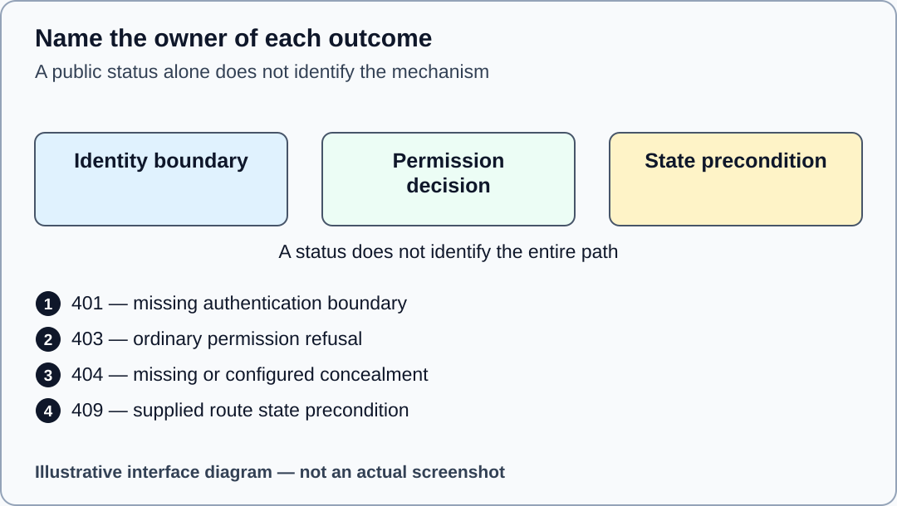

Illustrative interface diagram. Outcome categories are instructional, not measured HTTP responses.

## 16 Distinguish forbidden concealed and missing

30–39

**WHERE YOU ARE** Your P02 result/source records, using fresh synthetic fixtures for each case.

**WHAT TO FIND** The route concealment option, the ordinary forbidden result and the missing-resource result.

**EXACT ACTION** Compare the selected ordinary denial with the concealed and missing cases. Name the layer and configuration responsible for each result; retain the same public missing/concealed vocabulary where the contract requires it. Also compare the preserved submit/delete check’s benign contradictory body claim with the stored ownership and trusted role. Locate the exact assertion in tests/objective.test.js; do not send a new manual credential-bearing request or alter any guard.

**WHAT YOU SHOULD SEE** 403 identifies ordinary permission refusal in the selected route. A configured 404 can conceal a resource or represent absence; the status alone does not reveal the reason.

**WHAT TO RECORD** Complete forbid_observation and conceal_observation with report/action categories, status/body category, check name, locator and evidence class.

**DO NOT CONTINUE UNLESS** Every claim is tied to the route configuration and actual source/test category, without disclosing private report contents.

**IF YOU DO NOT SEE THIS** If you cannot distinguish the route option from the status alone, read the active route configuration and record the ambiguity. Do not invent an internal cause.

**STOP CONDITION** Stop if your evidence reveals raw credentials or claims source/model results were Express responses.

**CONTINUE WITH** Step 17


Illustrative interface diagram. Outcome categories are instructional, not measured HTTP responses.

## 17 Separate permission from state conflict

30–39

**WHERE YOU ARE** P02 source and result records for a state-changing action; no external service is targeted.

**WHAT TO FIND** The stored report state and the supplied route precondition after policy allowance.

**EXACT ACTION** Use the documented state-precondition case to compare the predicted permission with the route outcome. Record the state category before and after the case using its named test or source locator.

**WHAT YOU SHOULD SEE** A permitted principal may still encounter 409 invalid_report_state. That route-state result is different from authorisation refusal.

**WHAT TO RECORD** Complete state_prediction and state_observation. Keep source state, actual measured result and unmeasured assumptions separate.

**DO NOT CONTINUE UNLESS** The case began from a fresh fixture; an earlier mutation has not silently changed the initial state.

**IF YOU DO NOT SEE THIS** If a case depends on earlier requests, restart the supplied fixture through the named test harness rather than manually resetting hidden state. Preserve failing evidence.

**STOP CONDITION** Stop if you are tempted to edit repository or route state rules to obtain a desired result.

**CONTINUE WITH** Step 18

Mechanism check after prediction: A decision to permit an operation does not promise that every domain precondition is satisfied.

## 18 Record the single resource load

30–39

**WHERE YOU ARE** The named P02 checks or a separately identified callback observation, with its evidence class visible.

**WHAT TO FIND** The assertion measuring the injected loader and the continuation that reaches the route.

**EXACT ACTION** Record the loader count and how it was measured for the selected case. Distinguish source assertions, a response substitute and an actual Express request.

**WHAT YOU SHOULD SEE** A recorded count has a witness, such as a named assertion in its real suite report. A callback count does not prove Express invoked every middleware in the intended order.

**WHAT TO RECORD** Use resource_loads and p02_checks with the measured count or NOT_EXECUTED, harness/check identity and locator.

**DO NOT CONTINUE UNLESS** The evidence names the measured operation rather than inferring a count from a successful HTTP status.

**IF YOU DO NOT SEE THIS** If the count was never observed, identify the assertion source and retain a pending measurement. Do not add invisible instrumentation to protected supplied tests.

**STOP CONDITION** Stop on a claim that a single loader result proves concurrency safety or transaction isolation.

**CONTINUE WITH** Step 19

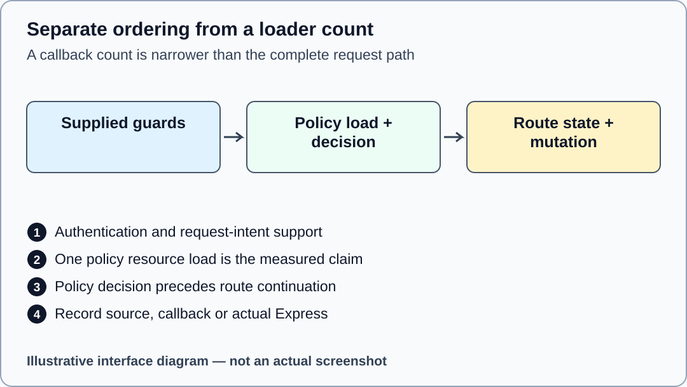

Illustrative interface diagram. No full middleware-order or concurrency acceptance is implied.

## 19 Explain the snapshot limit and CSRF boundary

30–39

**WHERE YOU ARE** P02 source/result records and the supplied request-intent scaffolding.

**WHAT TO FIND** The authorised resource attachment, flat frozen snapshot and the authentication/CSRF ordering before mutation.

**EXACT ACTION** Write which flat snapshot property your check establishes, then identify the supplied CSRF fixture and the layer that checks an unsafe operation before mutation.

**WHAT YOU SHOULD SEE** The evidence distinguishes a flat frozen clone from a transaction or deep immutability guarantee, and a deterministic teaching comparison from a production session secret.

**WHAT TO RECORD** Complete snapshot_observation and principal_resource_independence, and use csrf_trace for the later reduced portfolio. Keep token values redacted.

**DO NOT CONTINUE UNLESS** Your limitation states what the check does not establish about nested objects, concurrency, browser enforcement or deployment.

**IF YOU DO NOT SEE THIS** If you only read source, classify it SOURCE. If the supplied boundary is unclear, record its assumption and ask the teacher; do not weaken or rewrite the guard.

**STOP CONDITION** Stop before exporting cookies, session values or CSRF token values into the form or Gemini.

**CONTINUE WITH** Step 24 for the normal content route. Steps 20–23 are an optional later browser lane only after separate strict qualification; record NOT_EXECUTED when unavailable.

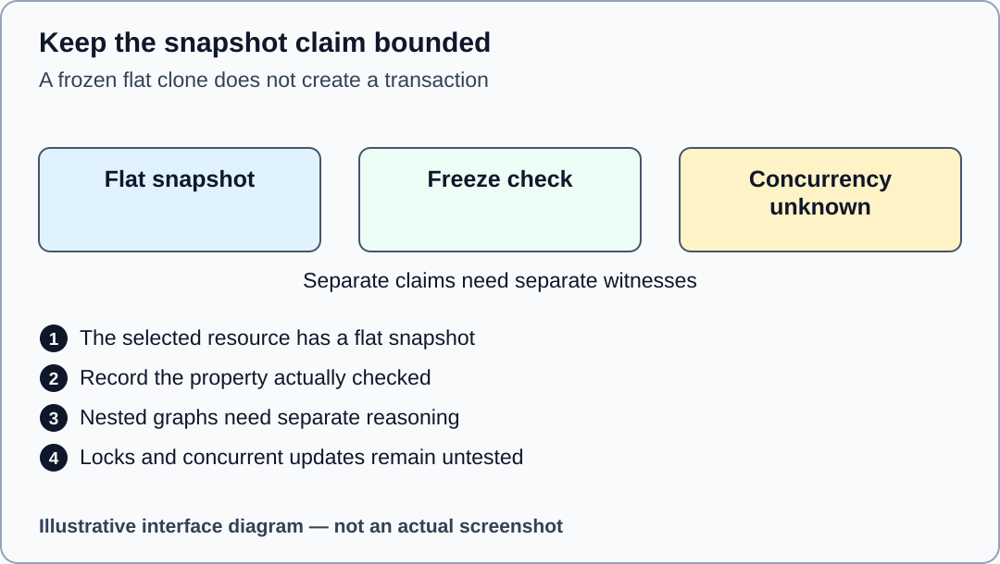

Illustrative interface diagram. This is an explanatory comparison, not a database or race experiment.

## 20 Open a future local health page only after qualification

OPTIONAL_QUALIFIED_BROWSER_LANE

**WHERE YOU ARE** The P02 project terminal, only in a separately provisioned and authorised later classroom environment.

**WHAT TO FIND** The root START_P02.cmd or START_P02.sh launcher, or the project start script, and the server’s real listening message.

**EXACT ACTION** In a separately qualified classroom environment, double-click START_P02.cmd from the root on Windows, or run sh ./START_P02.sh from the root terminal on macOS/Linux. The server stays in its own foreground terminal. Copy its actual local URL into a new browser tab and append /health. The direct alternative is npm start from projects/p02/student only.

**WHAT YOU SHOULD SEE** The source default is http://127.0.0.1:3000/health. A real local health response establishes only that benign endpoint, not authentication or moderation-policy success.

**WHAT TO RECORD** Record the actual URL, status and evidence class only if you ran it. In the present local production phase the server/browser lane remains NOT_EXECUTED.

**DO NOT CONTINUE UNLESS** The host is 127.0.0.1 and the listening message belongs to your own current S11 process. No public or institutional service is the testing target.

**IF YOU DO NOT SEE THIS** For address-in-use or startup failure, retain the exact diagnostic and return to the teacher. Do not kill unrelated processes or guess another active service.

**STOP CONDITION** Stop on dependency/runtime refusal, unexpected hostname or a missing authorisation to launch. This optional lane does not bypass canonical P02 checks.

**CONTINUE WITH** Step 21 only after the optional local server and browser lane is actually qualified. Otherwise retain its block and return to Step 24.

## 21 Open DevTools on the correct local tab

OPTIONAL_QUALIFIED_BROWSER_LANE

**WHERE YOU ARE** The browser tab whose address is your actual local /health URL, not the guide, Gemini, ChatGPT or Moodle.

**WHAT TO FIND** Select Chrome, Edge or Firefox in this guide’s browser selector. Its verified mouse route appears in the browser-help section.

**EXACT ACTION** Use the selected browser’s main-menu route to open its developer tools. Confirm the inspected tab address still begins http://127.0.0.1: followed by your actual port.

**WHAT YOU SHOULD SEE** A DevTools area beside or below that local page. Its opening panel may differ; this is normal. The selector changes instructions, not your browser.

**WHAT TO RECORD** Record the browser/version and actual tab URL without private tabs or account details. Do not call the diagram a screenshot.

**DO NOT CONTINUE UNLESS** The tools inspect your local health tab. DevTools are tools built into a browser; they are different from DevOps deployment practice.

**IF YOU DO NOT SEE THIS** If a panel is hidden, widen DevTools or use its overflow/More tools control. If institutional policy disables DevTools, keep the browser lane BLOCKED and retain other evidence.

**STOP CONDITION** Stop if Network shows chatgpt.com, gemini.google.com or online.ase.ro as the target of your supposed local observation.

**CONTINUE WITH** Step 22

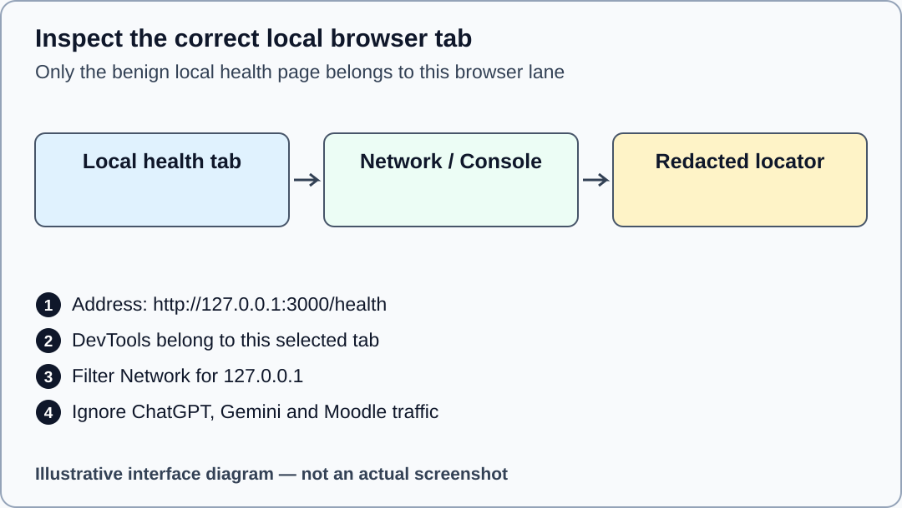

Illustrative interface diagram. Port 3000 is the source default; use the actual printed URL. No real browser screenshot.

## 22 Filter the benign Network record

OPTIONAL_QUALIFIED_BROWSER_LANE

**WHERE YOU ARE** DevTools attached to the actual local health tab.

**WHAT TO FIND** Network in Chrome/Edge or Network/Network Monitor in Firefox, the filter field and the health request row.

**EXACT ACTION** Choose the Network tool. Enter 127.0.0.1 in its text filter, then reload the local /health page once. Select the health row and inspect its URL and status; choose Headers only for this credential-free health request.

**WHAT YOU SHOULD SEE** A request associated with your local host and health endpoint. An empty list may mean recording/filter timing rather than a successful policy or a crash.

**WHAT TO RECORD** If actually observed, record only the local URL, method/status, date and a redacted capture locator. The authenticated moderation experiments still use named canonical suites.

**DO NOT CONTINUE UNLESS** The row URL is your own local health endpoint. No cookies, authorisation headers or unrelated requests appear in the submitted capture.

**IF YOU DO NOT SEE THIS** Clear an over-restrictive filter, check recording is active and reload once. If the row remains absent, record the browser observation as unavailable instead of inventing traffic.

**STOP CONDITION** Stop before capturing credential-bearing request details or treating a health 200 as authorisation acceptance.

**CONTINUE WITH** Step 23


Illustrative interface diagram. Port 3000 is the source default; use the actual printed URL. No real browser screenshot.

## 23 Read the Console without pasting code

OPTIONAL_QUALIFIED_BROWSER_LANE

**WHERE YOU ARE** The same local health tab’s DevTools; this guide supplies no credential-bearing console command.

**WHAT TO FIND** Console in Chrome/Edge or Console/Web Console in Firefox, and its text filter.

**EXACT ACTION** Choose the Console tool and review messages for the current local page. Record an actual error category if present; do not paste code from a message or an AI answer.

**WHAT YOU SHOULD SEE** Existing messages or an empty Console. Neither an empty Console nor the absence of a red entry establishes security correctness.

**WHAT TO RECORD** Record relevant redacted error text and a locator when actually present, or state that this browser lane was NOT_EXECUTED.

**DO NOT CONTINUE UNLESS** You are reading the correct context and have not exposed sessions, tokens, account details or irrelevant conversations.

**IF YOU DO NOT SEE THIS** If no tool name is visible, widen DevTools or use its More tools/overflow list. If messages concern another frame/site, return to the local tab context.

**STOP CONDITION** Stop before executing unknown pasted JavaScript or adding a raw-cookie experiment outside the contract.

**CONTINUE WITH** Step 24

## 24 Prepare one falsifiable Gemini claim

39–45

**WHERE YOU ARE** Your evidence form and your own bounded P02 code or redacted named trace.

**WHAT TO FIND** GEMINI_PROMPT_EN_GB.txt, GEMINI_AUDIT_WORKSHEET_EN_GB.md and the ai_claim field. GEMINI_PROMPT.txt is an exact alias. FLAWED_PATCH_OR_CLAIM.txt is practice input only, not a received answer. The obsolete full-solution prompt is not the active task.

**EXACT ACTION** Write one own claim narrow enough to test, such as a claim about loader-count scope or the meaning of a concealed result. Select only the minimal relevant own excerpt and its stated evidence class.

**WHAT YOU SHOULD SEE** A sanitised critique input: one claim, one small excerpt, source/test locator and a question about a limit. It contains no complete private/reference implementation.

**WHAT TO RECORD** Complete ai_claim and prepare ai_prompt. Identify your planned independent check before asking Gemini.

**DO NOT CONTINUE UNLESS** The prompt asks for critique and an independent check, not the complete policy, two-helper answer or an exploit.

**IF YOU DO NOT SEE THIS** Remove passwords, cookie/session/token values, secret configuration and institutional records. If you cannot safely sanitise the excerpt, use a source-supported mechanism claim without private data.

**STOP CONDITION** Stop if the proposed input would disclose sensitive information or delegate the assessed implementation.

**CONTINUE WITH** Step 25

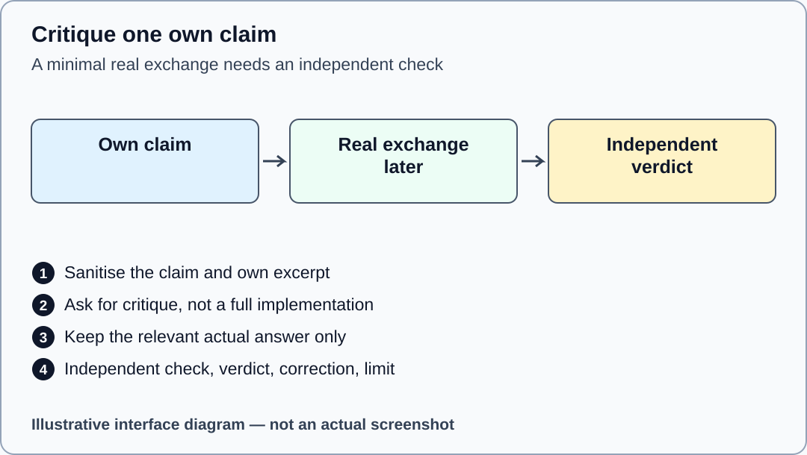

Illustrative interface diagram. Synthetic layout, not a received Gemini conversation.

## 25 Obtain and retain the real bounded exchange

39–45

**WHERE YOU ARE** A separate browser tab at gemini.google.com, only during the future authorised student activity.

**WHAT TO FIND** The text box near the bottom of Gemini’s page and its Submit control. Record the actual model label if visible rather than assuming a particular model.

**EXACT ACTION** Enter the prepared minimal prompt into the text box and choose Submit once. Wait for its real response; retain only the relevant prompt/answer excerpt in your own draft.

**WHAT YOU SHOULD SEE** A real Gemini answer or a genuine access/availability block. Google’s official help notes that school-account availability depends on the institution; this package does not create access.

**WHAT TO RECORD** Set ai_route to ACTUAL_RECORDED only after the exchange occurred. Fill ai_prompt and ai_response with the relevant actual excerpt; otherwise use PENDING and describe the block.

**DO NOT CONTINUE UNLESS** The response actually came from your exchange. A synthetic practice claim or illustration is not an answer received from Gemini.

**IF YOU DO NOT SEE THIS** If access, an account choice or a limit blocks the task, retain the block and request the teacher’s established assessment route. Do not purchase a plan, share credentials or invent an answer.

**STOP CONDITION** Stop if the response offers a full implementation, requests secrets or broadens the task; keep the critique bounded.

**CONTINUE WITH** Step 26


Illustrative interface diagram. Synthetic layout, not a received Gemini conversation.

## 26 Check the AI claim independently

45–50

**WHERE YOU ARE** Your own source/test/observation record, independent of Gemini’s confidence.

**WHAT TO FIND** ai_check, ai_verdict and ai_correction_limit in the form.

**EXACT ACTION** Perform or cite the narrow independent check you planned. Compare the answer with the exact source contract or your real qualified observation and record ACCEPTED, REJECTED, PARTIALLY ACCEPTED or UNKNOWN.

**WHAT YOU SHOULD SEE** A verdict supported by a locator, with any correction and remaining limitation. UNKNOWN is an honest AI verdict, not a PASS for unfinished implementation.

**WHAT TO RECORD** Write the exact independent evidence class and locator in ai_check; explain what changed in ai_correction_limit.

**DO NOT CONTINUE UNLESS** Your verdict does not rely solely on the answer repeating a desirable result. The independent evidence has its own identity and scope.

**IF YOU DO NOT SEE THIS** When execution is unavailable, use a source-supported scope critique and state that the behavioural claim remains untested. Retain PENDING if there was no real exchange.

**STOP CONDITION** Stop if an unexecuted named test is being presented as measured independent evidence.

**CONTINUE WITH** Step 27

Mechanism check after prediction: A callback loader count can support that callback observation. It cannot by itself support a claim about the complete Express request order.

## 27 Plan the required two class portfolio

50–55

**WHERE YOU ARE** The active REDUCED_SECURITY_PORTFOLIO guide and your own draft.

**WHAT TO FIND** The active REDUCED_SECURITY_PORTFOLIO guide and portfolio/p03-reduced/student/src/security-boundary.js. CORS and CSRF only are assessed.

**EXACT ACTION** Read the reduced contract and predict a benign allowed/refused exact-origin decision plus safe/unsafe cookie-authenticated CSRF categories. Plan its later one-file implementation and named controls.

**WHAT YOU SHOULD SEE** Two source-to-decision traces, later protective evidence and an explicit limit for query, output and configuration-secret classes. Five minutes is a transfer segment, not full portfolio completion.

**WHAT TO RECORD** Use portfolio_route, cors_trace, cors_controls, csrf_trace, csrf_controls, portfolio_patch, portfolio_retained, portfolio_limits and portfolio_completion.

**DO NOT CONTINUE UNLESS** The original insecure all-five starter is not imported or launched. Record Vary/status/sharing separately, and redact all CSRF token values.

**IF YOU DO NOT SEE THIS** If the two-class scope is unclear, read the reduced contract rather than attempting all-five work. Use the later work-result verifier after your required P02 and P03 changes are complete.

**STOP CONDITION** Stop before scanning public systems, weakening controls or calling two-class results an all-five PASS.

**CONTINUE WITH** Step 28

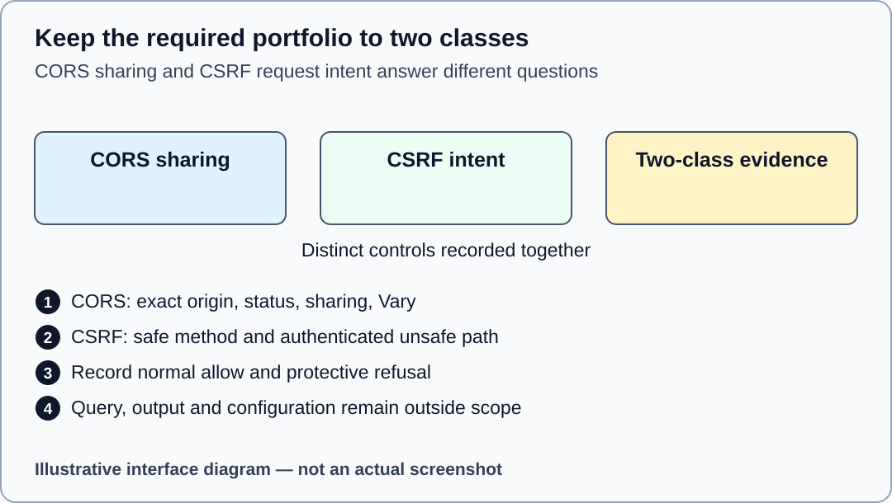

Illustrative interface diagram. No exploit trace, browser/cache result or all-five PASS is depicted.

## 28 Save an honest draft and stop at minute 60

55–60

**WHERE YOU ARE** Your own evidence form, before any claim of final PDF or Moodle submission.

**WHAT TO FIND** The form controls Save this draft locally, Export JSON backup, Import v1.2.1 JSON and Print current draft; remaining_work and reflection fields; this guide’s timer.

**EXACT ACTION** Record unfinished required P02, reduced portfolio, Gemini and evidence obligations. Choose Save this draft locally and read its real status, then Export JSON backup and confirm the downloaded file in your file manager. Optional local autosave starts OFF and does not create a portable backup. Print current draft is a visibly incomplete draft route, not final submission. STOP content work at minute 60. If you actually started the optional local server, select its own foreground terminal and press Ctrl+C once to stop that process; do not kill unrelated processes.

**WHAT YOU SHOULD SEE** A retained individual draft, with uncertainty visible. The source estimate for P02 alone is 55–65 minutes; the 18-minute segment does not promise full completion.

**WHAT TO RECORD** Complete p02_unresolved, remaining_work and reflection truthfully. P01 capstone integration and advanced 11.3B stay outside the compulsory S11 completion gate.

**DO NOT CONTINUE UNLESS** Draft data has been saved or exported successfully and any storage error is visible. Do not write REQUIRED: NONE until every required item is actually complete.

**IF YOU DO NOT SEE THIS** If local storage is blocked, retain current text and use Export JSON backup, confirming the file really exists, or save the DOCX draft in an available application. To restore only your own backup later, choose Import v1.2.1 JSON and your exported file; compare the restored alias and fields before editing. A version/schema refusal leaves the current form intact; do not relabel old JSON. Never import an example as completed evidence.

**STOP CONDITION** Stop at minute 60. The 30 reserved administrative minutes are not hidden content or installation time.

**CONTINUE WITH** Step 29


Illustrative interface diagram. No actual execution, saved PDF or submission is fabricated.

## 29 Complete required work before reviewing one PDF

AFTER_CLASS_REQUIRED

**WHERE YOU ARE** Your separately scheduled completion session, with the actual teacher-set deadline known.

**WHAT TO FIND** The work-result verifier, the full evidence form and S11_EVIDENCE_FORM.docx for genuine captures.

**EXACT ACTION** Finish only the permitted P02 and reduced P03 files. Run the strict work-result command from the package root in the qualified environment. In the form choose Check standard final fields and resolve its actual refusals. Choose Print standard final candidate only after it accepts the required structure, then select the browser’s available PDF destination and save the reviewed record. S11_EVIDENCE_FORM.docx is the documented route for inserting your genuine redacted captures in the same PDF. A structure check does not validate truth or upload to Moodle.

**WHAT YOU SHOULD SEE** WORK_RESULT_PASS requires actual all-pass mandatory canonical P02 baseline 2, objective 5 and regression 3 plus reduced P03 baseline 2, objective 4 and regression 2, with the allowed edit boundaries. Additional required successor suites must also pass: P02 infrastructure 10; P03 infrastructure 6 and successorInputs 12. WORK_RESULT_BLOCKED stops completion. Save the reviewed PDF as TW2026_S11_GROUP_ALIAS.pdf; a source/model draft cannot fulfil the normal canonical Express gate.

**WHAT TO RECORD** Update p02_checks, p02_completion and portfolio_completion only from genuine actual results. Each suite row uses NAME: PASS; COUNT: n/n; LOCATOR: your actual sanitised locator. Use uppercase names, no extra suffixes and no semicolon or vertical bar in a locator. p02_checks contains exactly one ACTUAL_RECORDED line plus BASELINE 2/2, OBJECTIVE 5/5, REGRESSION 3/3 and INFRASTRUCTURE 10/10 rows. portfolio_patch starts with the assessed reduced-P03 file and narrow diff locator, then one --- P03 SUITE LEDGER --- separator, one ACTUAL_RECORDED line and BASELINE 2/2, OBJECTIVE 4/4, REGRESSION 2/2, INFRASTRUCTURE 6/6 and SUCCESSOR_INPUTS 12/12 rows. Keep result/status rows out of its file/diff preamble. The exact syntax is shown in each form field help; replace placeholders with actual independent evidence locators. These expected counts and PASS tokens are syntax, not observations supplied by this guide. Record the actual evidence class and measured environment in their existing fields. Select FINAL_CANDIDATE_NOT_YET_SAVED while producing the first PDF; open that real PDF and review every page, embedded captures, captions, long text and redaction. Set LOCAL_PDF_REVIEWED_NOT_MOODLE_RECEIPT only after review, regenerate the current record and check the revised PDF too.

**DO NOT CONTINUE UNLESS** Required work is genuinely complete, all final evidence has locators, and the saved PDF contains the whole record. Native Word/browser qualification remains distinct from this local package’s authoring status.

**IF YOU DO NOT SEE THIS** If a suite is blocked or a page is clipped, retain the draft and correct the issue before final submission. A genuine prior teacher-authorised alternative uses its own recorded route; selecting it does not authorise it.

**STOP CONDITION** Stop on an unexpected test failure, unreadable/missing PDF page, exposed secret or unresolved required evidence.

**CONTINUE WITH** Step 30

```text
node tools/verify-work-result.mjs
```

## 30 Recognise the actual Moodle receipt

AFTER_CLASS_REQUIRED

**WHERE YOU ARE** The real private S11 Assignment on online.ase.ro, after the teacher has configured it. This guide does not contact Moodle.

**WHAT TO FIND** The teacher-published S11 assignment instructions, accepted PDF type and current submission status. Exact controls depend on the real instance and settings.

**EXACT ACTION** Follow the teacher’s instance-specific steps to attach the reviewed PDF, save it and complete any separate final-submit confirmation that is actually present. Return to the assignment status page and inspect its real result.

**WHAT YOU SHOULD SEE** An actual submission/receipt state that the instance displays. Saved draft and submitted work can be different states. No status in the offline form uploads a file.

**WHAT TO RECORD** Record the real submission date/status and receipt locator without private account details. Mark ACTUAL_MOODLE_RECEIPT_RECORDED only after observing a genuine receipt.

**DO NOT CONTINUE UNLESS** The attached file is the reviewed S11 PDF, not a ZIP, project folder, node_modules or teacher kit. The current assignment matches your seminar and group.

**IF YOU DO NOT SEE THIS** If the instance retains Draft, inspect the published teacher instructions for the real final-submit step. If controls differ or submission is blocked, retain the PDF and contact the teacher with the exact observed status.

**STOP CONDITION** Stop on the wrong assignment, an unexpected file-type requirement, an ambiguous final status or a need to disclose credentials. Do not infer a Moodle receipt from local form validation.

**CONTINUE WITH** Retain the reviewed PDF and the genuine receipt. Report any remaining block to the teacher.

## Glossary

**Authentication** A trusted verification or server-session lookup that establishes the acting principal.

**Authorisation** A separate decision about this principal, constant action and server-owned resource.

**Principal** The supplied identity and role produced by authentication; not a body claim.

**Resource ownership** A server-stored relationship used by policy; not a caller’s proposed ownerId.

**Deny by default** Allowance needs an explicit documented rule. Unknown or unsupported cases do not receive accidental permission.

**Concealment** A route policy that uses the public missing-resource vocabulary for a forbidden resource to limit disclosure.

**State precondition** A domain requirement checked by a supplied route, such as the report being in the required state.

**Middleware** A request-processing function with a defined position and continuation/error boundary.

**Snapshot** The flat resource copy attached on allowance; freezing it is not a database lock or transaction.

**Origin** The tuple of scheme, host and port. The exact reviewed allowlist establishes sharing policy.

**CORS** A browser response-sharing policy. It does not establish user permission or request intent.

**CSRF** A request-intent concern for ambient credentials, kept separate from identity and permission.

**Fixture** Synthetic controlled teaching data. A deterministic session/token fixture is not a production secret.

**Baseline** Named checks of supplied infrastructure, separate from the assessed objective.

**Objective** Named checks of the assessed behaviour. Intended initial assertion failures are documented exactly.

**Regression** Named checks that existing behaviour and boundaries remain healthy after a change.

**Evidence locator** A precise pointer to a source path/line, named test/report row or redacted capture; a vague filename alone is insufficient.

**SOURCE** Source reading. It establishes what the supplied code or contract says, not that it executed.

**PURE_FUNCTION** A measured helper result without an application request. Record actual inputs by safe category and the limit.

**CALLBACK_MODEL** A request/response substitute or callback harness. It does not prove full Express middleware order.

**ACTUAL_EXPRESS** An actual request handled by the named Express harness in the recorded environment.

**REAL_BROWSER** An actual browser observation of the stated local page, with browser/version and context recorded.

**TLS_DEPLOYMENT** Separate real transport/deployment evidence. A forwarded string or Secure header is not a TLS handshake.

**NOT_EXECUTED** The operation did not run; its result must remain unmeasured.

**BLOCKED** A specific unavailable prerequisite or operation, preserved without inventing a successful result.

**DevTools** Inspection tools built into the browser and attached to a particular tab. These are different from DevOps.

**ZIP** A compressed archive. Extracted files in a real folder are needed before editing and checking the package.

**Working directory** The folder from which a terminal resolves relative paths in a command.

**TAP** Structured test output whose named records, counts, failures, skips and cancellations can be verified.

**Final candidate** A completed record proposed for review. The package remains WIP/PREVIEW_NOT_FINAL until its separate qualification gates close.

## Why this step matters

Teaching analogy: a business reporting portal must let a legitimate owner submit a report while preventing another member from changing it. Being signed in establishes a principal; ownership, role permission and report state still need their own decisions. Remember: a 404 can be a privacy decision, while a 200 from /health says nothing about who may moderate. For your minute-60 exit ticket, use reflection to name one prediction you corrected, its evidence locator and one conclusion you still cannot support.

## Bounded prompt format

Replace every bracketed placeholder with your own sanitised claim and true evidence class before the real exchange.

```text
S11 bounded Gemini critique — v1.2.1 CANDIDATE

I am assessing one sanitised, falsifiable claim from the supplied local classroom lab. This is a bounded critique, not a request for the complete authorisation policy or security-boundary solution.

CLAIM: [Paste one claim, for example the intentionally flawed benign claim in FLAWED_PATCH_OR_CLAIM.txt.]
MINIMAL SANITISED SOURCE OR TRACE: [Paste only the small relevant excerpt, without credentials, raw cookies, session/CSRF values, configured secrets, private records or institutional data.]
ACTUAL EVIDENCE CLASS: [SOURCE / PURE_FUNCTION / CALLBACK_MODEL / ACTUAL_EXPRESS / REAL_BROWSER / TLS_DEPLOYMENT / NOT_EXECUTED / BLOCKED, whichever is true.]
QUESTION: What does this evidence support, what does it not establish and which independent source/check would test the claim? Identify any unsupported inference and explain a narrow correction in words.

Do not write the complete solution, invent an execution result, request secrets or propose exploit payloads/external testing. Distinguish authorisation from route state and application decisions from browser enforcement where relevant.

I will independently check your answer and record only the relevant actual excerpts, a justified ACCEPTED/REJECTED/PARTIALLY_ACCEPTED/UNKNOWN verdict and the remaining limitation.
```
