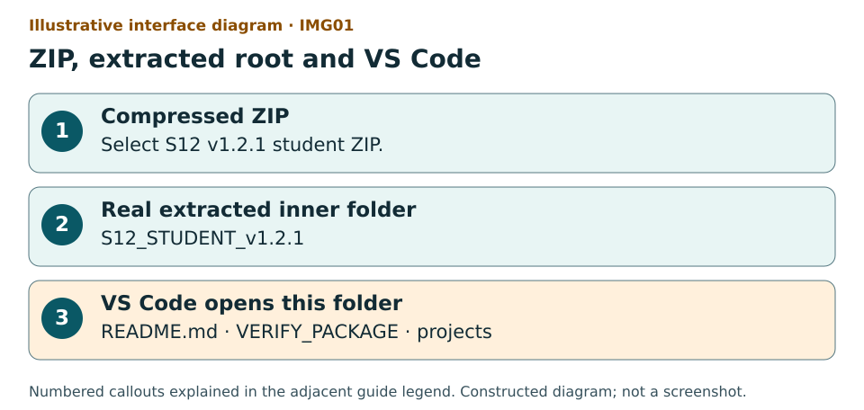
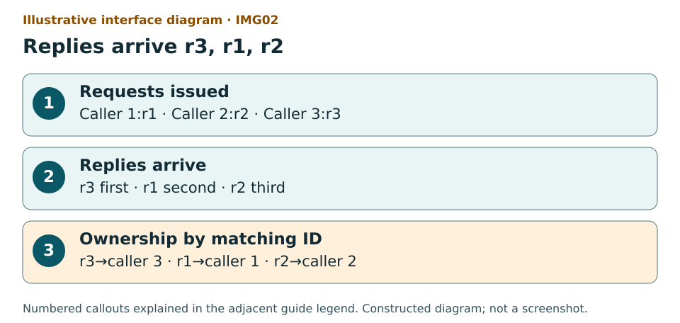
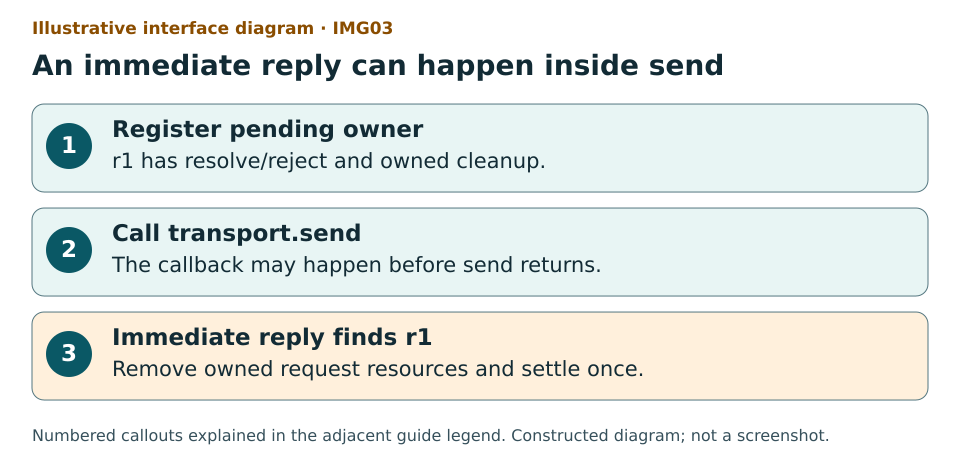
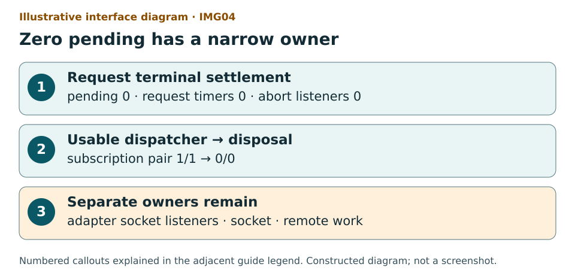
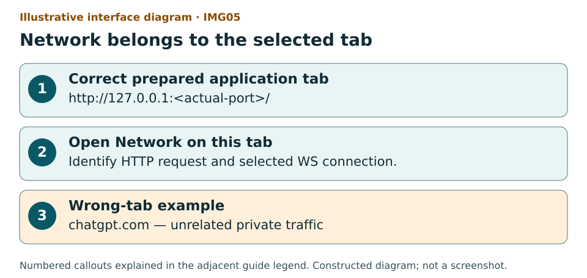
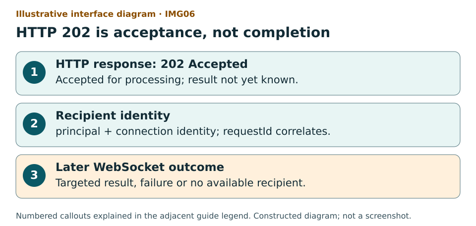
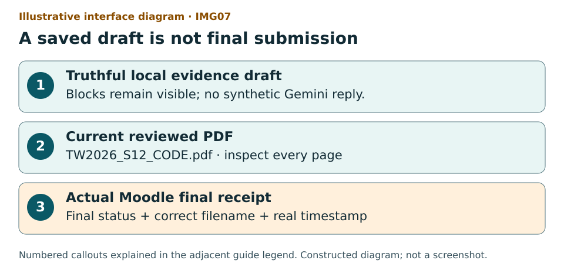

# S12 — Correlated Request Dispatcher and HTTP/WebSocket demonstration

v1.2.1 FINAL_LOCAL — content and packaging only. An offline operational guide for the first-time user.

One caller must receive the outcome belonging to its own opaque request ID, even when replies arrive out of order. Pending ownership exists before send. One terminal owner removes per-request state before settling once. Zero pending does not prove that adapter listeners, a socket or remote work have gone.

P03 is the full central implementation in one assessed file: `projects/p03/student/src/request-dispatcher.mjs`. P01 is a required individual supplied source/model trace in the same evidence PDF. P02 is optional advanced work and requires separately prepared Redis/BullMQ infrastructure. There is no C12 Assignment.

## 60 content minutes in a 90-minute meeting

| Content minutes | Individual activity | Operational locator |
| --- | --- | --- |
| 00–05 | Confirm root, identity and execution lane | Steps 01–07 |
| 05–12 | Predict lifecycle and ownership | Step 08 and initial check when qualified |
| 12–30 | P03 implementation segment | Steps 10–12; save unresolved obligations |
| 30–39 | Bounded individual observations | Steps 13–18; preserve actual results |
| 39–45 | One bounded Gemini critique or actual block | Steps 22–26 |
| 45–50 | Independent claim check and verdict | Step 27 |
| 50–55 | Required individual P01 annotation | Steps 19–20; browser route only if qualified |
| 55–60 | Save truthful draft, exit ticket and STOP | Steps 28 and 38; PDF/Moodle support uses admin reserve only when ready |

Full P03 work is estimated at 55–65 minutes by its source. The 18-minute implementation segment does not promise completion. Keep 30 minutes for attendance, setup, form, Moodle and incidents. Stop new technical content at minute 60 and save an honest draft. Later required work follows the actual teacher-set deadline; no date, penalty, pass mark or institutional alternative is invented.

## Prerequisite bridge and where you are

S03: a terminal executes a command in one current folder. S04: promises represent outcomes that may arrive later. S05: HTTP responses have a status and body. S10: state has an owner. S11: identity limits who may receive an operation result. S12 combines those ideas: a shared channel needs an opaque correlation ID and deliberate ownership.

File manager means the window that shows folders/ZIPs. VS Code is the editor and contains the integrated terminal. The browser displays this offline guide and form; it does not execute your Node module. DevTools is a browser inspection tool, not DevOps. Network attached to a file:// guide is not the local HTTP application’s traffic.

When a command is shown, copy exactly one platform command, paste into the root VS Code terminal, press Enter once and wait for the prompt to return. Do not paste it into a source file or the browser Console. Never treat a crash, timeout, guard block or missing command as a planned assertion failure.

## Seven illustrative diagrams

### IMG01: ZIP, extracted root and VS Code



Illustrative interface diagram: `assets/diagrams/img01-extracted-root.svg`. Constructed locally, not a screenshot.

Illustrative interface diagram: a ZIP is distinct from the real S12_STUDENT_v1.2.1 folder; VERIFY_PACKAGE and projects are siblings in the folder opened by VS Code.

1 identifies the download. 2 is the writable working root. 3 shows sibling items used to confirm the VS Code root. Ignore the invented window frame; this is not a screenshot.

### IMG02: Replies arrive r3, r1, r2



Illustrative interface diagram: `assets/diagrams/img02-reversed-ownership.svg`. Constructed locally, not a screenshot.

Illustrative interface diagram: three callers issue r1, r2 and r3; replies arrive r3 then r1 then r2 and each opaque ID selects its own caller.

1 is issue order. 2 is deliberately reversed arrival. 3 is the required owner map. Promise.all result order is its input order, not arrival order.

### IMG03: An immediate reply can happen inside send



Illustrative interface diagram: `assets/diagrams/img03-pending-before-send.svg`. Constructed locally, not a screenshot.

Illustrative interface diagram: register pending r1 first, invoke transport.send second and handle a synchronous fake callback third before send returns.

The numbered order is the requirement. Moving registration after send can lose the immediate reply. This constructed fake sequence is not a network timing capture.

### IMG04: Zero pending has a narrow owner



Illustrative interface diagram: `assets/diagrams/img04-cleanup-owners.svg`. Constructed locally, not a screenshot.

Illustrative interface diagram: terminal settlement removes pending, request timer and abort listener; dispatcher subscriptions stay while usable and disposal removes them; adapter, socket and remote work remain separate owners.

1 measures request-owned resources. 2 measures dispatcher-owned subscriptions at disposal. 3 needs its own evidence. Local abort does not establish remote cancellation.

### IMG05: Network belongs to the selected tab



Illustrative interface diagram: `assets/diagrams/img05-correct-network-tab.svg`. Constructed locally, not a screenshot.

Illustrative interface diagram: the intended local application tab begins http://127.0.0.1 with its actual port; a chatgpt.com tab is a wrong-tab example and its traffic must not be copied.

1 requires a real prepared local app and actual port. 2 belongs to that tab. 3 is a wrong domain example. No server is started by this guide and no real capture is shown.

### IMG06: HTTP 202 is acceptance, not completion



Illustrative interface diagram: `assets/diagrams/img06-acceptance-vs-result.svg`. Constructed locally, not a screenshot.

Illustrative interface diagram: a request is accepted by HTTP 202; principal and connection identity target a later WebSocket result with requestId; failure or disconnection can occur between them.

1 is HTTP acceptance. 2 is recipient/correlation ownership. 3 is a separate later event with separate conditions. Supplied source/model annotation is not an actual protocol run.

### IMG07: A saved draft is not final submission



Illustrative interface diagram: `assets/diagrams/img07-draft-pdf-moodle.svg`. Constructed locally, not a screenshot.

Illustrative interface diagram: truthful draft first, current reviewed one-PDF evidence second and actual Moodle final status with filename and timestamp third; Draft is a stop.

1 may be incomplete. 2 requires review and actual required evidence for normal completion. 3 is observed in the real instance. Save changes can leave Draft: STOP.

## Step 01: Identify the student ZIP

**WHERE YOU ARE** — Your file manager: Windows File Explorer, macOS Finder or Linux Files.

**WHAT TO FIND** — TW2026_S12_STUDENT_EN_GB_v1.2.1_FINAL_LOCAL.zip. A ZIP is a compressed container, not the working folder.

**EXACT ACTION** — Select the named ZIP once and read its full filename.

**WHAT YOU SHOULD SEE** — S12, EN_GB, v1.2.1 and FINAL_LOCAL in the filename. FINAL_LOCAL covers local content and packaging with documented platform limits; it does not claim publication or native platform acceptance.

**WHAT TO RECORD** — Keep the supplied download identity with your notes; package_id is obtained from the extracted package checker later.

**DO NOT CONTINUE UNLESS** — You have the student ZIP for S12 v1.2.1, rather than a teacher kit or an older seminar.

**IF YOU DO NOT SEE THIS** — Ask the teacher for this exact distribution. Keep an older working folder intact.

**STOP CONDITION** — Different seminar/version, teacher/private kit or an unavailable ZIP.

**CONTINUE WITH** — Step 02: extract a separate working copy.

**Why this step matters** — The teacher distribution contains private material. The student distribution is the individual work boundary.

## Step 02: Extract to a real folder

**WHERE YOU ARE** — The file manager with the selected student ZIP.

**WHAT TO FIND** — Extract All on Windows; the ZIP extraction action on macOS/Linux.

**EXACT ACTION** — Use the extraction action and choose a writable short folder. On Windows, right-click the ZIP and choose Extract All, then Extract.

**WHAT YOU SHOULD SEE** — A real folder containing S12_STUDENT_v1.2.1. Open that inner folder: README.md, VERIFY_PACKAGE.cmd and projects must be siblings.

**WHAT TO RECORD** — In environment_limit, record an extraction problem if one exists. Store personal evidence and exported drafts outside this package.

**DO NOT CONTINUE UNLESS** — You are viewing the real inner folder and can see the root launchers and projects together.

**IF YOU DO NOT SEE THIS** — If the path still shows the ZIP, close that window and open the extracted destination. If there is one extra enclosing folder, open S12_STUDENT_v1.2.1 inside it.

**STOP CONDITION** — Extraction error, read-only location, a shortcut/symlink root or missing root files.

**CONTINUE WITH** — Step 03: choose this exact folder in VS Code.

**Why this step matters** — Editing a compressed preview can lose changes. Root identity checks compare the actual extracted files.

## Step 03: Choose the correct VS Code folder

**WHERE YOU ARE** — VS Code, the editor window, not the browser.

**WHAT TO FIND** — File in the top application menu and Open Folder.

**EXACT ACTION** — Choose File, then Open Folder and select S12_STUDENT_v1.2.1. Confirm Select Folder/Open as your platform presents it.

**WHAT YOU SHOULD SEE** — The Explorer pane lists projects, README.md and root launchers beneath one S12_STUDENT_v1.2.1 root.

**WHAT TO RECORD** — In p03_changed_path, later record projects/p03/student/src/request-dispatcher.mjs, the exact package-root path. Do not open projects/p03/student as the package root.

**DO NOT CONTINUE UNLESS** — The editor Explorer root matches the extracted inner folder.

**IF YOU DO NOT SEE THIS** — Choose File → Open Folder again and select the inner folder that contains VERIFY_PACKAGE.cmd. If Explorer is hidden, choose View → Explorer.

**STOP CONDITION** — Different package root, missing launchers or an unexpected trust/security prompt that you cannot resolve with the teacher.

**CONTINUE WITH** — Step 04: create a terminal in this root.

**Why this step matters** — A terminal opened in a different folder cannot identify the intended package. Trust this supplied source only under your institution’s policy.

## Step 04: Locate the integrated terminal

**WHERE YOU ARE** — VS Code with the correct folder open.

**WHAT TO FIND** — Terminal in the top menu and New Terminal.

**EXACT ACTION** — Choose Terminal → New Terminal once.

**WHAT YOU SHOULD SEE** — A command prompt at the bottom of VS Code. Its current location ends in S12_STUDENT_v1.2.1. A cursor waits for input.

**WHAT TO RECORD** — Record any shell/location problem in environment_limit; command outputs belong in the matching evidence field, not in the code file.

**DO NOT CONTINUE UNLESS** — The terminal location is the package root and no unrelated server is running there.

**IF YOU DO NOT SEE THIS** — Close this terminal with its bin icon and create a new terminal after reopening the correct root. Do not paste a command into a source editor or browser Console.

**STOP CONDITION** — You cannot establish the root location or the terminal reports an unavailable shell.

**CONTINUE WITH** — Step 05: check the untouched package.

**Why this step matters** — Press Enter once after each complete command. Wait for the terminal prompt to return before another command.

## Step 05: Verify exact package identity before edits

**WHERE YOU ARE** — The VS Code terminal at S12_STUDENT_v1.2.1, before changing any package file.

**WHAT TO FIND** — VERIFY_PACKAGE.cmd on Windows or VERIFY_PACKAGE.sh on macOS/Linux.

**EXACT ACTION** — Paste the one command for your platform into the terminal and press Enter once.

**WHAT YOU SHOULD SEE** — JSON with verdict PACKAGE_IDENTITY_PASS, the actual package ID and the checked file inventory. Read the actual values rather than an illustration.

**WHAT TO RECORD** — Copy the actual ID to package_id. Keep the entire verdict outside the package. Do not add evidence files inside the exact package tree.

**DO NOT CONTINUE UNLESS** — The verifier reports PACKAGE_IDENTITY_PASS with no missing, extra, modified, unsafe or linked entry.

**IF YOU DO NOT SEE THIS** — Preserve this folder. Extract a fresh copy to a different location and repeat Step 05. Do not rewrite the manifest or remove unexplained files to force PASS.

**STOP CONDITION** — Any other verdict, a missing command, a crash or a prompt that never returns.

**CONTINUE WITH** — Step 06: check the strict runtime. After editing, use the work-boundary checker rather than expecting pristine identity.

Windows / PowerShell:

```text
.\VERIFY_PACKAGE.cmd
```

macOS / Linux:

```text
bash VERIFY_PACKAGE.sh
```

**Why this step matters** — The package ID identifies the supplied bytes. The later work checker has a separate one-file edit contract.

## Step 06: Read the strict runtime gate

**WHERE YOU ARE** — The same root terminal.

**WHAT TO FIND** — CHECK_ENVIRONMENT.cmd or CHECK_ENVIRONMENT.sh.

**EXACT ACTION** — Paste the platform command and press Enter once.

**WHAT YOU SHOULD SEE** — ENVIRONMENT_PASS only for Node v24.21.0 and npm 11.19.0 with the required clean runtime settings. ENVIRONMENT_BLOCKED means stop execution; preserve the actual Node/npm values.

**WHAT TO RECORD** — actual_node, actual_npm, execution_class and environment_limit. Type the observed versions, not the prescribed versions.

**DO NOT CONTINUE UNLESS** — ENVIRONMENT_PASS permits the execution lane. A mismatch does not become PASS through a QA override.

**IF YOU DO NOT SEE THIS** — Record the block. Continue only with labelled reading/prediction/draft preparation until the teacher provides the applicable qualified environment. Do not install software or copy an author override.

**STOP CONDITION** — Missing/mismatched runtime, injected Node options/path, ambiguous executable or an environment block.

**CONTINUE WITH** — Step 07 for a truthful draft. Step 09 and all executable observations require ENVIRONMENT_PASS.

Windows / PowerShell:

```text
.\CHECK_ENVIRONMENT.cmd
```

macOS / Linux:

```text
bash CHECK_ENVIRONMENT.sh
```

**Why this step matters** — The build environment used Node 24.19.0/npm 11.9.0 and is recorded as DOCUMENTED_RUNTIME_MISMATCH. That author result does not qualify your runtime.

## Step 07: Open the individual evidence form

**WHERE YOU ARE** — Your file manager at the package root.

**WHAT TO FIND** — FORM_S12_EN_GB.html, the current form v1.2.1.

**EXACT ACTION** — Double-click FORM_S12_EN_GB.html once. If your file manager asks which application, choose your ordinary browser.

**WHAT YOU SHOULD SEE** — A local offline EN-GB form with seven sections. Check core draft and Print honest draft are distinct from assessed completeness.

**WHAT TO RECORD** — student_code is the teacher-approved alias/code. Fill identity fields and the actual execution_class. After Step 09, copy the actual source_sha256 from a successful VERIFY_INITIAL_STATE receipt and retain its output locator. If that gate is blocked, record NOT_RECORDED or BLOCKED with the actual reason; do not invent a hash. Keep the private identity mapping with the teacher.

**DO NOT CONTINUE UNLESS** — The form title identifies S12 v1.2.1 and does not request private credentials.

**IF YOU DO NOT SEE THIS** — Open this exact filename directly. If local storage is blocked, use Export JSON outside the package or the supplied DOCX form; record the recovery.

**STOP CONDITION** — Wrong form/version, inaccessible fields or loss of your only draft copy.

**CONTINUE WITH** — Step 08: write predictions before observations.

**Why this step matters** — 49 field IDs remain stable across the form, its DOCX version and this guide. Filling a field does not certify that an experiment ran.

## Step 08: Make two predictions before execution

**WHERE YOU ARE** — The form’s Protocol prediction section, with the guide alongside it.

**WHAT TO FIND** — accepted_owner_map, pending_before_send_prediction, terminal_paths_prediction and cleanup_invariant.

**EXACT ACTION** — Write two predictions in your own words before checks: whether a synchronous reply can arrive inside send before pending exists and which resources remain owned after request settlement. Also predict the r3 owner for the E01 case.

**WHAT YOU SHOULD SEE** — Two falsifiable predictions that could be contradicted by a trace. Include a resource-owner prediction and identify the chosen fake unit lane in transport_choice.

**WHAT TO RECORD** — accepted_owner_map, transport_choice, connection_identity, pending_before_send_prediction, terminal_paths_prediction and cleanup_invariant.

**DO NOT CONTINUE UNLESS** — The predictions exist before their corresponding observations and do not merely say “it should work”.

**IF YOU DO NOT SEE THIS** — Use the conceptual prompts below. Label any retrospectively reconstructed statement as retrospective rather than a pre-experiment prediction.

**STOP CONDITION** — An observation has already occurred but is being presented as a prior prediction.

**CONTINUE WITH** — Step 09 if the strict environment gate passed; otherwise keep a blocked reading draft.

**Why this step matters** — A report export may be accepted before accounting totals exist. Correct correlation prevents one caller receiving another caller’s result.

## Step 09: Confirm the intended initial state

**WHERE YOU ARE** — The root terminal in a clean, untouched starter with ENVIRONMENT_PASS.

**WHAT TO FIND** — VERIFY_INITIAL_STATE.cmd or VERIFY_INITIAL_STATE.sh.

**EXACT ACTION** — Run the platform command once and wait for the prompt to return.

**WHAT YOU SHOULD SEE** — INITIAL_STATE_PASS: canonical baseline 2 PASS, the separately derived initial-objective harness 5 bounded ERR_ASSERTION failures and canonical regression 3 PASS.

**WHAT TO RECORD** — Record the suite names and counts in p03_baseline_results, p03_objective_results and p03_regression_results. Before implementation, copy source_sha256 and source_path from the successful initial-state receipt and keep its actual output locator. A blocked gate stays NOT_RECORDED/BLOCKED with its real reason. Mark evidence status truthfully.

**DO NOT CONTINUE UNLESS** — The derived five failures are named assertions. A direct rejection, parse error, skip, cancellation, timeout, guard block or crash is a real failure.

**IF YOU DO NOT SEE THIS** — Read the suite and failure classification. The preserved original objective starter suite has four assertion failures and one direct dispatcher_unavailable rejection; that direct rejection is not an expected assertion. Use the explicitly derived initial harness.

**STOP CONDITION** — Different counts/classification, changed starter, unexpected stderr or no terminal completion.

**CONTINUE WITH** — Step 10: locate the one assessed file.

Windows / PowerShell:

```text
.\VERIFY_INITIAL_STATE.cmd
```

macOS / Linux:

```text
bash VERIFY_INITIAL_STATE.sh
```

**Why this step matters** — A red result is expected only in this narrowly defined initial assertion harness. A red observation after implementation is unresolved work.

## Step 10: Locate the one assessed P03 file

**WHERE YOU ARE** — The VS Code Explorer pane.

**WHAT TO FIND** — projects, then p03, then student, then src, then request-dispatcher.mjs.

**EXACT ACTION** — Click request-dispatcher.mjs once to open it in the editor.

**WHAT YOU SHOULD SEE** — The .mjs module exporting createRequestDispatcher. The starter is deliberately incomplete; public infrastructure and canonical tests are not your edit targets.

**WHAT TO RECORD** — p03_changed_path: projects/p03/student/src/request-dispatcher.mjs, exactly. The shorter student/src/request-dispatcher.mjs is relative source navigation inside P03, not the form field value. p03_diff_locator: narrow diff/evidence outside the kit.

**DO NOT CONTINUE UNLESS** — The editor breadcrumb ends in the exact file and you have not opened a teacher reference.

**IF YOU DO NOT SEE THIS** — Close the wrong editor tab without saving it and select the stated path from the correct root.

**STOP CONDITION** — Any other file must be changed to make your assessed solution pass; ask the teacher rather than editing support/tests/locks.

**CONTINUE WITH** — Step 11: implement and save this file.

**Why this step matters** — The active requirements include permanent close, relevant-lifetime ID uniqueness and a rejected promise if the ID generator throws.

## Step 11: Implement a bounded segment and save

**WHERE YOU ARE** — The editor tab for the assessed request-dispatcher.mjs.

**WHAT TO FIND** — The dispatch, message, close and dispose responsibilities in the supplied contract/specification.

**EXACT ACTION** — Implement only this file, then choose File → Save. Work from your predictions and the obligations below rather than copying a complete implementation.

**WHAT YOU SHOULD SEE** — The unsaved dot on this tab disappears. Your edit remains inside the one-file boundary. A saved file is not a passing file.

**WHAT TO RECORD** — p03_unresolved_work: which obligations remain, including known failures. p03_diff_locator: the saved diff/source evidence location. source_sha256 is obtained from final work output.

**DO NOT CONTINUE UNLESS** — No test/support/lock/manifest was edited and unfinished obligations remain explicitly recorded.

**IF YOU DO NOT SEE THIS** — If you cannot finish, save a truthful partial draft. Preserve syntax errors and their actual observation; do not hide them as pedagogical failure.

**STOP CONDITION** — The implementation segment reaches content minute 30, or you need an unauthorised second edit.

**CONTINUE WITH** — Step 12: obtain a bounded final-work observation, with unresolved results kept as draft.

**Why this step matters** — Only 18 content minutes are assigned to implementation here. The source estimates 55–65 minutes for full P03 work; completion may continue by the actual teacher-set deadline.

## Step 12: Run the final work boundary and checks

**WHERE YOU ARE** — The root terminal after saving the assessed file and with a qualified strict runtime.

**WHAT TO FIND** — VERIFY_WORK_RESULT.cmd or VERIFY_WORK_RESULT.sh.

**EXACT ACTION** — Run the platform command once. Wait for its complete JSON/verdict and the terminal prompt.

**WHAT YOU SHOULD SEE** — WORK_RESULT_PASS requires the permitted one-file boundary and 18 checks: all 10 canonical non-integration tests, six derived lifecycle cases and two adapter support cases. Real WebSocket integration has its own unopened qualification gate.

**WHAT TO RECORD** — p03_baseline_results, p03_objective_results, p03_regression_results and p03_unresolved_work: record exact check names and actual failures. After required work passes, replace source_sha256 with the actual VERIFY_WORK_RESULT value and retain its final receipt locator before the assessed PDF. A hash identifies bytes, not correct behaviour.

**DO NOT CONTINUE UNLESS** — Your source hash is the saved assessed source and no forbidden edit is hidden. PASS in this lane is a bounded unit/support result.

**IF YOU DO NOT SEE THIS** — Use the reported first failure and return to the assessed file. Keep the actual report. If you are blocked by runtime or infrastructure, preserve the block and stop executing.

**STOP CONDITION** — Unexpected failure/crash/timeout, forbidden file change or pressure to change tests to manufacture green output.

**CONTINUE WITH** — Step 13: record E01 correlation. Passing final checks do not replace interpreted evidence.

Windows / PowerShell:

```text
.\VERIFY_WORK_RESULT.cmd
```

macOS / Linux:

```text
bash VERIFY_WORK_RESULT.sh
```

**Why this step matters** — Canonical npm test also contains real WebSocket integration. Do not run npm install, npm ci, npm start or broad npm test as this guide’s hidden preflight.

## Step 13: E01: observe reversed replies

**WHERE YOU ARE** — The root terminal in the qualified fake transport unit lane.

**WHAT TO FIND** — The E01 observation launcher and checks/e01-correlation.test.mjs.

**EXACT ACTION** — Run the E01 platform command once and wait for its named TAP observation.

**WHAT YOU SHOULD SEE** — The three synthetic IDs are r1, r2 and r3. Replies are delivered r3/r1/r2; each result belongs to the caller with the matching ID. An incomplete solution may fail.

**WHAT TO RECORD** — p03_reversed_order_trace: IDs, reply-arrival order, caller-result map, named check and actual verdict. Use PURE_JS for a real fake-transport JS execution.

**DO NOT CONTINUE UNLESS** — Your record distinguishes arrival order from the input order retained by Promise.all. A copied illustrative trace is MODEL, not PURE_JS.

**IF YOU DO NOT SEE THIS** — Compare the pending-map lookup by opaque ID with your source. Record the mismatch and return to Step 11 within the allotted segment/later work.

**STOP CONDITION** — Unhandled rejection, hang, missing test or a trace without an identifiable request-to-caller mapping.

**CONTINUE WITH** — Step 14: observe an immediate reply.

Windows / PowerShell:

```text
.\OBSERVE_P03_CASES.cmd E01
```

macOS / Linux:

```text
bash OBSERVE_P03_CASES.sh E01
```

**Why this step matters** — A reply channel is not a supermarket queue: the last request can finish first. The fake proves a bounded mapping, not network delivery.

## Step 14: E02: observe pending before send

**WHERE YOU ARE** — The root terminal and your saved assessed source.

**WHAT TO FIND** — checks/e02-pending-before-send.test.mjs and the pending registration before transport.send.

**EXACT ACTION** — Run E02 once and wait for the named observation.

**WHAT YOU SHOULD SEE** — An immediate-reply fake calls the dispatcher callback before send returns. The relevant pending owner must already exist to receive that result.

**WHAT TO RECORD** — p03_sync_reply_trace: named check, registration/send sequence, actual outcome and source locator. Keep the prior pending_before_send_prediction.

**DO NOT CONTINUE UNLESS** — You explain why pending state must exist before send rather than claiming that JavaScript is always asynchronous.

**IF YOU DO NOT SEE THIS** — Locate the order in your source. Do not add an arbitrary delay to disguise the synchronous witness.

**STOP CONDITION** — A lost reply, timeout, invented trace or an unqualified command execution.

**CONTINUE WITH** — Step 15: inspect invalid request refusal.

Windows / PowerShell:

```text
.\OBSERVE_P03_CASES.cmd E02
```

macOS / Linux:

```text
bash OBSERVE_P03_CASES.sh E02
```

**Why this step matters** — A synchronous fake is a race witness. It does not predict actual socket latency or scheduling.

## Step 15: E03: observe validation without sending

**WHERE YOU ARE** — The qualified root terminal.

**WHAT TO FIND** — checks/e03-validation.test.mjs.

**EXACT ACTION** — Run E03 once and read each validation case.

**WHAT YOU SHOULD SEE** — Empty/non-string type, nonpositive or over-60,000 ms timeout and a pre-aborted signal are rejected before send. The fake send count for refused requests stays zero.

**WHAT TO RECORD** — p03_objective_results: input case, public error code, zero-send counter, named check and actual verdict.

**DO NOT CONTINUE UNLESS** — The record distinguishes a safe rejection from a crash. A valid AbortSignal and supplied asynchronous timer contract are assumed.

**IF YOU DO NOT SEE THIS** — Review validation before allocation/send. Keep a wrong result as unresolved work, including any request that was sent incorrectly.

**STOP CONDITION** — Raw/private errors, a synchronous generator crash or validation that sends before refusing.

**CONTINUE WITH** — Step 16: inspect terminal cleanup.

Windows / PowerShell:

```text
.\OBSERVE_P03_CASES.cmd E03
```

macOS / Linux:

```text
bash OBSERVE_P03_CASES.sh E03
```

**Why this step matters** — Input validation prevents side effects. Invalid requests are not remote-work experiments.

## Step 16: E04: observe one terminal owner

**WHERE YOU ARE** — The qualified root terminal.

**WHAT TO FIND** — checks/e04-terminal-cleanup.test.mjs.

**EXACT ACTION** — Run E04 once. Read the timeout/abort observation and the late-completion observation.

**WHAT YOU SHOULD SEE** — A terminal timeout or abort settles once. Per-request pending, timer and abort-listener counts return to zero; a later reply cannot change the settled result.

**WHAT TO RECORD** — p03_timeout_trace, p03_abort_trace and p03_zero_pending: the triggering path, public code, late reply and separately named resource counters.

**DO NOT CONTINUE UNLESS** — You identify the local owner and do not claim that timeout/abort cancelled remote work.

**IF YOU DO NOT SEE THIS** — Trace the shared settlement/cleanup path and the point where owned resources are removed. Never suppress the first rejection to manufacture a successful trace.

**STOP CONDITION** — Double settlement side effects, a pending leak, a timer/listener leak or an unhandled rejection.

**CONTINUE WITH** — Step 17: distinguish close from disposal.

Windows / PowerShell:

```text
.\OBSERVE_P03_CASES.cmd E04
```

macOS / Linux:

```text
bash OBSERVE_P03_CASES.sh E04
```

**Why this step matters** — Zero local pending says nothing by itself about remote completion or exactly-once distributed execution.

## Step 17: E05: distinguish close and disposal

**WHERE YOU ARE** — The qualified root terminal.

**WHAT TO FIND** — checks/e05-close-dispose.test.mjs.

**EXACT ACTION** — Run E05 once and read close, later dispatch and repeated disposal separately.

**WHAT YOU SHOULD SEE** — Close rejects the two pending calls and permanently refuses later dispatch. The dispatcher’s subscription pair stays 1/1 while usable; disposal removes it to 0/0 and is idempotent.

**WHAT TO RECORD** — p03_close_trace, p03_dispose_trace and p03_zero_listeners_timers: state before/after each action, dispatcher subscriptions and per-request resources separately.

**DO NOT CONTINUE UNLESS** — The counter owner is named. Adapter socket listeners and the socket itself have separate disposal obligations.

**IF YOU DO NOT SEE THIS** — Separate pending cleanup from dispatcher disposal in your source and explanation. Do not demand zero dispatcher subscriptions while the dispatcher is still usable.

**STOP CONDITION** — Post-close sending, non-idempotent disposal or an “all listeners zero” claim without owner-specific measurements.

**CONTINUE WITH** — Step 18: inspect lifetime ID uniqueness.

Windows / PowerShell:

```text
.\OBSERVE_P03_CASES.cmd E05
```

macOS / Linux:

```text
bash OBSERVE_P03_CASES.sh E05
```

**Why this step matters** — No reconnect, transport-security or distributed exactly-once guarantee is established here.

## Step 18: E06: refuse a retired ID

**WHERE YOU ARE** — The qualified root terminal.

**WHAT TO FIND** — checks/e06-id-lifetime.test.mjs.

**EXACT ACTION** — Run E06 once and read the repeated-ID and throwing-generator cases.

**WHAT YOU SHOULD SEE** — A controlled retired ID cannot start a new request that an old reply could settle. A throwing nextId generator becomes a rejected promise with a safe public failure.

**WHAT TO RECORD** — p03_objective_results and evidence_class_limits: the repeat/late-first sequence, refusal code, generator case and named check. State the bounded classroom lifetime.

**DO NOT CONTINUE UNLESS** — Uniqueness covers the relevant dispatcher lifetime, not just IDs currently in pending. Retired IDs consume retained memory.

**IF YOU DO NOT SEE THIS** — Read the active lifetime bound in the supplied specification. Do not clear retired IDs merely to claim zero memory or reuse an old ID.

**STOP CONDITION** — Old reply settles a new caller, synchronous generator throw or an unbounded-memory claim unsupported by a lifetime policy.

**CONTINUE WITH** — In class, continue with Step 22 at content minutes 39–45 for Gemini. After Step 27, return to Step 19 at minutes 50–55 for the required P01 trace. The timeline governs the live order.

Windows / PowerShell:

```text
.\OBSERVE_P03_CASES.cmd E06
```

macOS / Linux:

```text
bash OBSERVE_P03_CASES.sh E06
```

**Why this step matters** — A small classroom lifetime is an explicit limit. A long-running service requires its own replay/memory strategy.

## Step 19: E07: read the supplied P01 source/model trace

**WHERE YOU ARE** — The package root in VS Code or the file manager.

**WHAT TO FIND** — S12_P01_GUIDED_TRACE.md and the supplied original P01 source/model trace.

**EXACT ACTION** — Open S12_P01_GUIDED_TRACE.md and read its trace in order, without starting a server.

**WHAT YOU SHOULD SEE** — Explicit source/model labels and separate HTTP acceptance, WebSocket registration, principal/connection/request IDs and targeted result events.

**WHAT TO RECORD** — p01_demo_scope: individual supplied source/model analysis. Set relevant statuses to SOURCE_ANALYSIS or MODEL, never REAL_PROTOCOL for this reading.

**DO NOT CONTINUE UNLESS** — You identify your evidence class and the trace/source locator. The original source’s limitations are visible rather than silently repaired.

**IF YOU DO NOT SEE THIS** — Use the supplied HTML/Markdown trace, not a colleague’s observations. Ask for the exact file if it is missing.

**STOP CONDITION** — A supplied trace is being labelled as your actual HTTP/WebSocket run.

**CONTINUE WITH** — Step 20: annotate acceptance and ownership individually.

**Why this step matters** — P01 is required individual analysis in the same PDF. It is not a second assessed implementation. P02 Redis/BullMQ is optional advanced work.

## Step 20: E07: annotate acceptance, target and cleanup

**WHERE YOU ARE** — The form’s P01 guided trace section, with the supplied trace visible.

**WHAT TO FIND** — The 202 acceptance event and the later targeted WebSocket result.

**EXACT ACTION** — Write your own annotations for the acceptance, registration, recipient identity and cleanup counterexamples.

**WHAT YOU SHOULD SEE** — HTTP 202 means accepted for processing, not completed. The principal plus connection identity selects the recipient; requestId correlates a later result.

**WHAT TO RECORD** — p01_http_acceptance, p01_ws_registration, p01_targeted_result, p01_identity_binding, p01_cleanup_observation and p01_demo_limit.

**DO NOT CONTINUE UNLESS** — You name the original duplicate-ID overwrite and disconnect/pending-cleanup limits. Query identity fixtures are not production authentication.

**IF YOU DO NOT SEE THIS** — Return to the labelled original trace/source. Separate what is observed in the model from what is inferred about a real protocol.

**STOP CONDITION** — A completion/security/cleanup claim exceeds the source/model evidence.

**CONTINUE WITH** — In class, continue with Step 28 at content minutes 55–60, then Step 38. Step 21 is a separately qualified protocol reference route, not a hidden extra live content block.

**Why this step matters** — HTTP and WebSocket have different responsibilities. Acceptance can precede failure or the disappearance of a recipient.

## Step 21: Find Network in an explicitly prepared local tab

**WHERE YOU ARE** — An already prepared, teacher-approved local application tab whose address begins http://127.0.0.1:. This is a separate real-protocol qualification route.

**WHAT TO FIND** — The browser-specific mouse route below and then its Network panel.

**EXACT ACTION** — Choose your browser in this guide and follow its documented menu route. Read the local address before opening the tool.

**WHAT YOU SHOULD SEE** — Network attached to the local application tab. The chatgpt.com tab in the diagram is the wrong-tab example. A file:// guide has no HTTP app traffic to measure.

**WHAT TO RECORD** — p03_integration_results only for a genuinely executed qualified protocol check. Otherwise explicitly NOT_EXECUTED/BLOCKED with the reason; p01_demo_limit records the supplied-source scope.

**DO NOT CONTINUE UNLESS** — The actual local app, pinned dependency, bounded open/test/cleanup and teacher-approved instructions exist. This guide does not start or provision them.

**IF YOU DO NOT SEE THIS** — If the local app is unavailable, return to Step 19’s source/model route. If Network is empty, confirm the selected tab; do not expose traffic from Gemini/Moodle/private accounts.

**STOP CONDITION** — No prepared app, wrong domain, unknown port, private traffic or an instruction to install/start a hidden dependency.

**CONTINUE WITH** — Step 22: begin the bounded Gemini critique, or record its actual block.

**Why this step matters** — Official routes were checked on 2 October 2026. Version, language and managed-policy differences remain possible. No native browser acceptance is claimed.

## Step 22: Open Gemini Web in a new tab

**WHERE YOU ARE** — Your ordinary browser, with the offline guide kept open.

**WHAT TO FIND** — The plus-shaped New tab button to the right of the tab strip and the address bar.

**EXACT ACTION** — Click New tab, type https://gemini.google.com in the address bar and press Enter once.

**WHAT YOU SHOULD SEE** — Gemini Web, or an actual sign-in/access/network block. Use only an account permitted by your institution’s existing policy.

**WHAT TO RECORD** — If blocked, gemini_prompt and gemini_response_excerpt record the actual reason with BLOCKED/NOT_EXECUTED metadata. Do not create a synthetic dialogue.

**DO NOT CONTINUE UNLESS** — You have authorised account access and can review what will be sent.

**IF YOU DO NOT SEE THIS** — Keep a truthful draft and obtain the applicable teacher assessment policy later. No automatic alternative or invented grade rule is supplied.

**STOP CONDITION** — Unauthorised account, unavailable access or sensitive information in the intended input.

**CONTINUE WITH** — Step 23 if available; otherwise Step 28 for a blocked draft.

**Why this step matters** — Gemini is a preliminary critic. Its prose is not independent technical evidence.

## Step 23: Start a new Gemini chat

**WHERE YOU ARE** — Gemini Web in the newly opened tab.

**WHAT TO FIND** — New chat, commonly in the left panel. If that panel is collapsed, find its menu icon to show it.

**EXACT ACTION** — Select New chat once. If your version uses another label, verify that the displayed conversation is new and record the observed label.

**WHAT YOU SHOULD SEE** — An empty prompt box without a previous private conversation. Interface positions/labels are version-dependent; this route has not been qualified in a live session here.

**WHAT TO RECORD** — Record any UI block in gemini_prompt/environment_limit. Do not copy account identifiers or earlier conversations into your evidence.

**DO NOT CONTINUE UNLESS** — The new conversation and prompt box are available.

**IF YOU DO NOT SEE THIS** — If a new conversation cannot be established, stop this exchange and retain the actual block. Do not reuse a private unrelated chat.

**STOP CONDITION** — An inaccessible control, accidental private context or a policy restriction.

**CONTINUE WITH** — Step 24: review and paste the bounded prompt.

**Why this step matters** — A fresh conversation limits irrelevant context, but it does not guarantee an accurate reply.

## Step 24: Review a minimal prompt before pasting

**WHERE YOU ARE** — The guide’s prompt box and the new Gemini chat.

**WHAT TO FIND** — The supplied bounded lifecycle claim prompt below. Its miniature excerpt is illustrative, not your full assessed file.

**EXACT ACTION** — Read the prompt, then use Copy and paste it into the prompt box. If Copy is blocked, use the visible manual-copy box and Ctrl+C/Cmd+C.

**WHAT YOU SHOULD SEE** — Only a small sanitised excerpt and one flawed claim about pendingCount === 0. There is no request for a complete dispatcher implementation.

**WHAT TO RECORD** — gemini_prompt: preserve the actual prompt that you send. Record any deliberate sanitised variation.

**DO NOT CONTINUE UNLESS** — There are no passwords, tokens, cookies, API keys, real personal/database data, private source, private captures or Moodle data.

**IF YOU DO NOT SEE THIS** — Remove sensitive content before proceeding. If the only useful example is private/unauthorised, do not send it.

**STOP CONDITION** — Sensitive/unauthorised input or a prompt asking the model to write the full assessed implementation.

**CONTINUE WITH** — Step 25: send once and wait.

**Why this step matters** — The flawed claim is that zero pending proves dispatcher, adapter, socket and remote work have all been cleaned up.

## Step 25: Send once and preserve the relevant reply

**WHERE YOU ARE** — The new Gemini prompt box containing the reviewed prompt.

**WHAT TO FIND** — The Send control beside/below the prompt box, commonly an arrow; verify its accessible label in your version.

**EXACT ACTION** — Click Send once and wait until the response finishes. Do not click repeatedly.

**WHAT YOU SHOULD SEE** — One actual response, or an actual refusal/error. Preserve the relevant claim and response excerpt without unnecessary personal information.

**WHAT TO RECORD** — gemini_response_excerpt and gemini_claim. Use ACTUAL_GEMINI only for the actual exchange; if it did not happen, keep BLOCKED/NOT_EXECUTED.

**DO NOT CONTINUE UNLESS** — The response is complete and the recorded excerpt comes from this exchange.

**IF YOU DO NOT SEE THIS** — Record a refusal, interruption or network block. Do not fill the response field with a supplied/model example as though Gemini produced it.

**STOP CONDITION** — Repeated-send ambiguity, absent response or fabricated response provenance.

**CONTINUE WITH** — Step 26: select a falsifiable claim.

**Why this step matters** — A fluent response can still collapse separate owners into one misleading cleanup statement.

## Step 26: Separate observed, inferred and unknown

**WHERE YOU ARE** — The actual response and your form’s Bounded Gemini critique section.

**WHAT TO FIND** — One statement you can test or check independently.

**EXACT ACTION** — Write the exact relevant claim and classify each supporting item as observed, inferred or unknown.

**WHAT YOU SHOULD SEE** — A claim with a concrete condition/outcome, such as “pendingCount 0 proves adapter listeners are gone”, rather than a vague judgement that the code is good.

**WHAT TO RECORD** — gemini_claim: relevant quotation/paraphrase and what would refute it. gemini_independent_check: the intended independent check locator.

**DO NOT CONTINUE UNLESS** — The claim is not accepted solely because the model said it.

**IF YOU DO NOT SEE THIS** — Narrow a broad answer to one resource-owner claim. If the answer makes no checkable claim, state that limit and use UNKNOWN rather than inventing one.

**STOP CONDITION** — The reply is copied without a claim/check or presented as the only evidence.

**CONTINUE WITH** — Step 27: perform the independent check and decide.

**Why this step matters** — Observed refers to your actual bounded evidence; inferred requires a stated chain of reasoning; unknown remains unresolved.

## Step 27: Check the claim and justify a verdict

**WHERE YOU ARE** — Your own source, prior bounded E04/E05 evidence and the form.

**WHAT TO FIND** — Owner-specific counters/source locators, separate from the model’s prose.

**EXACT ACTION** — Compare the claim against an independent named observation/source check and write a verdict with a correction and limit.

**WHAT YOU SHOULD SEE** — ACCEPTED, REJECTED, PARTIALLY ACCEPTED or UNKNOWN justified by evidence. For example, zero pending can coexist with a usable dispatcher subscription pair; local abort does not establish remote cancellation.

**WHAT TO RECORD** — gemini_independent_check and gemini_verdict_correction: locator, observed/inferred status, actual result, verdict, correction and limit.

**DO NOT CONTINUE UNLESS** — The check is independent of model text and its evidence class is explicit. A source-only check is SOURCE_ANALYSIS, not an actual protocol run.

**IF YOU DO NOT SEE THIS** — If execution is blocked, use a labelled source check and keep the blocked execution status. A missing actual Gemini exchange still prevents normal assessed completeness.

**STOP CONDITION** — Unjustified verdict, fabricated execution or claims about adapter/socket/remote cleanup without their own evidence.

**CONTINUE WITH** — In class, continue with Step 19 at content minutes 50–55 for the required individual P01 trace, then Step 20 and Step 28. Outside the live route, Step 28 reviews an already completed P01 record.

**Why this step matters** — A corrected claim states which resources were owned, which were measured and what remains unknown.

## Step 28: Review evidence status and unresolved work

**WHERE YOU ARE** — The local FORM_S12_EN_GB.html form.

**WHAT TO FIND** — The 49 field locators below, evidence-status dropdowns and the core/assessed check buttons.

**EXACT ACTION** — Choose Check core draft for the class-time state. Use Check assessed completeness only after actual required work/evidence is complete.

**WHAT YOU SHOULD SEE** — Explicit per-field evidence statuses. NOT_RECORDED, NOT_EXECUTED and BLOCKED remain drafts; prose such as NOT_EXECUTED does not certify execution or completion.

**WHAT TO RECORD** — p02_optional_status (NOT_STARTED is valid for optional P02), cross_protocol_reflection, evidence_class_limits, next_work and p03_unresolved_work. Keep privacy_redaction/declaration_truthful accurate.

**DO NOT CONTINUE UNLESS** — Normal assessed completion has the one-file completed P03 final checks, required individual P01 trace, actual bounded Gemini audit under the teacher policy and a reviewed PDF. Structural completeness is not truth.

**IF YOU DO NOT SEE THIS** — Fix the specific missing field/status. An unavailable Gemini exchange remains an honest printable draft, with later teacher policy unresolved. Imported text is unverified; recheck declarations.

**STOP CONDITION** — A block is being bypassed as an automatically authorised alternative, or a check label is being used as a truth certificate.

**CONTINUE WITH** — Step 29: generate the appropriate draft or assessed print projection.

**Why this step matters** — Autosave is local only. Switching it off cancels queued saves. Export JSON outside the package before relying on a browser session.

## Step 29: Generate the current print projection

**WHERE YOU ARE** — The current offline form after reviewing your fields and statuses.

**WHAT TO FIND** — Print honest draft or Print assessed candidate.

**EXACT ACTION** — Click the control matching the actual state once.

**WHAT YOU SHOULD SEE** — The browser print dialogue with the current text projection. An honest draft remains labelled as a draft. Editing/importing later invalidates a stale projection and declarations.

**WHAT TO RECORD** — pdf_review_status remains NOT_REVIEWED until you inspect the saved file. final_status must match the actual form state.

**DO NOT CONTINUE UNLESS** — The output matches the current revision and includes all long evidence as printable text.

**IF YOU DO NOT SEE THIS** — Cancel printing, return to the current form and regenerate after any material edit. If local printing is blocked, use the supplied DOCX route and preserve the same evidence/status fields.

**STOP CONDITION** — Old content, omitted fields, private data or a draft being presented as assessed complete.

**CONTINUE WITH** — Step 30: save the PDF with the code convention.

**Why this step matters** — A print dialogue is not a PDF review and not a Moodle submission.

## Step 30: Save one PDF outside the package

**WHERE YOU ARE** — The browser print dialogue.

**WHAT TO FIND** — Destination/printer control and Save as PDF or the platform’s PDF saving route.

**EXACT ACTION** — Choose the PDF destination, A4 and a readable default/fit scale, then save outside the package using TW2026_S12_CODE.pdf with CODE replaced by your approved code.

**WHAT YOU SHOULD SEE** — One saved PDF, for example TW2026_S12_DEMO17.pdf. Do not use a surname/group convention copied from another seminar. Browser-specific print controls vary.

**WHAT TO RECORD** — The actual PDF filename and location. Keep a JSON/DOCX draft separately if needed.

**DO NOT CONTINUE UNLESS** — The filename uses student_code/approved alias and the saved file is a PDF.

**IF YOU DO NOT SEE THIS** — If no PDF route exists, stop the upload and ask for the applicable institution-approved PDF route. Do not rename a DOCX/HTML file to .pdf.

**STOP CONDITION** — Wrong name/type, unknown destination or an unsaved output.

**CONTINUE WITH** — Step 31: open and review the saved PDF.

**Why this step matters** — Only this reviewed evidence PDF is the normal Assignment upload. Do not upload the project, source tree, node_modules or teacher material.

## Step 31: Review every saved PDF page

**WHERE YOU ARE** — Your PDF viewer with the saved TW2026_S12_CODE.pdf open.

**WHAT TO FIND** — All seven sections, long answers and the final paragraph of each long field.

**EXACT ACTION** — Read every page, including the last page, and check the actual saved text against your current form.

**WHAT YOU SHOULD SEE** — Readable uncut text, current source/check evidence, truthful limitations and no sensitive information. Find the last paragraph of your longest field.

**WHAT TO RECORD** — Set pdf_review_status to DRAFT_REVIEWED for a reviewed draft or FINAL_REVIEWED for the actual assessed candidate. Material changes require a regenerated PDF and another review.

**DO NOT CONTINUE UNLESS** — Every page and the final long-answer paragraphs survived. A final reviewed PDF includes required actual evidence and declarations.

**IF YOU DO NOT SEE THIS** — Return to the form, correct the layout/text and regenerate. Do not upload a clipped or stale file. Recheck the final saved file after status/declaration changes.

**STOP CONDITION** — Truncation, stale revision, omitted evidence, exposed sensitive data or the PDF is still a draft.

**CONTINUE WITH** — Step 32 only when the actual teacher policy/deadline and final candidate are ready; otherwise save the truthful draft and Step 38.

**Why this step matters** — Native browser/Word print acceptance is not asserted by the local static/model checks for this candidate.

## Step 32: Reach the correct Moodle course

**WHERE YOU ARE** — Your ordinary browser. Keep the saved PDF available in the file manager.

**WHAT TO FIND** — A new tab with online.ase.ro and your institution-approved login route.

**EXACT ACTION** — Open https://online.ase.ro, complete your institution’s login and select the Tehnologii Web course and Week 12 provided by the teacher.

**WHAT YOU SHOULD SEE** — The intended course/week and a single S12 Assignment. Exact theme/login controls are instance-dependent and have not been observed in this build.

**WHAT TO RECORD** — submission_status remains NOT_SUBMITTED or READY_NOT_SUBMITTED. Do not store credentials or Moodle cookies in this form.

**DO NOT CONTINUE UNLESS** — The course and week are confirmed by the teacher’s actual instructions, with a reviewed final PDF and the actual deadline.

**IF YOU DO NOT SEE THIS** — If login/course/week differs or is unavailable, retain the actual block and contact the teacher through the established route. Do not invent dates, penalties or a replacement Assignment.

**STOP CONDITION** — Wrong course/week, unavailable Assignment or unauthorised account.

**CONTINUE WITH** — Step 33: verify the S12 Assignment title.

**Why this step matters** — There is no C12 Assignment and no P02 completion gate in the S12 normal route.

## Step 33: Verify the Assignment before adding a file

**WHERE YOU ARE** — Moodle in the correct Week 12 area.

**WHAT TO FIND** — The teacher’s actual S12 Assignment title, instructions and Add submission control.

**EXACT ACTION** — Open the S12 Assignment and compare its instructions/title against MOODLE_UPLOAD_GUIDE_S12_EN_GB.md and the teacher’s current instructions.

**WHAT YOU SHOULD SEE** — Individual one-PDF evidence instructions and real availability/deadline settings. The setup proposal’s dates are placeholders.

**WHAT TO RECORD** — Record a title/policy mismatch as a block. Do not infer an institutional exception from a generic guide.

**DO NOT CONTINUE UNLESS** — The intended Assignment is identified and accepts your final PDF under the actual settings.

**IF YOU DO NOT SEE THIS** — Return to the correct course/week if the title differs. Ask for the applicable policy if the teacher configured a material variation.

**STOP CONDITION** — Unexpected extra requirements, wrong seminar or an unreviewed/draft PDF.

**CONTINUE WITH** — Step 34: add the reviewed file.

**Why this step matters** — Moodle labels may vary by version/theme. Follow the observed equivalent only after confirming its function.

## Step 34: Add the reviewed PDF and wait

**WHERE YOU ARE** — The confirmed S12 Assignment submission area.

**WHAT TO FIND** — Add submission/Edit submission and the file area or file-picker control.

**EXACT ACTION** — Select Add submission, then add the one reviewed PDF using the file area or its picker. Wait until the upload finishes before another action.

**WHAT YOU SHOULD SEE** — The exact TW2026_S12_CODE.pdf filename in the submission file area. Check the actual name and remove an accidental wrong file before saving.

**WHAT TO RECORD** — submission_status is still READY_NOT_SUBMITTED. An uploaded file in an edit form is not final submission.

**DO NOT CONTINUE UNLESS** — One correct reviewed PDF is visible, with no source ZIP, project or node_modules.

**IF YOU DO NOT SEE THIS** — If uploading fails, keep the original PDF and the actual error. Do not repeatedly add duplicate files or upload a renamed non-PDF.

**STOP CONDITION** — Wrong file, duplicate file, unfinished transfer or an unavailable file control.

**CONTINUE WITH** — Step 35: save the submission edit.

**Why this step matters** — This step stages a file. It does not by itself prove final submission.

## Step 35: Save the staged submission

**WHERE YOU ARE** — The Moodle submission edit page after the upload has finished.

**WHAT TO FIND** — Save changes or its observed equivalent.

**EXACT ACTION** — Click Save changes once and wait for the Assignment status page.

**WHAT YOU SHOULD SEE** — The stored filename and a displayed submission state. With a final-submit button enabled, this may still be Draft.

**WHAT TO RECORD** — Record the observed state. Keep READY_NOT_SUBMITTED if a final submit is still required.

**DO NOT CONTINUE UNLESS** — The correct stored filename is visible and the page has finished saving.

**IF YOU DO NOT SEE THIS** — If the page reports a save error, retain it and do not assume the file is stored. If Draft remains, continue to the final-submit action.

**STOP CONDITION** — Error, missing/wrong filename or Draft being called final submission.

**CONTINUE WITH** — Step 36: use the final submit action where required.

**Why this step matters** — Save changes and Submit assignment are distinct operations in the proposed configuration.

## Step 36: Use final Submit assignment

**WHERE YOU ARE** — The Moodle Assignment status page with the correct saved PDF.

**WHAT TO FIND** — Submit assignment or its actual configured final-submit equivalent, then any submission statement/confirmation.

**EXACT ACTION** — Select the final-submit control once and complete the truthful confirmation if shown.

**WHAT YOU SHOULD SEE** — A final state such as Submitted for grading rather than Draft. If no such control exists, read the actual instance’s policy/status instead of inventing a label.

**WHAT TO RECORD** — submission_status may become SUBMITTED_UNVERIFIED in this local form; it still requires the actual receipt observation in Step 37.

**DO NOT CONTINUE UNLESS** — The real page reports the intended final state and the submission statement is truthful.

**IF YOU DO NOT SEE THIS** — If it remains Draft, stop and resolve the actual final-submit route with the teacher. Do not change deadlines or Assignment settings.

**STOP CONDITION** — Draft, blocked confirmation or an unknown final state.

**CONTINUE WITH** — Step 37: observe and retain the real receipt.

**Why this step matters** — A local form status cannot certify Moodle’s server-side submission.

## Step 37: Verify the real receipt

**WHERE YOU ARE** — The actual Moodle Assignment status page after final submission.

**WHAT TO FIND** — Displayed final status, stored filename and timestamp.

**EXACT ACTION** — Read and retain the actual status, exact filename and timestamp, with only the minimum permitted redacted receipt evidence.

**WHAT YOU SHOULD SEE** — The correct S12 PDF, final submission state and the actual timestamp. No receipt/status was created by this build.

**WHAT TO RECORD** — Keep the receipt with your evidence outside the exact package. submission_status stays explicitly a student report, not automatic verification.

**DO NOT CONTINUE UNLESS** — The real final state and correct name/time are all visible under the actual institution policy.

**IF YOU DO NOT SEE THIS** — If any item is missing, retain the uncertainty and resolve it through the established teacher route. Do not fabricate a timestamp or receipt.

**STOP CONDITION** — Draft, absent/wrong file, unknown timestamp or unresolved server error.

**CONTINUE WITH** — Step 38: save the actual exit state and stop.

**Why this step matters** — The evidence form does not transmit data. Moodle submission happens only through the actual institution site.

## Step 38: STOP at content minute 60

**WHERE YOU ARE** — Your current work, form and the guide’s 60-minute timer.

**WHAT TO FIND** — The remaining required work and the exit-ticket prompts below.

**EXACT ACTION** — At content minute 60 stop new technical content. Save the assessed source in its existing permitted path, then export the truthful evidence draft outside the package and record the next required work.

**WHAT YOU SHOULD SEE** — A preserved draft/actual evidence state, not forced completion. The remaining 30 meeting minutes are reserved for attendance, setup, form, Moodle and incidents.

**WHAT TO RECORD** — next_work, p03_unresolved_work and evidence_class_limits. Exit ticket: name one state required before send and one action that local abort does not prove.

**DO NOT CONTINUE UNLESS** — Any unfinished required work and actual blocks are visible. The source’s 55–65 minute full-P03 estimate has not been disguised as an 18-minute completion promise.

**IF YOU DO NOT SEE THIS** — If saving fails, preserve the text through Export JSON or the DOCX fallback outside the kit. For any separately prepared process, use its teacher-provided owned cleanup instructions; do not kill unrelated Node processes.

**STOP CONDITION** — Minute 60, loss of the sole draft or an unsafe/unowned cleanup request.

**CONTINUE WITH** — Later required work by the actual teacher-set deadline. P02 remains optional and no date/penalty/pass mark is invented.

**Why this step matters** — The content STOP is complete. Administrative reserve does not become unplanned coding overflow.

## Implementation obligations without a full solution

Use the active specification in `projects/p03/student/SPEC.md`. Validate before side effects; establish the owner before send; route matching completed/failed messages by opaque ID; share one terminal cleanup path; keep close permanent; dispose owned subscriptions idempotently; reject generator failure as a promise; refuse repeated retired IDs for the stated relevant lifetime. Keep public errors safe and state the lifetime/memory limit. The guide supplies no complete reference implementation.

Predictions to record before reveals: Will r3 finishing first resolve caller 1? Can send invoke a callback before returning? After abort, which owner is known to be cleaned? Does pending 0 remove a usable dispatcher’s subscriptions?

Conceptual answer: ID ownership, rather than arrival position, selects the caller. A fake can reply inside send. Local settlement removes request-owned resources; dispatcher subscriptions remain until disposal and remote cancellation is not proved. These explanations are concepts, not your execution evidence.

## Browser routes: qualified protocol lane only

### Chrome

Chrome mouse route: select the intended local application tab. Click the vertical three-dot menu at the top right, to the right of the address bar. Choose More tools, then Developer tools. Select Network in DevTools; if hidden, use the panel overflow control to reveal Network. F12 or Ctrl+Shift+I (Windows/Linux) and Cmd+Option+I (macOS) are fallbacks. For an existing qualified WebSocket connection, select its request row, then Messages. Clear the log once before a teacher-prepared repeat; Network records while DevTools is open.

### Edge

Edge mouse route: on the intended local application page, right-click a neutral part of the page and select Inspect. In DevTools select Network on the Activity Bar. If it is hidden, click More tools in that Activity Bar and choose Network. Ctrl+Shift+J (Windows/Linux) or Cmd+Option+J (macOS) is a fallback documented for opening DevTools. This route avoids assuming that Edge uses the same panel layout as Chrome. Empty initial Network output can simply mean no activity has occurred since opening it.

### Firefox

Firefox mouse route: select the intended local application tab. Click the three-line hamburger menu at the top right and find Browser Tools, then Web Developer Tools and its Network panel. Some versions expose a wrench tool menu with Network directly; use the observed equivalent. Ctrl+Shift+E (Windows/Linux) or Cmd+Option+E (macOS) opens Network as a fallback. The tool is called Network Monitor and its toolbox labels/layout differ from Chrome. A just-opened tool may initially be empty.

These official-document routes are not native UI acceptance. If labels, language or managed policy differ, record the difference and stop improvising. The unit lane is real JavaScript with fake transport. A real HTTP/WebSocket lane requires its own prepared app, pinned dependency, bounded connection/test/cleanup and actual protocol evidence. Do not provision it through this guide.

## Bounded Gemini prompt

Copy only the prompt below after reviewing it for privacy. The excerpt is illustrative and must not be labelled as your actual dispatcher output. Keep the actual response and independently verify one claim.

```text
I am evaluating one lifecycle claim in a teaching exercise, not requesting an implementation. Do not write, replace or complete the request dispatcher.

FLAWED CLAIM:
After a request completes or is aborted, dispatcher.pendingCount === 0 proves that the dispatcher, adapter, socket and remote work are all cleaned up.

MINIMAL SANITISED SCHEMATIC EXCERPT — not a complete implementation:
const offMessage = transport.onMessage(handleMessage);
const offClose = transport.onClose(handleClose);
// pendingCount reports pending.size, a per-request map.
// dispose() separately calls offMessage() and offClose().

Review only this claim and excerpt. Distinguish Observed, Inferred and Unknown. Name a bounded counterexample or check that could falsify the claim. Separate per-request pending/timer/abort cleanup from dispatcher subscriptions, adapter listeners, socket lifetime and remote execution. Do not assume that local abort cancels remote work. Suggest one narrowly scoped correction and explain what the excerpt cannot establish. Keep your response concise and do not invent test output.
```

## Form field locator map

The form retains seven sections, 49 IDs, 13 core fields and 36 later fields. Evidence-status metadata is separate from prose. Use SOURCE_ANALYSIS/MODEL for supplied P01 annotation; PURE_JS/CANONICAL_TESTS for actual qualified fake-unit work; REAL_PROTOCOL only for a real qualified protocol run; ACTUAL_GEMINI only for an actual exchange. BLOCKED/NOT_EXECUTED cannot become normal assessed completion through a leading text token.

| Field ID | Section | Purpose | Phase |
| --- | --- | --- | --- |
| `student_code` | Identity and execution | Student code or approved alias | core |
| `package_id` | Identity and execution | Public package ID | core |
| `source_sha256` | Identity and execution | Assessed source SHA-256 | core |
| `actual_node` | Identity and execution | Actual Node.js version | core |
| `actual_npm` | Identity and execution | Actual npm version | core |
| `execution_class` | Identity and execution | Evidence execution class | core |
| `environment_limit` | Identity and execution | Environment limitation or block | core |
| `accepted_owner_map` | Protocol and prediction | Acceptance, execution and delivery owner map | core |
| `transport_choice` | Protocol and prediction | Chosen transport and justification | core |
| `connection_identity` | Protocol and prediction | Principal, connection and request identity map | core |
| `pending_before_send_prediction` | Protocol and prediction | Prediction: pending-before-send ordering | core |
| `terminal_paths_prediction` | Protocol and prediction | Predicted terminal paths | core |
| `cleanup_invariant` | Protocol and prediction | Scoped cleanup invariant | core |
| `p03_changed_path` | P03 implementation and evidence | Assessed P03 path changed | final |
| `p03_diff_locator` | P03 implementation and evidence | Narrow diff or hash locator | final |
| `p03_baseline_results` | P03 implementation and evidence | P03 baseline results | final |
| `p03_objective_results` | P03 implementation and evidence | P03 objective results | final |
| `p03_regression_results` | P03 implementation and evidence | P03 regression results | final |
| `p03_integration_results` | P03 implementation and evidence | P03 integration result or honest block | final |
| `p03_reversed_order_trace` | P03 implementation and evidence | Reversed-order trace | final |
| `p03_sync_reply_trace` | P03 implementation and evidence | Synchronous reply trace | final |
| `p03_timeout_trace` | P03 implementation and evidence | Timeout trace | final |
| `p03_abort_trace` | P03 implementation and evidence | Abort trace | final |
| `p03_close_trace` | P03 implementation and evidence | Transport close trace | final |
| `p03_dispose_trace` | P03 implementation and evidence | Dispose trace | final |
| `p03_zero_pending` | P03 implementation and evidence | Evidence that pending count returns to zero | final |
| `p03_zero_listeners_timers` | P03 implementation and evidence | Scoped listener and timer cleanup evidence | final |
| `p03_unresolved_work` | P03 implementation and evidence | Unresolved P03 work | final |
| `p01_demo_scope` | P01 guided trace | P01 guided demonstration scope | final |
| `p01_http_acceptance` | P01 guided trace | HTTP acceptance observation | final |
| `p01_ws_registration` | P01 guided trace | WebSocket registration observation | final |
| `p01_targeted_result` | P01 guided trace | Targeted result observation | final |
| `p01_identity_binding` | P01 guided trace | Identity binding observation | final |
| `p01_cleanup_observation` | P01 guided trace | Cleanup observation | final |
| `p01_demo_limit` | P01 guided trace | Guided-demo limitation | final |
| `gemini_prompt` | Bounded Gemini critique | Actual bounded Gemini prompt | final |
| `gemini_response_excerpt` | Bounded Gemini critique | Relevant Gemini response excerpt | final |
| `gemini_claim` | Bounded Gemini critique | Falsifiable claim evaluated | final |
| `gemini_independent_check` | Bounded Gemini critique | Independent check | final |
| `gemini_verdict_correction` | Bounded Gemini critique | Verdict, correction and limitation | final |
| `p02_optional_status` | Reflection and transfer | Optional P02 status | final |
| `cross_protocol_reflection` | Reflection and transfer | Cross-protocol reflection | final |
| `evidence_class_limits` | Reflection and transfer | Evidence-class limitations | final |
| `next_work` | Reflection and transfer | Required next work | final |
| `privacy_redaction` | Declaration and PDF route | I removed credentials, tokens, cookies and unnecessary personal data | final |
| `declaration_truthful` | Declaration and PDF route | I declare that the evidence and limitations are truthful | final |
| `pdf_review_status` | Declaration and PDF route | PDF review status | final |
| `submission_status` | Declaration and PDF route | Submission status | final |
| `final_status` | Declaration and PDF route | Form status | final |

## Troubleshooting and recovery

Wrong root: reopen the extracted inner S12_STUDENT_v1.2.1 folder and check that root launchers and projects are siblings. Package mismatch: keep the existing folder and compare a separate fresh extraction; do not repair the manifest. Runtime block: preserve actual versions and stop executing. A red final-work check: keep the named actual failure and revisit only the assessed file. Empty Network: first confirm the prepared local application tab and actual qualification; the source/model route remains labelled. Gemini unavailable: truthful blocked draft and applicable teacher policy later. Missing saved draft: export text/JSON outside the kit before closing. Moodle Draft: stop final-completion claims and use the actual configured submit route.

## Glossary

| Term | Meaning in this seminar |
| --- | --- |
| Opaque request ID | A token used for matching, without interpreting its contents as position/identity. |
| Correlation | Associating a later result with the caller/request that owns it. |
| Pending owner | Local state holding the resolve/reject path and request-owned resources. |
| Settlement | The terminal resolve/reject decision, with owned cleanup performed once. |
| Abort | A local cancellation signal; remote work cancellation needs separate protocol evidence. |
| Timeout | Local refusal to wait longer; not proof that remote computation stopped. |
| Disposal | Ending an owner’s lifetime and releasing its owned subscriptions/resources. |
| Adapter | The boundary converting socket events/messages into the transport interface. |
| HTTP 202 | Accepted for processing; processing is not known to be complete. |
| WebSocket | A message channel; request/result correlation remains an application responsibility. |
| Source/model evidence | A labelled analysis or supplied simulation, not a real protocol observation. |
| TAP | The deterministic text test-report format used by the supplied checks. |
| Draft | A preserved truthful state with unfinished or blocked required obligations. |

## Offline controls and qualification

The HTML guide includes sticky contents, search, self-reported progress with reset/export/import, projector mode, text scale, visible focus, reduced motion, A4 print, browser selector, copy/manual fallback, a troubleshooting selector and a monotonic 60-minute timer. Progress is not assessment. Storage failure keeps an in-memory session and offers exported progress. The HTML embeds its CSS, JavaScript and all seven essential SVGs. It does not send data or require external resources. Official links are optional.

Static/source and finite guide-model checks only. Native browser, file://, print, exact runtime, real WebSocket, Gemini, Moodle and cohort timing acceptance remain open.

## Optional official references

- Google. Open Chrome DevTools. https://developer.chrome.com/docs/devtools/open/ — Chrome menu and keyboard entry routes; checked 2 October 2026.
- Google. Network features reference. https://developer.chrome.com/docs/devtools/network/reference — Network recording, clearing and WebSocket Messages; checked 2 October 2026.
- Microsoft. Inspect network activity. https://learn.microsoft.com/en-us/microsoft-edge/devtools/network/ — Inspect, Activity Bar and More tools; checked 2 October 2026.
- Mozilla. Network Monitor. https://firefox-source-docs.mozilla.org/devtools-user/network_monitor/index.html — Browser Tools/wrench variants and Network shortcuts; checked 2 October 2026.
- Google. Use Gemini Apps. https://support.google.com/gemini/answer/13275745 — Gemini availability/access and user prompt flow; checked 2 October 2026.
- IETF. RFC 9110: HTTP Semantics, section 15.3.3. https://www.rfc-editor.org/rfc/rfc9110.html#section-15.3.3 — HTTP 202 acceptance semantics; Phase 1 primary-source verification.
- Node.js. Node 24 test runner. https://nodejs.org/docs/latest-v24.x/api/test.html — The supplied deterministic test lane uses the built-in test runner.
- Moodle. Assignment settings. https://docs.moodle.org/502/en/Assignment_settings — Proposal context; the actual institution instance/version remains unobserved.

Exit ticket: Name one state that must exist before send and one action that local abort does not prove. Save a truthful draft and stop new content at minute 60.
