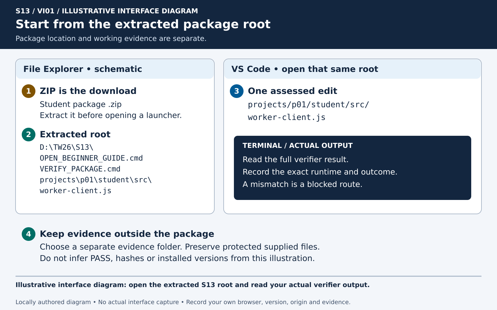
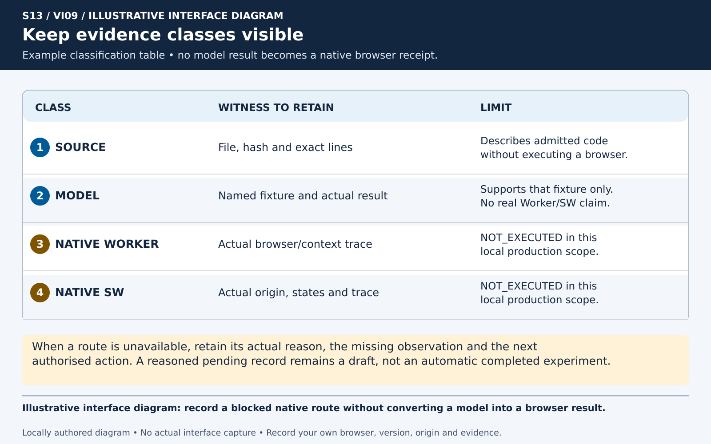
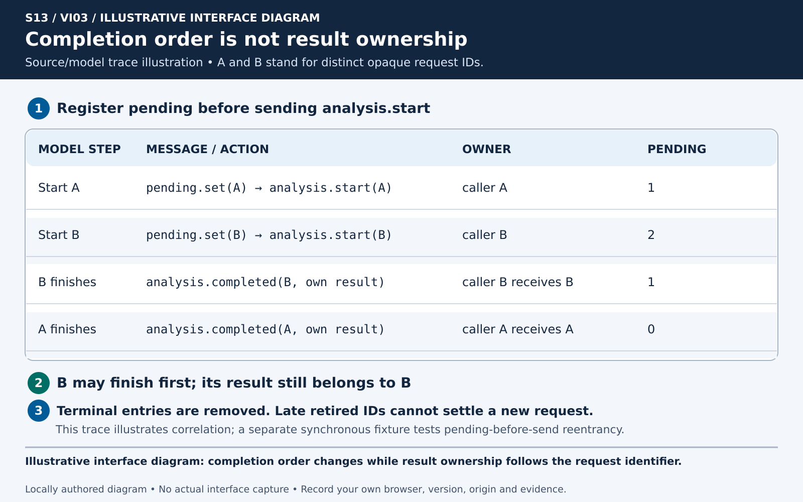
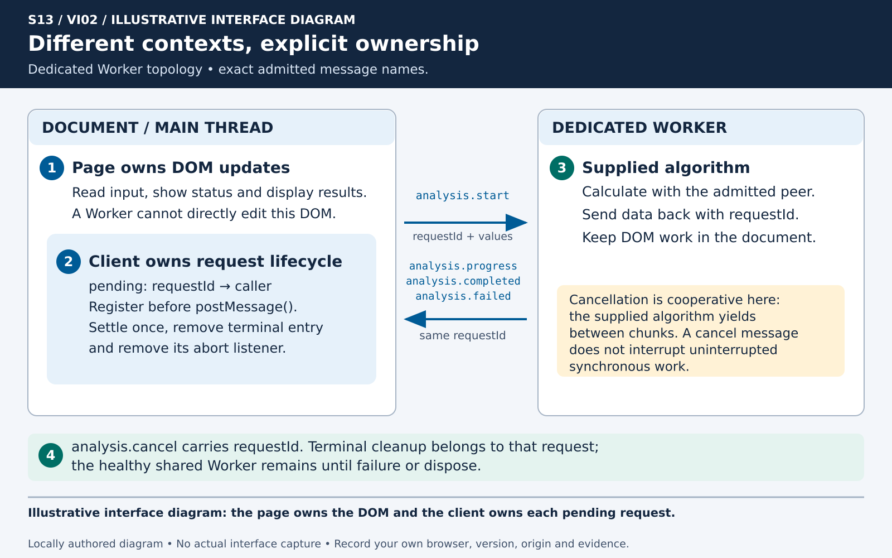
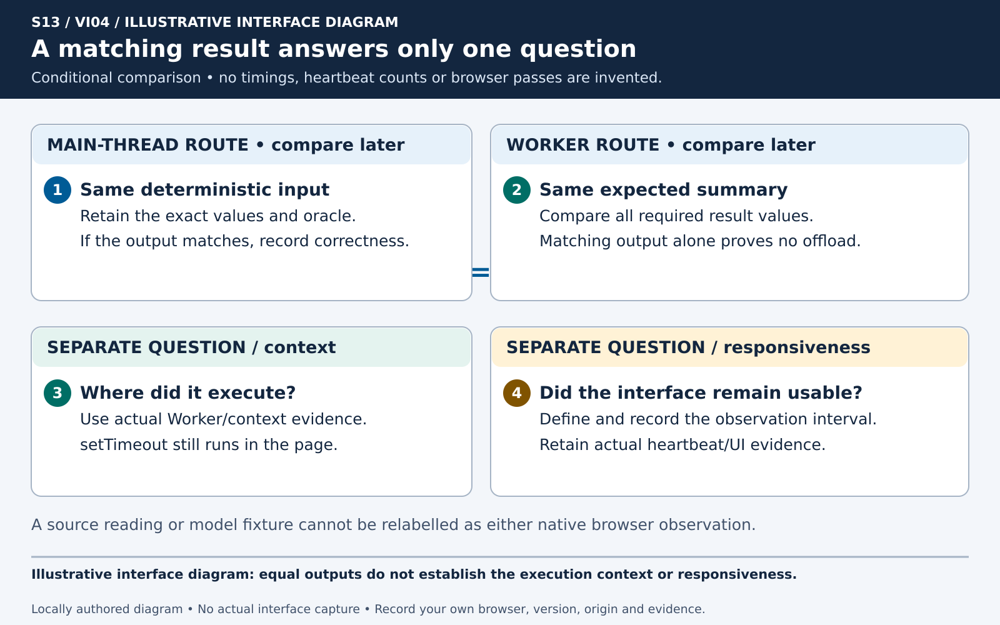
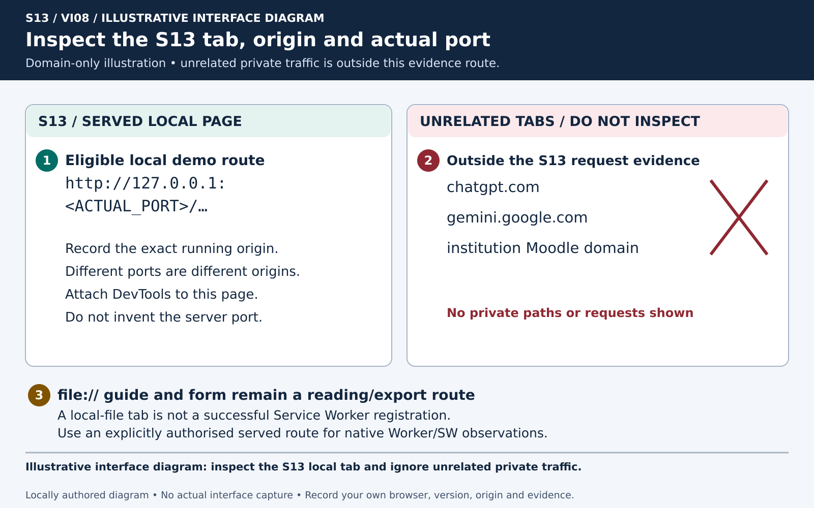
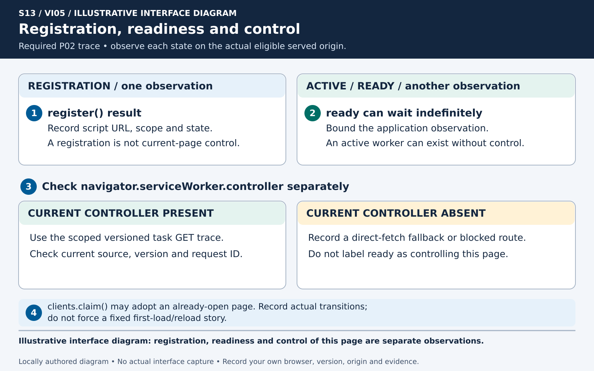
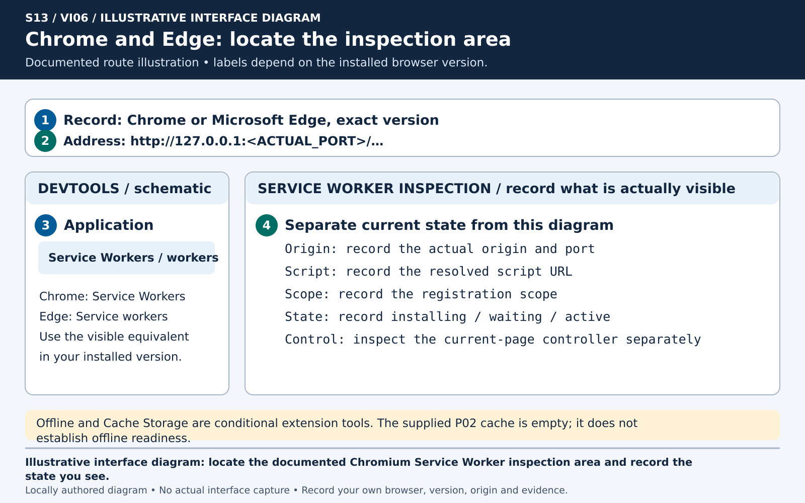
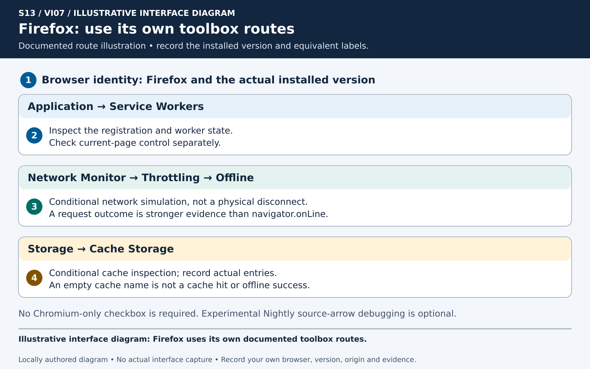
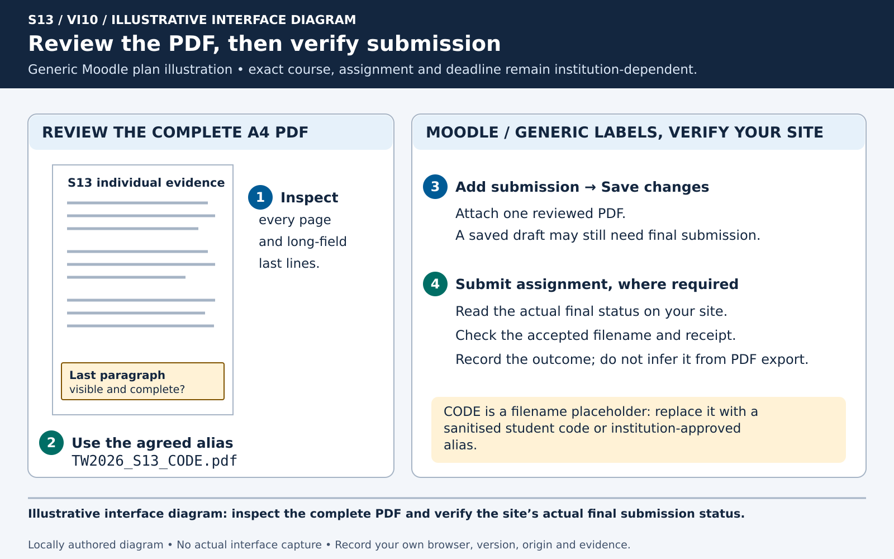

# S13 - Worker Offload and a Service Worker demonstration

Kit 1.2.0. This is the complete text route for the offline interactive guide. A checked navigation step is not assessed completion or execution evidence.

The guide/form can be read through file://. Native Worker/SW observation needs a separately authorised eligible served route. No server or remote activity starts from this guide.

## Roles and timing

P01 full implementation is required in projects/p01/student/src/worker-client.js. Required P02 is an individual guided trace. P03 is optional. Required Regression Harness launch is a two-minute five-item hand-off. Full P01 and RH work each have a 55-65-minute planning estimate and continue honestly before S14.

| Minutes | Action |
| --- | --- |
| 00-05 | Package and actual environment |
| 05-12 | Predictions and ownership |
| 12-30 | P01 edit budget |
| 30-39 | Named checks and evidence limits |
| 39-45 | One bounded Gemini critique |
| 45-50 | Independent check and verdict |
| 50-53 | Required P02 trace |
| 53-55 | Required Regression Harness launch |
| 55-60 | Reflection, save and STOP |

Administration plan: attendance/distribution 00-10, setup 10-15, content 15-75, form/PDF support 75-85 and submission/cleanup 85-90. No measured cohort timing is claimed.

One reviewed individual S13 PDF contains P01, required P02 and RH launch. Rubric 5.0/1.5/1.5/1.0/1.0, total 10.0. No C13 Assignment. Filename TW2026_S13_CODE.pdf replaces CODE with the institutionally permitted code or approved alias. Actual deadlines and alias policy are not invented.

## Exact form values

execution_class: SOURCE_ONLY / NODE_FAKE_WORKER / REAL_BROWSER_WORKER / BLOCKED_UNQUALIFIED. These correspond to source reading, the stated Worker model, qualified actual browser Worker or blocked route. Each P02/RH case records its own boundary.

Gemini evidence: REAL_GEMINI_INTERACTION / PENDING / BLOCKED / SYNTHETIC_SAMPLE_NOT_GEMINI. Verdict: ACCEPTED / REJECTED / PARTIALLY_ACCEPTED / UNKNOWN. Claim class: Observed / Inferred / Unknown. Pending/blocked actual response stays null.

## Guide controls

The HTML provides sticky contents, actual-platform/browser instruction selectors, CSS text scales 80/100/125/150/200, a progress-only local draft, bounded strict JSON backup/import, storage-denial notice, controlled reset, explicit copy/manual fallback, initially closed comparison, Projector/Esc, complete A4 print, glossary and troubleshooter. All ten essential PNGs are embedded as exact data URIs.

The sixty-minute timer begins paused, stops persistently at zero and requires an explicit confirmed new-session reset. It is a planning tool. Progress reset does not reset the timer. Alt+Left/Right navigation ignores inputs, selects, buttons and editable text.

## Where am I?

Use the numbered step title to match the current application, file, tab and action. Each step states the expected screen/output, record, gate, recovery, stop and next action.

## Step 01 - Download and extract the Student package

Time: Preparation

**WHERE YOU ARE**

You are in your browser and the file manager. The ZIP is a carrier. Work from a newly extracted directory.

**WHAT TO FIND**

Find the Student ZIP and its matching SHA-256 sidecar supplied for S13 v1.2.0. Keep private Teacher and QA packages out of the student workspace.

**EXACT ACTION**

On Windows, save the ZIP in D:\#___MY_SPACE\Downloads. In File Explorer, right-click the ZIP, choose Extract All, choose a new short directory such as D:\TW26\S13 and click Extract. On macOS or Linux, use the file manager extraction action into a new short directory. Open the contained package root, rather than the directory above it.

**WHAT YOU SHOULD SEE**

The extracted root contains this guide, PROJECT_ROLES.json, projects, guided, optional, portfolio and the root launchers. It is a directory you can enter, not the preview of files inside a ZIP.

**WHAT TO RECORD**

Record the actual ZIP filename and extracted root. Keep your evidence directory outside this exact-set package, for example D:\TW26\S13_EVIDENCE.

**DO NOT CONTINUE UNLESS**

You can identify the extracted Student root and the matching carrier. A previous seminar folder cannot substitute for this package.

**IF YOU DO NOT SEE THIS**

Return to the download directory and extract once into a new directory. Ask for the exact Student carrier if its identity is unclear. Do not merge with an old extraction.

**STOP CONDITION**

Stop if the carrier is untrusted, the extraction reports an error or the workspace belongs to someone else.

**CONTINUE WITH**

Open the offline guide and choose your routes in step 2.

Illustrative interface diagram: open the extracted S13 root and read your actual verifier output.

## Step 02 - Open the offline guide and choose your route

Time: 00-05

**WHERE YOU ARE**

You are in the extracted root in your file manager.

**WHAT TO FIND**

Find S13_INTERACTIVE_ULTRA_BEGINNER_GUIDE_EN_GB_v1.2.0.html or OPEN_BEGINNER_GUIDE.cmd on Windows and OPEN_BEGINNER_GUIDE.sh on macOS/Linux.

**EXACT ACTION**

Double-click the HTML. If the launcher is permitted, use it instead. At the top of the guide, select your actual platform and the browser you are using. Increase Text size if needed. Use the contents menu to return to any step.

**WHAT YOU SHOULD SEE**

The guide opens with a file:// URL and an S13 heading. All ten illustrations are available without a network connection. A notice explains that local progress is not evidence.

**WHAT TO RECORD**

Record the actual OS, browser name and version in the form. A selector changes instructions. It does not detect or certify your environment.

**DO NOT CONTINUE UNLESS**

You are reading the S13 guide from the extracted root. This page requests no install, starts no server and registers no Service Worker.

**IF YOU DO NOT SEE THIS**

Open the HTML directly. If scripts are disabled, read the complete text and use the MD/PDF version. Follow the labelled source route when a native route is unavailable.

**STOP CONDITION**

Stop an unexpected download, install request or page from an unrelated origin. Do not enter credentials into this guide.

**CONTINUE WITH**

Inspect package identity in step 3.

## Step 03 - Verify the exact package before executing code

Time: 00-05

**WHERE YOU ARE**

You are at the extracted root. Open VS Code, choose File, then Open Folder and select this root. Choose Terminal, then New Terminal.

**WHAT TO FIND**

Find VERIFY_PACKAGE.cmd/.sh, SHA256SUMS.txt, FILE_INDEX.csv and PACKAGE_ID.txt. These describe the package identity and permitted file set.

**EXACT ACTION**

Click in the terminal input line and run the platform command below from the root. Read the complete output. Save the output in your separate evidence directory or copy it into the form with its locator.

**WHAT YOU SHOULD SEE**

A completed verifier identifies the root and reports PASS or a specific refusal. A failure, blocked prerequisite or missing command is not a PASS. Opening PACKAGE_ID.txt alone does not verify the package.

**WHAT TO RECORD**

Record the actual PACKAGE_ID, verifier command, status, output locator and time. Do not copy an illustration value as your measurement.

**DO NOT CONTINUE UNLESS**

The verifier accepts the exact package and no unsafe object, missing file or protected change is reported.

**IF YOU DO NOT SEE THIS**

Check that the terminal is at the directory containing the launcher. Re-extract a trusted carrier into a fresh directory if integrity fails. Retain the refusal text.

**STOP CONDITION**

Stop execution on an integrity failure, symlink/special-file refusal or unexpected file. Do not edit the manifest or verifier to obtain PASS.

**CONTINUE WITH**

Check the actual runtime in step 4. If execution stays blocked, keep the source route and its reason.

Windows: `.\VERIFY_PACKAGE.cmd`

macOS/Linux: `./VERIFY_PACKAGE.sh`

Illustrative interface diagram: record a blocked native route without converting a model into a browser result.

## Step 04 - Check the actual runtime and initial scope

Time: 00-05

**WHERE YOU ARE**

You are in the same root terminal. The guide remains an offline document.

**WHAT TO FIND**

Find CHECK_ENVIRONMENT and VERIFY_INITIAL_STATE root launchers. The prescribed environment is Node 24.21.0 and npm 11.19.0.

**EXACT ACTION**

Run CHECK_ENVIRONMENT with the platform command below. Then run VERIFY_INITIAL_STATE only after its prerequisites pass. Read the versions printed by the commands, rather than assuming a version from a selector.

**WHAT YOU SHOULD SEE**

A strict runtime mismatch reports BLOCKED before project execution. A verified initial state identifies the one assessed path. The package is dependency-free for the supplied pure checks. No npm install is required by this route.

**WHAT TO RECORD**

Record actual Node/npm versions, status, OS and initial scope. If a tool is absent or mismatched, record the actual reason and the next permitted action.

**DO NOT CONTINUE UNLESS**

The exact runtime and package prerequisites pass before code execution. Source reading can continue honestly when they do not.

**IF YOU DO NOT SEE THIS**

Use the documented source/model explanation and leave actual execution pending. Arrange the prescribed environment outside the timed core through the institutionally permitted route.

**STOP CONDITION**

Stop on unknown versions, unsafe environment overrides, an install prompt or a failed initial guard. Do not bypass the public guard.

**CONTINUE WITH**

Before any test or reveal, record predictions in step 5.

Windows: `.\CHECK_ENVIRONMENT.cmd`

macOS/Linux: `./CHECK_ENVIRONMENT.sh`

After environment PASS: Windows `.\VERIFY_INITIAL_STATE.cmd` or macOS/Linux `./VERIFY_INITIAL_STATE.sh`.

## Step 05 - Write two predictions before the checks

Time: 05-12

**WHERE YOU ARE**

You are in the form or your separate evidence draft. No comparison reveal or test has run yet.

**WHAT TO FIND**

Find predicted_sync_reply, predicted_out_of_order, prediction_limit, worker_owner and request_id_policy in the evidence form.

**EXACT ACTION**

Write prediction A for a valid request whose injected fake replies during analysis.start. Write prediction B for A and B when B completes first. For each, specify the result owner, final pending state and an observation that would falsify your prediction. Sketch page/DOM, client/pending map and Worker/algorithm ownership.

**WHAT YOU SHOULD SEE**

Your own predictions have a saved timestamp or ordered evidence locator. A synchronous fake is an injected reentrancy fixture. Native Worker messaging remains asynchronous.

**WHAT TO RECORD**

Record both predictions, concrete falsifiers and the source/model/native limitation. Keep later corrections separate from the original predictions.

**DO NOT CONTINUE UNLESS**

Both predictions exist before the relevant checks. A statement such as it works lacks a falsifiable observation.

**IF YOU DO NOT SEE THIS**

Use the question prompts in the presentation. Ask which caller owns each result and what state should remain after settlement. Do not copy a supplied comparison as your earlier prediction.

**STOP CONDITION**

Stop a test or reveal if your prediction has not been recorded. Do not backdate a later correction.

**CONTINUE WITH**

Read the exact assessed boundary in step 6.

### Supplied comparison example - open only after recording your predictions

For the stated fake, a retained own result and zero final pending entries support prediction A. For A and B, each result must follow its own request identifier even when B completes first. These observations concern the stated model. They do not prove native offload or simultaneous CPU execution.

## Step 06 - Find the one assessed P01 file

Time: 12-30

**WHERE YOU ARE**

You are in VS Code with the verified extracted root open.

**WHAT TO FIND**

In Explorer, expand projects, p01, student, src and select worker-client.js. Find its createWorkerClient export and public method contract.

**EXACT ACTION**

Open P01_CONTRACT_EN_GB_v1.2.0.md or projects/p01/CONTRACT.md. Only edit projects/p01/student/src/worker-client.js for the assessed implementation. Read the supplied peer and tests to understand the literal wire types. Preserve the Worker algorithm, UI, factory, tests, fixtures and dependency metadata.

**WHAT YOU SHOULD SEE**

The client is on the page side. It sends analysis.start or analysis.cancel and receives analysis.progress, analysis.completed or analysis.failed. The supplied algorithm owns calculation in the dedicated Worker.

**WHAT TO RECORD**

Record the exact assessed path and your intended ownership/cleanup policy in p01_diff_locator and related fields.

**DO NOT CONTINUE UNLESS**

The editor tab identifies the exact assessed path. The terminal root and editor folder refer to the same extraction.

**IF YOU DO NOT SEE THIS**

Close an unrelated project and reopen the verified root. Use VS Code Explorer to follow each directory. Do not search-and-replace across the whole package.

**STOP CONDITION**

Stop if your edit would touch protected code or weaken a test. Stop if a second full P02 implementation appears as a supposed core requirement.

**CONTINUE WITH**

Use the bounded edit budget in step 7.

Illustrative interface diagram: completion order changes while result ownership follows the request identifier.

## Step 07 - Attempt the bounded P01 edit and save

Time: 12-30

**WHERE YOU ARE**

You are editing the assessed worker-client.js. The class edit budget is eighteen minutes.

**WHAT TO FIND**

Find validation, lazy Worker creation, pending registration, message correlation and terminal cleanup boundaries in the contract.

**EXACT ACTION**

Implement your own client within this file. Validate a dense array of 1 to 100000 primitive finite numbers before creating a Worker or sending. Register pending ownership before send. Retain lifetime-unique non-empty string IDs. Accept the required own result property as an opaque payload. Save with Ctrl+S on Windows/Linux or Command+S on macOS.

**WHAT YOU SHOULD SEE**

Your saved file remains at the one assessed path. Own undefined, a string or {ok:true} can be a valid completion result. Algorithm parity has a separate oracle check. No inherited per-request deadline is added as a hidden requirement.

**WHAT TO RECORD**

Record what you actually changed and what remains unfinished. State how abort, error, messageerror and dispose settle or retire owned resources.

**DO NOT CONTINUE UNLESS**

The save completed and your description matches your own code. An eighteen-minute attempt is not the full project completion gate.

**IF YOU DO NOT SEE THIS**

Save a partial attempt and identify the missing mechanism. Full P01 source work is planned at 55-65 minutes and can continue honestly before S14.

**STOP CONDITION**

At minute 30, stop extending the class edit. Do not claim completion from time spent or a checked guide step.

**CONTINUE WITH**

Verify the edited work scope in step 8.

Illustrative interface diagram: the page owns the DOM and the client owns each pending request.

## Step 08 - Verify your P01 work and protected boundary

Time: 30-39

**WHERE YOU ARE**

You are back in the root terminal after saving the assessed file.

**WHAT TO FIND**

Find VERIFY_WORK_RESULT and the exact assessed path. Keep evidence files outside the package.

**EXACT ACTION**

Run the platform command below once. It checks the protected boundary, runs the bounded P01 pure suites and checks the boundary again. Read every refusal and named case. Preserve its report for step 9.

**WHAT YOU SHOULD SEE**

The work verifier permits the one assessed edit and protects other admitted files. PASS additionally requires the selected P01 suites to pass. This supports those named model cases; it does not certify native execution or every possible behaviour. An incomplete implementation remains FAIL or BLOCKED.

**WHAT TO RECORD**

Record command, output status, changed path and any reason for refusal. Use the actual output, not the expected wording.

**DO NOT CONTINUE UNLESS**

The protected boundary must be admitted before any suite runs. Preserve behavioural failures as unresolved work. A labelled source explanation can continue without claiming implementation PASS.

**IF YOU DO NOT SEE THIS**

Move accidental evidence exports outside the package only if they are your own files. Restore protected content by re-extracting the trusted carrier, then carry your one assessed edit through an explicit review.

**STOP CONDITION**

Stop if protected bytes changed, an unsafe file appears or the work checker cannot complete. Do not alter its authority files.

**CONTINUE WITH**

Read the named P01 pure-check report in step 9. Keep one report for this run; repeat only after a relevant change or when a distinct check is needed.

Windows: `.\VERIFY_WORK_RESULT.cmd`

macOS/Linux: `./VERIFY_WORK_RESULT.sh`

## Step 09 - Read the named P01 pure-check results

Time: 30-39

**WHERE YOU ARE**

You are in the root terminal with the strict runtime and work boundary accepted.

**WHAT TO FIND**

Find RUN_PROJECT_TESTS. The p01 selection runs the declared pure suites and separately identified normative tests.

**EXACT ACTION**

Use the completed VERIFY_WORK_RESULT report from step 8. RUN_PROJECT_TESTS p01 below is a separate route when a check is still needed; avoid repeating an unchanged completed run. Wait for any chosen bounded process to finish. Read PASS, EXPECTED_STARTER_ASSERTION_FAILURE, FAIL or BLOCKED and the individual cases. Starter classification is available only through the explicit initial-state route. A timeout, crash, cancelled case or leak is an actual failure.

**WHAT YOU SHOULD SEE**

A pure fake-Worker test checks client protocol under its fixture. It does not create a browser Worker. The unchanged starter may intentionally reject as unavailable until you implement it. Do not change tests to turn it green.

**WHAT TO RECORD**

Record actual runtime, exact command, suite/case name, input, prior prediction, expected result, actual result or null, status, evidence class and output locator.

**DO NOT CONTINUE UNLESS**

The process finishes within its declared bound and every claim you record maps to a named case. Unexpected errors need investigation.

**IF YOU DO NOT SEE THIS**

Keep the exact refusal and source-only analysis when a prerequisite blocks the check. Use the bounded supplied model explanation without promoting it to your own execution.

**STOP CONDITION**

Stop on timeout, crash, leak or an unrecognised failure. Do not count a hanging process as an expected starter assertion.

**CONTINUE WITH**

Separate happy and edge observations in step 10.

Windows: `.\RUN_PROJECT_TESTS.cmd p01`

macOS/Linux: `./RUN_PROJECT_TESTS.sh p01`

## Step 10 - Record happy, minimum and correlation cases separately

Time: 30-39

**WHERE YOU ARE**

You are reading the finished P01 case output or the explicitly labelled supplied source/model trace.

**WHAT TO FIND**

Find synchronous completion, dense input, own opaque result and reversed correlation/progress cases. Minimum valid input is a one-element finite array.

**EXACT ACTION**

For the happy fixture, note the own result and final pending state. For the edge fixture, distinguish A from B, record B-before-A completion and progress 40 followed by 20. For each case, link your earlier prediction and concrete result. Keep one actual row per case rather than declaring the whole matrix observed.

**WHAT YOU SHOULD SEE**

The case table distinguishes protocol correlation from arithmetic parity. Lower progress must not become accepted backwards progress. Unknown or stale IDs do not settle a current request. An opaque result is not a mandatory statistics object.

**WHAT TO RECORD**

Record p01_sync_reply, p01_reverse_order, p01_progress, pending state and the exact source/model class for each row.

**DO NOT CONTINUE UNLESS**

Every row has a case/action, expected result, actual result or null, locator, mechanism and limit. A green total cannot replace these individual observations.

**IF YOU DO NOT SEE THIS**

When a case did not run, leave actual result null and state the reason and next action. Reading a test expectation is SOURCE, not MODEL execution.

**STOP CONDITION**

Stop an unsupported native offload claim based only on a fake, order reversal or matching output.

**CONTINUE WITH**

Record rejected cases and lifecycle cleanup in step 11.

## Step 11 - Record rejected inputs and terminal cleanup

Time: 30-39

**WHERE YOU ARE**

You are reading named P01 validation and lifecycle cases under the permitted pure route.

**WHAT TO FIND**

Find separate empty-array, NaN/Infinity, pre-aborted valid request, abort, Worker error, messageerror and dispose cases.

**EXACT ACTION**

For each case actually checked, record whether the Worker factory and send were reached. Empty or invalid values should reject as invalid_values before factory/send. A pre-aborted valid request rejects as analysis_aborted before factory/send. Trace per-request abort listener removal separately from the healthy shared Worker listeners.

**WHAT YOU SHOULD SEE**

Terminal ownership clears once. Healthy shared message/error/messageerror listeners can remain until failure or dispose. A failed Worker retires and a later request can create a replacement. Dispose is idempotent, terminates the owned Worker and forbids later requests.

**WHAT TO RECORD**

Record exact case, stable error/status, pending/listener/Worker state and actual-or-model class. Do not claim all rejection branches from one observed rejection.

**DO NOT CONTINUE UNLESS**

Your cleanup claim states which resource and lifecycle boundary the evidence covers. Cancellation is best-effort signalling after local settlement.

**IF YOU DO NOT SEE THIS**

Use source reasoning for unexecuted paths and state the gap. A raw error stack or callback failure should not become an unbounded dangling request.

**STOP CONDITION**

Stop if a promise strands, settlement repeats, cancel repeats unexpectedly or an unowned process/resource requires action.

**CONTINUE WITH**

Assess output and responsiveness claims separately in step 12.

## Step 12 - Separate output correctness from responsiveness

Time: 30-39

**WHERE YOU ARE**

You are comparing the supplied deterministic calculation with client protocol evidence.

**WHAT TO FIND**

Find the synchronous oracle and the supplied browser self-test documentation. Treat arithmetic output, execution context and responsiveness as separate observations.

**EXACT ACTION**

Explain the source counterexample: a main-thread calculation can match the oracle exactly. A setTimeout callback still runs on the main thread. For a later authorised native observation, record the browser, actual page URL, workload, heartbeat interval, elapsed observation and result. Keep that route pending if it has not run.

**WHAT YOU SHOULD SEE**

Equal results support a calculation claim within the checked input. A heartbeat over a stated interval supports a limited responsiveness observation. Neither guarantees a speed-up for every workload.

**WHAT TO RECORD**

Record a mechanism statement and one claim your evidence cannot establish. Use a synthetic transaction total and explain why an input editor must remain usable.

**DO NOT CONTINUE UNLESS**

The evidence class and observation interval support the particular claim. A data-selftest marker alone cannot certify all responsiveness.

**IF YOU DO NOT SEE THIS**

Use the source/model comparison and leave native measurements null. Record the actual blocker instead of inventing timings.

**STOP CONDITION**

Stop a native performance, context or offline claim whose required measurement has not happened.

**CONTINUE WITH**

Perform one bounded Gemini critique in step 13.

Illustrative interface diagram: equal outputs do not establish the execution context or responsiveness.

## Step 13 - Prepare and send one bounded Gemini Web prompt

Time: 39-45

**WHERE YOU ARE**

You are reading AI/S13_GEMINI_BOUNDED_ACTIVITY_EN_GB_v1.2.0.md. Open Gemini Web only through your authorised account route when it is available.

**WHAT TO FIND**

Find AI/S13_GEMINI_PROMPT_EN_GB_v1.2.0.txt. Its flawed claim says pending state can always be registered after postMessage because every reply is asynchronous.

**EXACT ACTION**

Read the complete prepared prompt. Copy only the sanitised claim and its small send/lookup excerpt using the explicit Copy button or the text file. In Gemini Web, click the prompt entry, paste it, re-read it for privacy and send once. Ask for a minimum counterexample and independently checkable correction, rather than a full assessed implementation.

**WHAT YOU SHOULD SEE**

A real exchange has the exact sent prompt and one complete actual response. Availability or account restrictions can leave the exchange PENDING/BLOCKED. The guide itself sends no data.

**WHAT TO RECORD**

Record gemini_evidence_kind, exact prepared/sent prompt, selected claim and actual response excerpt. If it did not happen, keep the actual response null and state the reason.

**DO NOT CONTINUE UNLESS**

The prompt contains no credentials, cookies, personal data, private Moodle content or unauthorised code. Your account use is permitted.

**IF YOU DO NOT SEE THIS**

Retain a prepared prompt and honest pending reason. A supplied synthetic practice response stays SYNTHETIC_SAMPLE_NOT_GEMINI and cannot replace a REAL_GEMINI_INTERACTION.

**STOP CONDITION**

Stop on a login/account restriction, data disclosure risk or request for the entire assessed solution. Do not keep sending prompts beyond the bounded activity.

**CONTINUE WITH**

Independently check the selected claim in step 14.

Prepared prompt text: AI/S13_GEMINI_PROMPT_EN_GB_v1.2.0.txt. Read the full activity file before any permitted send.

## Step 14 - Check the claim independently and qualify the verdict

Time: 45-50

**WHERE YOU ARE**

You are in your evidence draft after the one bounded Gemini activity or an honest pending branch.

**WHAT TO FIND**

Find independent_check, gemini_claim_class, verdict and correction_limit.

**EXACT ACTION**

Select one precise claim from the actual response. Name a falsifier. Connect it to source or a named bounded model case and compare expected with actual. Classify the claim as Observed, Inferred or Unknown. Choose Accepted, Rejected, Partly accepted or Unknown with the specific correction and limitation.

**WHAT YOU SHOULD SEE**

The independent check refers to your own locator or a labelled supplied source. It distinguishes a synchronous injected fake from asynchronous native messaging. Reverse arrival tests correlation and does not directly falsify asynchronous delivery.

**WHAT TO RECORD**

Record the claim, falsifier, exact independent check, evidence class, verdict, correction and remaining uncertainty. Keep pending response fields honest.

**DO NOT CONTINUE UNLESS**

The verdict follows the check and its scope. Gemini confidence, fluent prose or a green fixture is insufficient on its own.

**IF YOU DO NOT SEE THIS**

Use Unknown where the check is absent or cannot support the selected class. Record what would resolve it before S14.

**STOP CONDITION**

Stop a verdict that turns a source/model result into native proof or treats a supplied sample as a real exchange.

**CONTINUE WITH**

Complete the required P02 guided trace in steps 15-18.

## Step 15 - Confirm the correct local tab before any native observation

Time: 50-53 or later authorised route

**WHERE YOU ARE**

You are on the required P02 source/model route now. Native browser observation is a separately authorised later route.

**WHAT TO FIND**

Find the actual served loopback URL and printed port only if a bounded, authorised server route has been supplied and started. The guide/form file:// tab is a document, not the Service Worker application.

**EXACT ACTION**

For a source/model trace, open P02_GUIDED_TRACE_EN_GB_v1.2.0.md, guided/p02/CONTRACT.md and the P02 source files in VS Code. For a later actual route, select the tab whose address matches the exact S13 application URL, including its actual port. Open DevTools from that tab. Ignore traffic in unrelated Gemini, Moodle or chatgpt.com tabs.

**WHAT YOU SHOULD SEE**

You can name the actual origin and intended script/scope. No server or registration starts when the guide opens. Service Worker registration needs an eligible served HTTP(S) origin such as the declared loopback route.

**WHAT TO RECORD**

Record SOURCE/MODEL/NATIVE_BROWSER, actual URL or null, browser/version or null, actual observation or blocker and locator.

**DO NOT CONTINUE UNLESS**

A native route has explicit authority, a bounded server plan and the correct local tab. Source reading can proceed without those gates.

**IF YOU DO NOT SEE THIS**

Continue the labelled source trace. Leave native registration/control and HTTP results NOT_EXECUTED. Do not invent a port or start the historical server from this guide.

**STOP CONDITION**

Stop on the wrong tab, file:// registration attempt, an unknown shared origin or an unowned process.

**CONTINUE WITH**

Separate lifecycle states in step 16.

Illustrative interface diagram: inspect the S13 local tab and ignore unrelated private traffic.

## Step 16 - Trace registered, ready and current controller separately

Time: 50-53

**WHERE YOU ARE**

You are reading guided/p02/student/src/sw-registration.js and the supplied lifecycle source or observing a qualified current page.

**WHAT TO FIND**

Find registration, active/waiting/installing, ready and navigator.serviceWorker.controller. Find the supplied clients.claim() choice.

**EXACT ACTION**

Fill a table with separate registration, active/ready and current-controller rows. Explain the route selected when controller is null. Read the controller-change generation policy. On a later actual route, use the observed page state rather than forcing a first-load story.

**WHAT YOU SHOULD SEE**

A ready registration can coexist with no controller for this page. ready may wait indefinitely. clients.claim() can control a page without a manual reload. None of these alone prove a completed task GET.

**WHAT TO RECORD**

Record p02_control_state, p02_uncontrolled_fallback, p02_controllerchange, evidence class, source line/model fixture/actual locator and limit.

**DO NOT CONTINUE UNLESS**

The table keeps registration and current-page control distinct. The model or source is labelled and the absent native state stays unknown.

**IF YOU DO NOT SEE THIS**

Use the declared source/controller-null fixture explanation. If an actual wait exceeds its route bound, record BLOCKED and the state at that point.

**STOP CONDITION**

Stop a ready-equals-controlled claim or an indefinite wait. Do not unregister or clear unrelated origin data.

**CONTINUE WITH**

Inspect the documentary browser routes in step 17 and task trust in step 18.

Illustrative interface diagram: registration, readiness and control of this page are separate observations.

## Step 17 - Locate browser-specific Service Worker inspection

Time: 50-53 or later authorised route

**WHERE YOU ARE**

You are in the correct local tab only for a later qualified actual observation. The illustrated panels below are documentary diagrams.

**WHAT TO FIND**

Select your actual browser in the guide. Chrome/Edge use their Application inspection area. Firefox has its own Application, Network Monitor and Storage tools.

**EXACT ACTION**

Chrome: open the browser menu, choose More tools, then Developer tools. In DevTools, use the panel overflow menu if needed, select Application and then Service Workers. Edge: choose Settings and more, More tools, Developer tools, then Application and Service Workers. Firefox: open the application menu, More tools, Web Developer Tools, select Application and Service Workers. Inspect Network Monitor or Storage/Cache Storage separately only when the trace needs them. Labels vary by version.

**WHAT YOU SHOULD SEE**

The documented area identifies the relevant origin, registration and state when the browser exposes it. Firefox Nightly/experimental debug arrows are not a Stable acceptance requirement. The existence of an empty cache does not prove offline content.

**WHAT TO RECORD**

Record browser/version, actual menu labels and registration/controller state you actually see or null with a specific blocked reason. Cite the documentary route separately.

**DO NOT CONTINUE UNLESS**

The tab/origin is correct and the observed panel belongs to your named browser. A diagram never serves as a native capture.

**IF YOU DO NOT SEE THIS**

Use the official optional references below for the named version. Keep the source table if the panel is absent. DevTools Offline is a simulated route, not physical disconnection proof.

**STOP CONDITION**

Stop if the panel belongs to an unrelated site or exposes private traffic. Do not perform a destructive origin-wide reset.

**CONTINUE WITH**

Trace task GET and reply trust in step 18.

Illustrative interface diagram: locate the documented Chromium Service Worker inspection area and record the state you see.

Illustrative interface diagram: Firefox uses its own documented toolbox routes.

## Step 18 - Trace the versioned P02 task GET and trust boundary

Time: 50-53

**WHERE YOU ARE**

You are in the P02 source/model table. A full second dispatcher implementation is optional.

**WHAT TO FIND**

Find guided/p02/student/src/sw-dispatcher.js and guided/p02/student/service-worker.js. The peer uses version 1, task.request, task.response and task.failed. Its same-origin allowed path is /api/tasks/ followed by 1-80 letters, digits, underscore or hyphen.

**EXACT ACTION**

Choose one allowed task GET. Trace controller-null direct fetch fallback separately from controlled message dispatch. Explain how a stale-version, wrong-source or unknown-request reply is treated and what controller replacement does to pending work. Record the source line or named fixture for each transition.

**WHAT YOU SHOULD SEE**

The supplied starter reports sw_dispatch_unavailable for the controlled path until optional implementation. The required trace remains individual. The peer opens an empty cache, has no respondWith precache policy and can perform the allowed task-message GET. C13 route classification is different. Complete offline/PWA support is NOT_PROVIDED.

**WHAT TO RECORD**

Record p02_target_request, p02_source_version_check, source/version/ID/controller generation, route, result or null, evidence class and p02_limit.

**DO NOT CONTINUE UNLESS**

Every trust claim connects to the exact source or observed fixture. Request identity alone is only one validation check.

**IF YOU DO NOT SEE THIS**

Keep unexecuted HTTP result null. Explain the documentary path and remaining actual route. Cache/offline extensions are separate optional work.

**STOP CONDITION**

Stop a successful GET, cache-hit, first-load or offline assertion without its own qualified evidence.

**CONTINUE WITH**

Prepare the required two-minute RH launch in step 19.

## Step 19 - Launch the required Regression Harness portfolio

Time: 53-55

**WHERE YOU ARE**

You are in the evidence form and portfolio/regression-harness source. This is the two-minute launch hand-off.

**WHAT TO FIND**

Open RH_LAUNCH_EN_GB_v1.2.0.md. Find the portfolio locator, its declared target behaviour and rh_package_locator, rh_target_contract, rh_test_matrix_draft, rh_mutation_candidate and rh_outstanding_before_s14.

**EXACT ACTION**

Write all five items: exact package/path locator, one target behaviour, a draft row for each selected boundary, one mutation candidate and outstanding work. A boundary row names input, expected observation and falsifier. A mutation should make a meaningful assertion fail rather than merely mirror your implementation.

**WHAT YOU SHOULD SEE**

You have a specific five-item launch draft. Persistence, error status and cleanup can differ even when a response looks correct. Full harness work is planned at 55-65 minutes outside this hand-off and must be completed before S14.

**WHAT TO RECORD**

Record the five fields and separate actual pure check evidence from unexecuted HTTP/server behaviour. RUN_PROJECT_TESTS rh selects its declared pure suites only.

**DO NOT CONTINUE UNLESS**

All five launch items exist. Required launch is not an optional branch and does not certify the full portfolio.

**IF YOU DO NOT SEE THIS**

Use a source-based draft with precise next actions if execution is blocked. Arrange bounded HTTP/server testing through a later authorised route.

**STOP CONDITION**

At minute 55 stop expanding the harness. Never run historical raw npm test as a shortcut because some suites start HTTP resources.

**CONTINUE WITH**

Finish the reflection and exit ticket in step 20.

## Step 20 - Save an honest draft and stop technical work

Time: 55-60

**WHERE YOU ARE**

You are in the form or separate evidence draft near the end of the sixty-minute content route.

**WHAT TO FIND**

Find reflection, outstanding_work and the guide timer. Local progress checkboxes only record your navigation.

**EXACT ACTION**

Answer: for one result, name the evidence class, resource owner and one unsupported claim. Connect the mechanism to a synthetic transaction interface. List the exact unfinished P01/RH/native/Gemini items and next actions before S14. Export your form draft outside the package. At content minute 60 stop new coding/testing.

**WHAT YOU SHOULD SEE**

A complete truthful draft can remain incomplete as assessed evidence. The persistent STOP remains visible at zero. Administrative time supports form/PDF/submission guidance and does not extend the code budget.

**WHAT TO RECORD**

Record outstanding work and source/model/native boundaries. Re-read the final paragraph to ensure it survives your export.

**DO NOT CONTINUE UNLESS**

The draft is saved outside the package and its status matches the evidence you actually have. A checked progress step is not implementation completion.

**IF YOU DO NOT SEE THIS**

Use the form backup route. If storage is denied, keep the page open and export a backup immediately. Record the issue and do not assume autosave succeeded.

**STOP CONDITION**

STOP at sixty content minutes. Only an explicit confirmed timer reset starts another planned session. Do not silently restart this class budget.

**CONTINUE WITH**

Use administration for PDF review in step 21 and site status in step 22.

## Step 21 - Review the complete A4 PDF before submission

Time: Administration or honest follow-up

**WHERE YOU ARE**

You are in FORM/S13_MOODLE_EVIDENCE_FORM_EN_GB_v1.2.0.html, opened with OPEN_MOODLE_FORM or directly from the root.

**WHAT TO FIND**

Find the form validation, backup and Print/Save as PDF controls. The form has sixty fields in seven sections. It distinguishes a core draft, later evidence and review confirmations.

**EXACT ACTION**

Read field errors and resolve or explain each missing observation. Review privacy and declaration after your final material edit. Use the form Print control, select A4 and Save as PDF. Save outside the package as TW2026_S13_CODE.pdf, replacing CODE with the institutionally permitted code or approved alias. Open the saved PDF and inspect every page, including the last line of long fields.

**WHAT YOU SHOULD SEE**

The actual PDF includes complete text and an honest draft banner when unresolved. There is one individual S13 PDF containing P01, required P02 trace and RH launch. No project ZIP or node_modules is submitted. No C13 Assignment is created.

**WHAT TO RECORD**

Record actual PDF filename, page review, missing content or correction and privacy/declaration state. Final structure validation does not prove truth, native execution or Moodle submission.

**DO NOT CONTINUE UNLESS**

The saved PDF is readable, complete and reviewed. Confirmations refer to the latest content. An imported draft has no inherited approval.

**IF YOU DO NOT SEE THIS**

Use the DOCX alternative as a working draft if the HTML route is unavailable. After any correction re-export and re-review the complete PDF. Keep unresolved status visible.

**STOP CONDITION**

Stop on clipped text, lost last paragraphs, private data, unreviewed pages or an invented institutional alias policy.

**CONTINUE WITH**

Submit only through the actual institutionally assigned activity in step 22.

Illustrative interface diagram: inspect the complete PDF and verify the site’s actual final submission status.

## Step 22 - Check the actual final Moodle submission status

Time: Administration or honest follow-up

**WHERE YOU ARE**

You are in your institutionally permitted Moodle account on the course and S13 activity actually assigned by the teacher.

**WHAT TO FIND**

Find the actual activity title, instructions, deadline and permitted alias policy. These are not invented by this package.

**EXACT ACTION**

Open the activity. Typical version-dependent labels are Add submission, upload the one reviewed PDF, Save changes and then Submit assignment if the site requires it. Read any declaration before confirming it. Return to the activity status page and inspect whether it reports a final submitted state or a draft. Follow the site instructions rather than relying on generic labels.

**WHAT YOU SHOULD SEE**

The site reports its actual saved/submitted state and filename. A local PDF review, form declaration or Save changes click alone does not prove final submission. Site configuration may use different labels or a different finalisation rule.

**WHAT TO RECORD**

Record the actual filename and final status with an appropriate private locator. Keep live submission pending if it did not occur. Do not include private account details in public evidence.

**DO NOT CONTINUE UNLESS**

The actual activity and deadline are known and the reviewed PDF is the latest one. The final status is verified from the site.

**IF YOU DO NOT SEE THIS**

Retain the PDF and honest pending reason. Ask the teacher for the exact activity/configuration when absent. Do not guess an activity ID, deadline or pass threshold.

**STOP CONDITION**

Stop on the wrong course/activity, unauthorised account, a draft state mistaken for final submission or disclosure of private site content.

**CONTINUE WITH**

Keep unfinished work scheduled before S14. For cleanup use step 23 only for recorded owned resources.

## Step 23 - Close documents and clean only owned resources

Time: After the route

**WHERE YOU ARE**

You are at the end of the local route. The offline guide itself starts no server, Worker or Service Worker.

**WHAT TO FIND**

Find STOP_AND_CLEANUP and any resource ownership record created by an explicitly authorised later runtime route.

**EXACT ACTION**

Save your separate evidence backups and close the documents you opened. If and only if a permitted route recorded owned resources, run the conditional cleanup launcher below and inspect its result. Never terminate an arbitrary PID, unregister an unrelated Service Worker or clear a whole shared origin.

**WHAT YOU SHOULD SEE**

The cleanup route reports no recorded owned resources or validates a finite ownership record and gives the appropriate owning-terminal instruction. It refuses unknown or unowned resources and does not automatically terminate a PID.

**WHAT TO RECORD**

Record the actual cleanup status and outstanding resources, if any. Source/model study has no invented process-cleanup receipt.

**DO NOT CONTINUE UNLESS**

Any resource acted on belongs to this recorded authorised route. No unrelated session or data is affected.

**IF YOU DO NOT SEE THIS**

Leave an unknown resource unchanged and report the concrete ownership gap. Keep a bounded next action rather than assuming cleanup.

**STOP CONDITION**

Stop if ownership cannot be established or a broad delete/kill/unregister action appears.

**CONTINUE WITH**

Retain the reviewed PDF and finish the outstanding P01/RH work before S14.

Windows: `.\STOP_AND_CLEANUP.cmd`

macOS/Linux: `./STOP_AND_CLEANUP.sh`

## Troubleshooter

### I am still inside a ZIP preview

Extract into a fresh short directory and open the contained root. Return to step 1.

### The launcher is missing or command is not found

Choose VS Code File > Open Folder for the extracted root. The terminal must show that root. Return to step 3.

### Node/npm is absent or mismatched

Keep the strict refusal. Do source reading and arrange the prescribed environment outside the timed core. Return to step 4.

### An expected starter assertion is red

Read its labelled learning baseline. Keep original tests unchanged and implement only the assessed path. A crash or timeout is a different actual failure. Return to step 9.

### A test hangs, crashes or leaks

Stop the bounded route, preserve the actual failure and report the owned resource state. Do not count it as expected red.

### Clipboard is denied

Use the displayed manual copy text, select all and use Ctrl+C or Command+C. The complete command stays visible.

### Storage is denied

Your current progress stays in memory. Export a JSON backup outside the package. No successful persistence is claimed.

### The import is rejected

Use this guide schema backup only. Files over 2 MiB, invalid UTF-8, unknown keys and invalid values fail closed. Keep the current draft.

### The Service Worker panel is absent

Check the actual browser/version and correct local tab. Use the labelled documentary/source trace and leave native observation pending.

### ready never resolves or controller stays null

Stop at the actual route bound. Record registered/active/ready/controller independently. Preserve direct fallback/source limits.

### Gemini or Moodle is unavailable

Keep the actual status pending/blocked and the reason. Prepared prompts and local PDFs do not become live activity receipts.

### The print preview loses text

Use A4, inspect all pages, re-export from the form after correcting the material and check the final line. Do not submit the clipped version.

### The content timer reaches zero

Stop new technical work. Save an honest draft and list remaining work before S14. Administration does not extend coding.

## Glossary

**Assessed edit**: The single file in which your required P01 implementation is evaluated.

**Boundary**: The point where ownership, trust or execution context changes.

**Controller**: The Service Worker currently controlling this page. It can be null even when a registration is ready.

**Correlation**: Connecting each reply to the request/caller that owns its identifier.

**Evidence class**: SOURCE reading, MODEL execution or separately qualified NATIVE_BROWSER observation. Each supports a different claim.

**Falsifier**: A concrete observation that would contradict a prediction or claim.

**Main thread**: The page execution context that owns its DOM and user interaction.

**Module Worker**: A dedicated browser Worker created with module semantics. A Node fake is not this runtime.

**Opaque result**: The required own result payload accepted by the adapter without inventing a statistics shape.

**Pending entry**: Client-owned state for a request that has not reached terminal settlement.

**Ready registration**: A registration with an active Service Worker. The ready promise alone does not identify this page controller.

**Terminal settlement**: Exactly one resolve or reject for a request, followed by request-owned cleanup.

**Trace locator**: A path, source line or named case/output location that lets another reader inspect the claimed evidence.

**Trust check**: A check of allowed type, source, version, current request and relevant controller generation.

**Worker offload**: Using a dedicated execution context for the supplied calculation while the page owns its interface.

## References - APA 7th edition

Google. (n.d.). *A service worker's life*. Chrome for Developers. Retrieved October 3, 2026, from https://developer.chrome.com/docs/workbox/service-worker-lifecycle/

Google. (2016, July 25). *Debug Progressive Web Apps*. Chrome for Developers. Retrieved October 3, 2026, from https://developer.chrome.com/docs/devtools/progressive-web-apps

Google. (2021, October 20). *Improving the service worker development experience*. Chrome for Developers. Retrieved October 3, 2026, from https://developer.chrome.com/docs/workbox/improving-development-experience

MDN contributors. (n.d.-a). *Cache*. MDN Web Docs. Retrieved October 3, 2026, from https://developer.mozilla.org/en-US/docs/Web/API/Cache

MDN contributors. (n.d.-b). *Cache: addAll() method*. MDN Web Docs. Retrieved October 3, 2026, from https://developer.mozilla.org/en-US/docs/Web/API/Cache/addAll

MDN contributors. (n.d.-c). *ExtendableEvent: waitUntil() method*. MDN Web Docs. Retrieved October 3, 2026, from https://developer.mozilla.org/en-US/docs/Web/API/ExtendableEvent/waitUntil

MDN contributors. (n.d.-d). *Navigator: onLine property*. MDN Web Docs. Retrieved October 3, 2026, from https://developer.mozilla.org/en-US/docs/Web/API/Navigator/onLine

MDN contributors. (n.d.-e). *Secure contexts*. MDN Web Docs. Retrieved October 3, 2026, from https://developer.mozilla.org/en-US/docs/Web/Security/Defenses/Secure_Contexts

MDN contributors. (n.d.-f). *ServiceWorkerContainer: controller property*. MDN Web Docs. Retrieved October 3, 2026, from https://developer.mozilla.org/en-US/docs/Web/API/ServiceWorkerContainer/controller

MDN contributors. (n.d.-g). *ServiceWorkerContainer: ready property*. MDN Web Docs. Retrieved October 3, 2026, from https://developer.mozilla.org/en-US/docs/Web/API/ServiceWorkerContainer/ready

MDN contributors. (n.d.-h). *ServiceWorkerContainer: register() method*. MDN Web Docs. Retrieved October 3, 2026, from https://developer.mozilla.org/en-US/docs/Web/API/ServiceWorkerContainer/register

MDN contributors. (n.d.-i). *ServiceWorkerGlobalScope: fetch event*. MDN Web Docs. Retrieved October 3, 2026, from https://developer.mozilla.org/en-US/docs/Web/API/ServiceWorkerGlobalScope/fetch_event

MDN contributors. (n.d.-j). *ServiceWorkerRegistration: unregister() method*. MDN Web Docs. Retrieved October 3, 2026, from https://developer.mozilla.org/en-US/docs/Web/API/ServiceWorkerRegistration/unregister

MDN contributors. (n.d.-k). *ServiceWorkerRegistration: update() method*. MDN Web Docs. Retrieved October 3, 2026, from https://developer.mozilla.org/en-US/docs/Web/API/ServiceWorkerRegistration/update

MDN contributors. (n.d.-l). *Using Service Workers*. MDN Web Docs. Retrieved October 3, 2026, from https://developer.mozilla.org/en-US/docs/Web/API/Service_Worker_API/Using_Service_Workers

MDN contributors. (n.d.-m). *Using Web Workers*. MDN Web Docs. Retrieved October 3, 2026, from https://developer.mozilla.org/en-US/docs/Web/API/Web_Workers_API/Using_web_workers

Microsoft. (n.d.). *Debug a Progressive Web App (PWA)*. Microsoft Learn. Retrieved October 3, 2026, from https://learn.microsoft.com/en-us/microsoft-edge/devtools/progressive-web-apps/

Mozilla. (n.d.-a). *Debugging service workers*. Firefox Source Docs. Retrieved October 3, 2026, from https://firefox-source-docs.mozilla.org/devtools-user/application/service_workers/index.html

Mozilla. (n.d.-b). *Throttling*. Firefox Source Docs. Retrieved October 3, 2026, from https://firefox-source-docs.mozilla.org/devtools-user/network_monitor/throttling/index.html

W3C Web Applications Working Group. (n.d.). *Service Workers Nightly*. Retrieved October 3, 2026, from https://w3c.github.io/ServiceWorker/

WHATWG. (n.d.). *HTML Standard: Web workers*. Retrieved October 3, 2026, from https://html.spec.whatwg.org/multipage/workers.html

No verified DOI is associated with these technical documentation records. Official labels are documentary and version-dependent. Cache/offline references govern an optional extension beyond the supplied P02 task trace.
